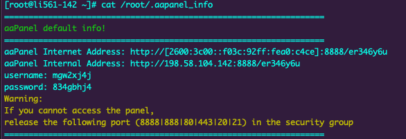
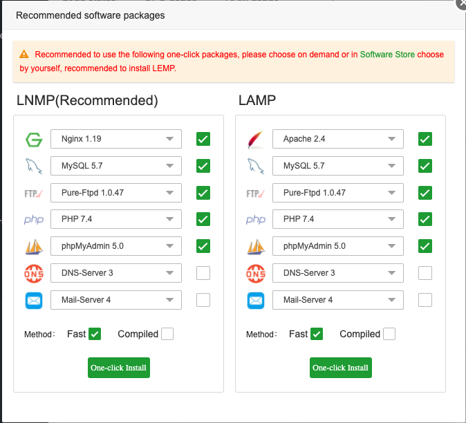

aaPanel is a free and open source web hosting control panel. It allows you to manage the server's web server, websites, databases, FTP, and more through a simple web-based interface. Through aaPanel, you can quickly install a LEMP (NGINX) or LAMP (Apache) stack on your server and start hosting your websites.

## Deploying the aaPanel Marketplace App



**Software installation should complete within 5-10 minutes after the Linode has finished provisioning.**

## Configuration Options

For advice on filling out the remaining options on the **Create a Linode** form, see [Getting Started > Create a Linode](/docs/guides/getting-started/#create-a-linode). That said, some options may be limited or recommended based on this Marketplace App:

- **Supported distributions:** CentOS 7
- **Recommended plan:** All plan types and sizes can be used.

## Getting Started after Deployment

### Access your aaPanel App

1.  After aaPanel has finished installing, log into your Linode via SSH, replacing `192.0.2.0` with your [Linode's IP address](/docs/quick-answers/linode-platform/find-your-linodes-ip-address/), and entering your Linode's root password when prompted:

        ssh root@192.0.2.0

2.  Once you login to the Linode, you will need to run the following command to obtain your login information for your aaPanel dashboard:

        cat /root/.aapanel_info

    

3.  Once you visit the URL and enter the login credentials you will be prompted to choose which One-Click services (LAMP/LNMP) you would like to install:

    

Now that you’ve accessed your dashboard, checkout [the official aaPanel documentation](https://doc.aapanel.com/) to learn how to further configure your instance.

