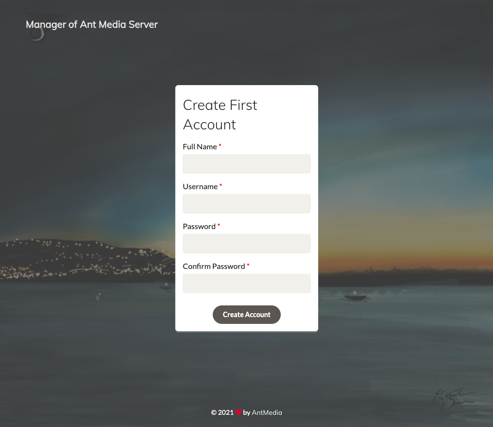

Ant Media Server is Highly Scalable Live Video Streaming Platform with ultra low latency. It supports WebRTC live streaming, in addition to CMAF and HLS streaming. It can be ingested through RTMP, WebRTC, or HLS. Any IP Camera can be connected through RTSP or ONVIF. It also enables live restreaming to social media platforms. All codes (H.264, H.265, and VP8) are enabled, and GPU based encoding is also available.

Ant Media Server Community Edition is a limited version of Ant Media Server Enterprise edition and supports the following features.

* Publish live streams with WebRTC, RTMP - Play Live and VoD streams with RTMP and HLS
* RTMP, RTSP, MP4 and HLS Support
* WebRTC to RTMP Adapter
* 360 Degree Live & VoD Streams
* Web Management Dashboard
* IP Camera Support
* Re-stream Remote Streams (IPTV)
* Open Source https://github.com/ant-media/Ant-Media-Server
* Simulcasting to Periscope
* Your Live or VoD streams can play anywhere including mobile(Android, iOS) browsers.

If you need adaptive streaming, cluster, load balancer, and hardware encoding, please use Enterprise Edition http://antmedia.io

## Deploying the Ant Media Server Marketplace App



**Software installation should complete within 2-5 minutes after the Linode has finished provisioning.**

### Configuration Options

For advice on filling out the remaining options on the **Create a Linode** form, see [Getting Started > Create a Linode](/docs/guides/getting-started/#create-a-linode). That said, some options may be limited or recommended based on this Marketplace App:

- **Supported distributions:** Ubuntu 20.04 LTS
- **Recommended plan:** 8GB Dedicated CPU Instance.

## Getting Started after Deployment

### Access your Ant Media Server App
After Ant Media Server has finished installing, you can access your server with your Linode's IPv4 address. Copy your Linode’s IPv4 address from the [Linode Cloud Manager](https://cloud.linode.com), and then connect to the server from your browser using your Linode's IPv4 address and port `5080`(for example `192.0.2.0:5080`).

For more on Ant Media Server, check out the following resources:

- [Ant Media Server wiki](https://github.com/ant-media/Ant-Media-Server/wiki)
- [Publishing a Live Stream](https://github.com/ant-media/Ant-Media-Server/wiki/Publishing-Live-Streams)

<!-- the following shortcode informs the user that Linode does not provide automatic updates to the Marketplace app, and that the user is responsible for the security and longevity of the installation. -->
