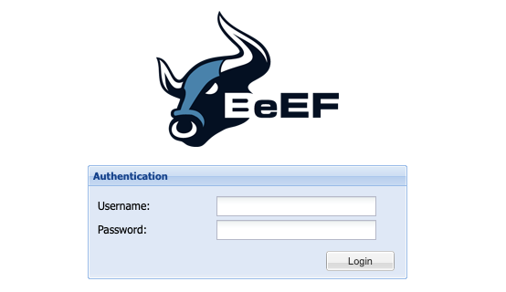

BeEF (The Browser Exploitation Framework) is a penetration testing tool that focuses on the web browser. BeEF offers an efficient and affective penetration test tool to assess the actual security posture of a target environment by using client-side attack vectors. BeEF looks beyond just the network perimeter and client system. It allows you to examine exploitability within the context of the web browser.

## Deploying the BeEF Marketplace App



**Software installation should complete within 10-15 minutes after the Linode has finished provisioning.**

## Configuration Options

### BeEF Options

Here are the additional options available for this Marketplace App:

| **Field** | **Description** |
|:--------------|:------------|
| **BeEF Password** | The BeEF Admin Password. *Required*. |
| **Admin Email for the server** | This email is require to generate the SSL certificates. *Required* |
| **Your Linode API Token** | Your Linode `API Token` is needed to create DNS records. If this is provided along with the `subdomain` and `domain` fields, the installation attempts to create DNS records via the Linode API. If you don't have a token, but you want the installation to create DNS records, you must [create one](/docs/platform/api/getting-started-with-the-linode-api/#get-an-access-token) before continuing. |
| **Subdomain** | The subdomain you wish the installer to create a DNS record for during setup. The suggestion given is `www`. The subdomain should only be provided if you also provide a `domain` and `API Token`. |
| **Domain** | The domain name where you wish to host your BeEF instance. The installer creates a DNS record for this domain during setup if you provide this field along with your `API Token`. |
| **The limited sudo user to be created for the Linode** | This is the limited user account to be created for the Linode. This account has sudo user privileges. |
| **The password for the limited sudo user** | Set a password for the limited sudo user. The password must meet the complexity strength validation requirements for a strong password. This password can be used to perform any action on your server, similar to root, so make it long, complex, and unique. |
| **The SSH Public Key that will be used to access the Linode** | If you wish to access [SSH via Public Key](/docs/security/authentication/use-public-key-authentication-with-ssh/) (recommended) rather than by password, enter the public key here. |
| **Disable root access over SSH?** | Select `Yes` to block the root account from logging into the server via SSH. Select `No` to allow the root account to login via SSH. |

### General Options

For advice on filling out the remaining options on the **Create a Linode** form, see [Getting Started > Create a Linode](/docs/guides/getting-started/#create-a-linode). That said, some options may be limited or recommended based on this Marketplace App:

- **Supported distributions:** Ubuntu 20.04 LTS
- **Recommended plan:** All plan types and sizes can be used.

## Getting Started after Deployment

### Accessing the BeEF App

1.  Once the app has been *fully* deployed, view the BeEF completion message through one of the methods below:

    -   **Lish Console:** Within the Cloud Manager, navigate to **Linodes** from the left menu, select the Compute Instance you just deployed, and click the **Launch LISH Console** button. See [Using the Lish Console](/docs/guides/using-the-lish-console/).
    -   **SSH:** Log in to your Compute Instance over SSH using the `root` user and run the following command. See [Connecting to a Remote Server Over SSH](/docs/guides/connect-to-server-over-ssh/) for assistance.

            cat /root/beef.info

1.  The completion message contains the *Endpoint* URL, as shown in the example below.

    
##############################
# BEEF INSTALLATION COMPLETE #
##############################
Endpoint: https://192-0-2-1.ip.linodeusercontent.com:3000/ui/panel
Credentials can be found here:
/home/beef/config.yaml
Happy hunting!


1.  Navigate to this URL in a web browser to display the login prompt.

    

1.  Enter `beef` as the username and use the password you entered into the *BeEF Password* field when you created the Instance.

    
If you forget this password, run the following command when logged in through Lish or SSH:

    less /home/beef/config.yaml

Scroll down until you see the *credentials* section with the *user* and *passwd* parameters as shown in the example output below:


# Credentials to authenticate in BeEF.
# Used by both the RESTful API and the Admin interface
credentials:
    user:   "beef"
    passwd: "T$a%T1O*&2kP"



Now that you’ve accessed your BeEF instance, check out [the official BeEF documentation](https://github.com/beefproject/beef/wiki) to learn how to further utilize your BeEF instance.

