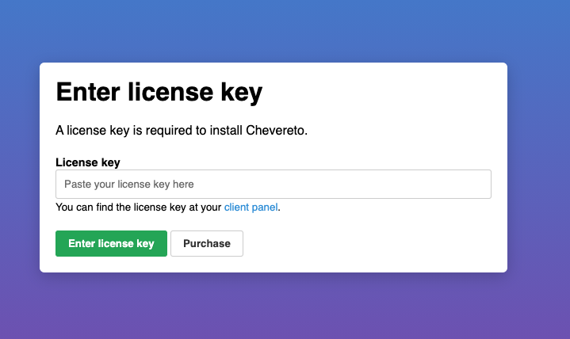
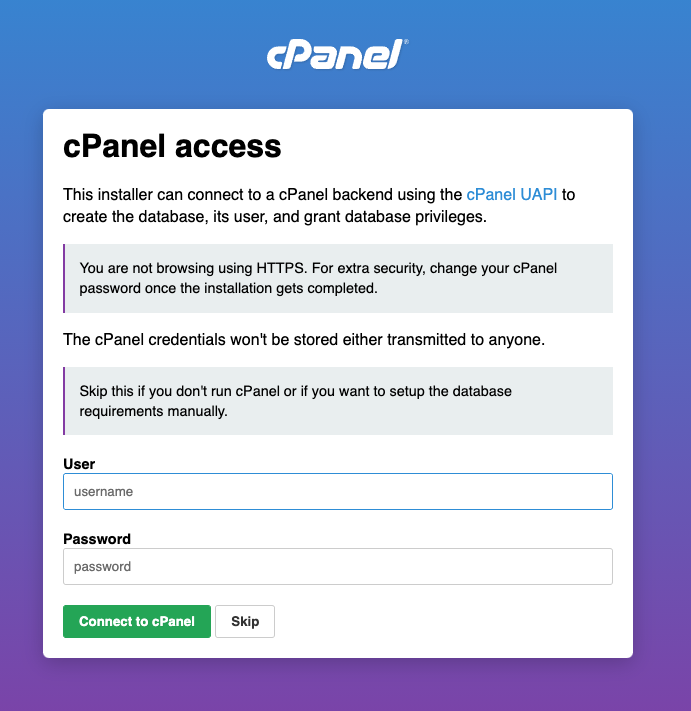
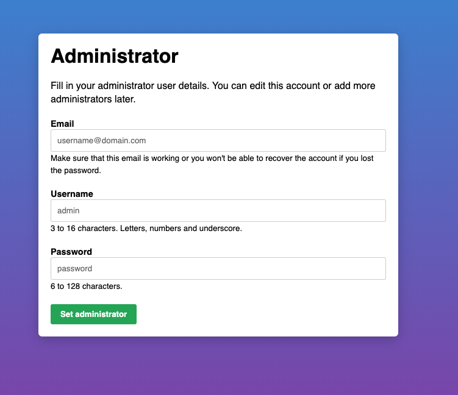
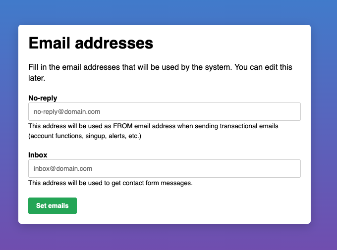

Chevereto is a self-hosted image sharing solution. It can be used to create a myriad of applications or to empower existing systems. Chevereto's features include multi-user support, multi-server support, bulk importing, integration with social media, and more.

## Deploying the Chevereto Marketplace App



**Software installation should complete within 2-5 minutes after the Linode has finished provisioning.**

## Configuration Options

For advice on filling out the remaining options on the **Create a Linode** form, see [Getting Started > Create a Linode](/docs/guides/getting-started/#create-a-linode). That said, some options may be limited or recommended based on this Marketplace App:

- **Supported distributions:** Ubuntu 20.04 LTS
- **Recommended plan:** All plan types and sizes can be used.

## Getting Started after Deployment

### Access your Chevereto App

1.  After Chevereto has finished installing,log into your Linode via SSH, replacing `192.0.2.0` with your [Linode's IP address](/docs/quick-answers/linode-platform/find-your-linodes-ip-address/), and entering your Linode's root password when prompted:

        ssh root@192.0.2.0

1.  You should see the Chevereto welcome message when logging into the Linode. This includes instructions for accessing the Chevereto installation script in your web browser along with the location of the credentials to the application. Replace `192.0.2.0` with your Linode’s IP address.

    

1.  You will then be able to proceed through the Chevereto Installer.

    

1.  To utilize Chevereto, you need to obtain a license key. You can do so clicking the purchase button and entering the license key provided by Chevereto.

    

1.  Next, you will be presented with a page where you can enter your cPanel credentials. Since this Marketplace App does not include a cPanel installation, you can simply select skip.

    

1.  The next page allows you to input the database information for this application. It should be pre-filled with the user and password details.

    

1.  You are then prompted to create the Administrator account. This will be the credentials used to access your Chevereto dashboard.

    

1.  The next prompt will ask you for the email addresses that will be used for this service.

    

1.  You are now ready to complete the Chevereto installation. Click the **Install Chevereto** button.

    

Now that you’ve accessed your dashboard, checkout [the official Chevereto documentation](https://v3-docs.chevereto.com/) to learn how to further configure your instance.

