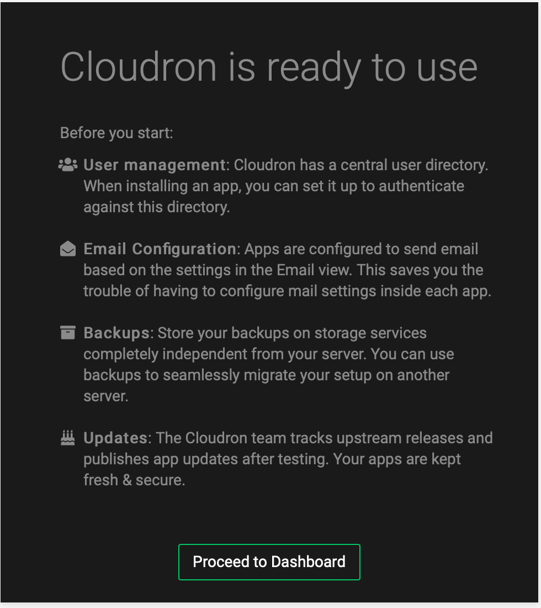

[Cloudron](https://www.cloudron.io) is a platform that makes it easy to install, manage and secure web apps on a server. Cloudron provides a centralized way to manage users and specify which apps they can access.

## Deploying the Cloudron Marketplace App



**Software installation should complete within 10-12 minutes after the Linode has finished provisioning.**

## Configuration Options

### Cloudron Options

The Cloudron Marketplace form includes advanced fields to setup your Cloudron server's limited user account and DNS records. These are optional configurations and are not required for installation.

| **Field&nbsp;&nbsp;&nbsp;&nbsp;&nbsp;&nbsp;&nbsp;&nbsp;&nbsp;&nbsp;&nbsp;&nbsp;&nbsp;&nbsp;&nbsp;&nbsp;&nbsp;&nbsp;&nbsp;&nbsp;&nbsp;&nbsp;&nbsp;&nbsp;&nbsp;&nbsp;&nbsp;&nbsp;&nbsp;&nbsp;&nbsp;&nbsp;&nbsp;&nbsp;&nbsp;&nbsp;&nbsp;&nbsp;&nbsp;&nbsp;&nbsp;&nbsp;** | **Description** |
|-----------|-----------------|
| **The limited sudo user to be created for the Linode** | This is the limited user account to be created for the Linode. This account has sudo user privileges. |
| **The password for the limited sudo user** | Set a password for the limited sudo user. The password must meet the complexity strength validation requirements for a strong password. This password can be used to perform any action on your server, similar to root, so make it long, complex, and unique. |
| **The SSH Public Key that will be used to access the Linode** | If you wish to access [SSH via Public Key](https://www.linode.com/docs/security/authentication/use-public-key-authentication-with-ssh/) (recommended) rather than by password, enter the public key here. |
| **Disable root access over SSH?** | Select `Yes` to block the root account from logging into the server via SSH. Select `No` to allow the root account to login via SSH. |

### General Options

For advice on filling out the remaining options on the **Create a Linode** form, see [Getting Started > Create a Linode](/docs/guides/getting-started/#create-a-linode). That said, some options may be limited or recommended based on this Marketplace App:

- **Supported distributions:** Ubuntu 18.04 LTS
- **Recommended plan:** All plan types and sizes can be used.

## Getting Started after Deployment

The Cloudron application is served on the Linode, however it still requires a few additional steps to fully complete the installation process.

1.  The Cloudron setup wizard is served at the IP address of the Linode server . For example, `http://203.0.113.0 `, replacing the IP address with values for the Linode server and accept the self-signed certificate.

    
In Chrome, you can accept the self-signed certificate by clicking on Advanced and then click Proceed to <ip> (unsafe). In Firefox, click on Advanced, then Add Exception and then Confirm Security Exception. 

1.  At this point, the Cloudron Domain setup wizard appears.

    

1.  In the setup screen, fill in the fields and click the **Next** button. The **Setup Admin Account** page appears.

    

1.  After the account is created, Cloudron prompts you to proceed to the dashboard on completing the setup and displays a confirmation screen.

    


