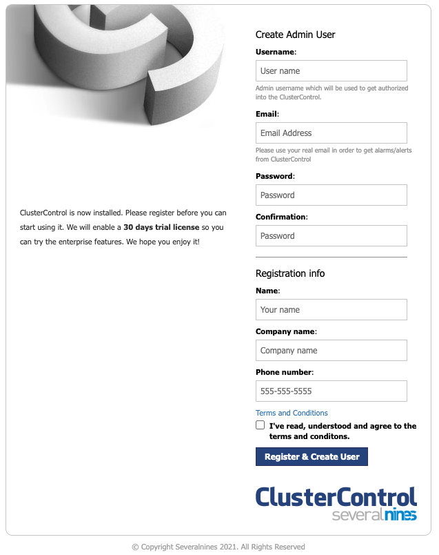

ClusterControl is a unified console to manage the full database lifecycle of the most popular open-source databases (on-premise or in the cloud). Provision, monitor and manage highly available database clusters in minutes with dashboards, backups, notifications, reports and automated recovery.

**Supported databases: MariaDB, MariaDB Galera Cluster, Percona, Percona XtraDB Cluster, MySQL Replication, MySQL Cluster (NDB), PostgreSQL, Redis, TimescaleDB and MongoDB ReplicaSet and Shards**

## Deploying the ClusterControl Marketplace App



**Software installation should complete within 2-5 minutes after the Linode has finished provisioning.**

## Configuration Options

### ClusterControl Options

Here are the additional options available for this Marketplace App:

| **Field** | **Description** |
|:--------------|:------------|
| **MySQL Root Password** | MySQL Root Password. *Required*. |
| **CMON User Password** | CMON user password. *Required*. |
| **Your Linode API Token** | Your Linode `API Token` is needed to create DNS records. If this is provided along with the `subdomain` and `domain` fields, the installation attempts to create DNS records via the Linode API. If you don't have a token, but you want the installation to create DNS records, you must [create one](/docs/platform/api/getting-started-with-the-linode-api/#get-an-access-token) before continuing. |
| **Subdomain** | The subdomain you wish the installer to create a DNS record for during setup. The suggestion given is `www`. The subdomain should only be provided if you also provide a `domain` and `API Token`. |
| **Domain** | The domain name where you wish to host your ClusterControl instance. The installer creates a DNS record for this domain during setup if you provide this field along with your `API Token`. |
| **SSL** | Would you like to use a free Let's Encrypt SSL certificate? (Uses the Linode's default rDNS if no domain is specified). |

### General Options

For advice on filling out the remaining options on the **Create a Linode** form, see [Getting Started > Create a Linode](/docs/guides/getting-started/#create-a-linode). That said, some options may be limited or recommended based on this Marketplace App:

- **Supported distributions:** Ubuntu 20.04 LTS
- **Recommended plan:** All plan types and sizes can be used.

## Getting Started after Deployment

### Access your ClusterControl App

To access your ClusterControl instance, Open a browser and navigate to the domain you created during in the beginning of your deployment or your Linode rDNS domain `https://li1234-555.members.linode.com`. Replace `https://li1234-555.members.linode.com` with your [Linode's RDNS domain](/docs/guides/remote-access/#resetting-reverse-dns).

From there you will see the welcome screen where you can enter the requested information to setup your ClusterControl instance:

Now that you’ve accessed your dashboard, checkout [the official ClusterControl documentation](https://docs.severalnines.com/docs/clustercontrol/) to learn how to further configure your instance.

