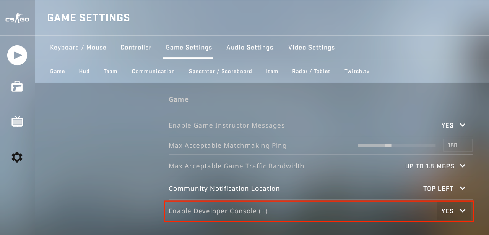
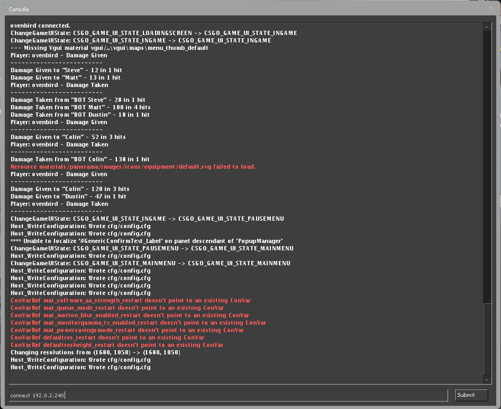



Counter-Strike: Global Offensive (CS:GO) is a fast-paced first person shooter. Teams compete against each other to complete objectives or to eliminate the opposing team.

A competitive match requires two teams of five players, but hosting your own server offers you control over team size and server location, so you and your friends can play with low latency. Up to 64 players can be hosted on a single server.

### Deploying the CS:GO Marketplace App



**Software installation should complete within 5-15 minutes after the Linode has finished provisioning.**

### CS:GO Options

You can configure your CS:GO App by providing values for the following fields:

| **Field**&nbsp;&nbsp;&nbsp;&nbsp;&nbsp;&nbsp;&nbsp;&nbsp;&nbsp;&nbsp;&nbsp;&nbsp;&nbsp;&nbsp;&nbsp;&nbsp;&nbsp;&nbsp;&nbsp;&nbsp;&nbsp;&nbsp;&nbsp;&nbsp; | **Description** |
|:--------------|:------------|
| **Game Server Login Token** | A Steam game server login token. This is required to publicly list your server. To get a Steam Token, visit the [Steam Game Server Account Management](https://steamcommunity.com/dev/managegameservers) page. *Required*. |
| **RCON Password** | Password for [RCON](https://developer.valvesoftware.com/wiki/Source_RCON_Protocol), a protocol which allows CS:GO administrators to remotely execute commands on the game server. Password must be at least 6 characters and contain each of the following characters: uppercase, lowercase, numeric, and special character. *Required*. |
| **Server Name** | Your CS:GO server's name. *Advanced Configuration*. |
| **Message of the Day** | The message of the day text that is displayed whenever a player logs on to the server. *Advanced Configuration*. |
| **CS:GO Server Password** | The password for the CS:GO server, if you want to make it password protected. Password must be at least 6 characters and contain each of the following characters: uppercase, lowercase, numeric, and special character. *Advanced Configuration*. |
| **Team Balance Enabled** | When enabled, automatically balances the number of players on a team. *Advanced Configuration*. |
| **Round Time Limit** | The time per round, in minutes. *Advanced Configuration*. |
| **Maximum Rounds** | The maximum amount of rounds before the map changes. *Advanced Configuration*. |
| **Buy Anywhere** | When enabled, allows teams to buy equipment from outside buy zones. *Advanced Configuration*. |
| **Friendly Fire Enabled** | Friendly fire allows teammates to damage and kill each other. *Advanced Configuration*. |

### General Options

For advice on filling out the remaining options on the **Create a Linode** form, see [Getting Started > Create a Linode](/docs/guides/getting-started/#create-a-linode). That said, some options may be limited or recommended based on this Marketplace App:

- **Supported distributions:** Debian 9
- **Recommended minimum plan:** 4GB Dedicated CPU Compute Instance

## Getting Started after Deployment

### Connect with the CS:GO Client

After CS:GO has finished installing, you will be able to access your game server by connecting to its IP address. To find your Linode's IPv4 address:

1. Click on the **Linodes** link in the [Linode Cloud Manager](https://cloud.linode.com) sidebar. You will see a list of all your Linodes.

1. Find the Linode you just created when deploying your app and select it.

1. Navigate to the **Networking** tab.

1. Your IPv4 address will be listed under the **Address** column in the **IPv4** table.

1. Copy the IPv4 address.

1. In CS:GO, use the back tick key (**&#96;**) to open the developer's console. If pressing the back tick key does not bring up the developer's console, you might need to enable it in the settings. Under *Game Settings* choose **Enable Developer's Console** and select **Yes**:

    

1. In the CS:GO developer's console, type `connect 192.0.2.240` and click **Submit**, where `192.0.2.240` is the IP address of your Linode.

    
If you included a **CS:GO Server Password** in your [CS:GO Options](#cs-go-options) when installing, submit `connect 192.0.2.240; password your_server_password` instead.
    

    

## Software Included

The CS:GO Marketplace App installs the following required software on your Linode:

| **Software** | **Description** |
|--------------|-----------------|
| [**Counter-Strike: Global Offensive**](https://store.steampowered.com/app/730/CounterStrike_Global_Offensive/) | Game server. |
| [**LinuxGSM**](https://linuxgsm.com) | A command line tool for the deployment and management of Linux game servers. |
| [**UFW**](https://wiki.ubuntu.com/UncomplicatedFirewall) | Firewall utility. Ports 27015, 27020/udp, 27005/udp, will allow outgoing and incoming traffic. |
| [**Fail2ban**](https://www.fail2ban.org/wiki/index.php/Main_Page) | Fail2Ban is an intrusion prevention software framework that protects computer servers from brute-force attacks. |


