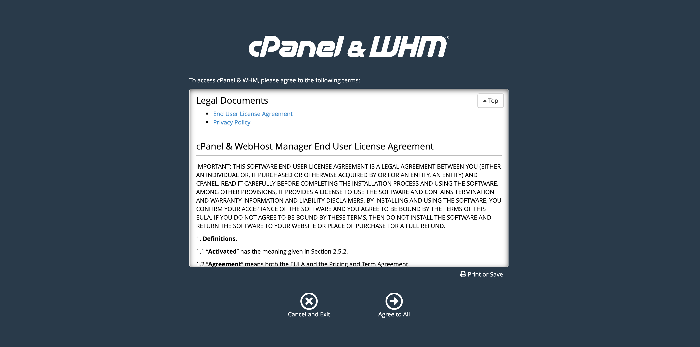

The [cPanel & WHM](https://cpanel.net/products/) Marketplace App streamlines publishing and managing a website on your Linode. cPanel & WHM is a Linux based web hosting control panel and platform that helps you create and manage websites, servers, databases, and more, with a suite of hosting automation and optimization tools.

## Deploying the cPanel Marketplace App



**Software installation should complete within 15 minutes after the Linode has finished provisioning.**

## Configuration Options

For advice on filling out the remaining options on the **Create a Linode** form, see [Getting Started > Create a Linode](/docs/guides/getting-started/#create-a-linode). That said, some options may be limited or recommended based on this Marketplace App:

- **Supported distributions:** CentOS 7
- **Recommended minimum plan:** 2GB Shared Compute Instance

## Getting Started after Deployment

### Access your cPanel Web Hosting Manager

1. Once your cPanel app has finished its installation, open a browser and navigate to `http://192.0.2.0:2087/`. Replace `192.0.2.0` with your [Linode's IP address](/docs/quick-answers/linode-platform/find-your-linodes-ip-address/).

    This will bring you to the Web Hosting Manager (WHM) login page. Enter `root` as the username and the root password you created when deploying your app. Click the **Log In** button.

    

1. You will be presented with cPanel and WHM's terms. Read through the terms and click on **Agree to All** if you agree and would like to continue.

    

1. You will be prompted to enter in an email address to receive status and error notifications. Enter in your preferred email address.

    You will also be prompted to provide nameserver's for your cPanel instance to use. By default, cPanel will fill in the values for you. Update the values with the nameservers you would like to use. If you are managing your own nameservers, enter them into the form or, if you will be using [Linode's DNS manager](/docs/guides/dns-manager/), enter in Linode's nameservers into the form. Click **Finish** to complete the initial login process.

    
Linode's nameservers are the following:

    ns1.linode.com.
    ns2.linode.com.
    ns3.linode.com.
    ns4.linode.com.
    ns5.linode.com.

See our [How do I set up DNS on cPanel?](https://www.linode.com/community/questions/19216/how-do-i-set-up-dns-on-cpanel) community question and answer for details related to cPanel and Linode nameservers.
    

    

1. You will be brought to your WHM's home page where you can continue to configure your cPanel instance.

    
Your cPanel Marketplace App installation will automatically receive a free 15-day trial license. You must [purchase a new cPanel & WHM license](https://documentation.cpanel.net/display/CKB/How+to+Purchase+a+cPanel+License) before the end of this trial period. At the end of your trial period your license will expire.
    

    

    Now that you've accessed your WHM homepage, read [cPanel and WHM's user documentation](https://documentation.cpanel.net/display/78Docs/WebHost+Manager+-+WHM+User+Documentation) to learn how to further configure your cPanel instance.


