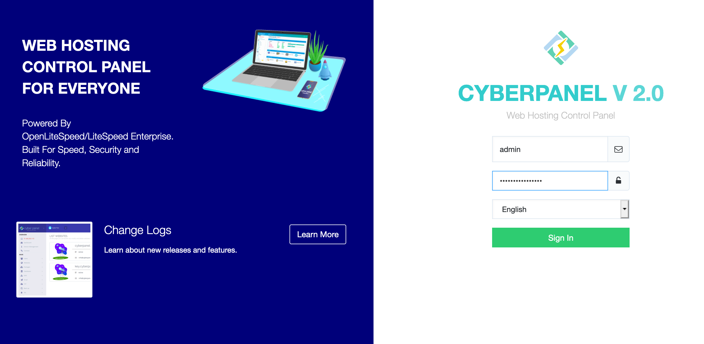
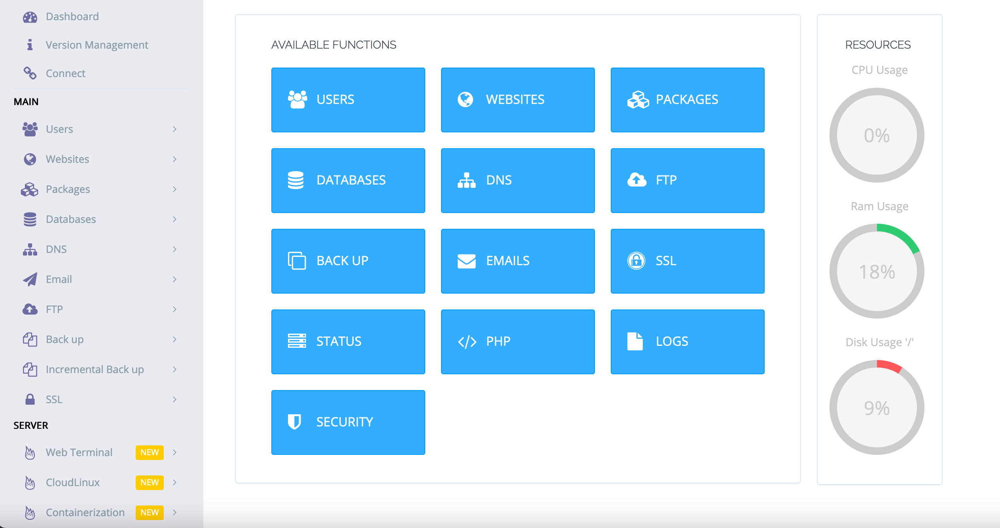

CyberPanel is a next-generation hosting control panel, which provides a friendly user interface. The CyberPanel app provides a One-Click installer for OpenLiteSpeed, LSCache, WordPress, Prestashop, Joomla, Magento, and Git. It also automates the initial setup for components like Mail service and DNS, to reduce the time it takes to get set up for hosting.

## Deploying the CyberPanel Marketplace App



**Software installation should complete within 10-20 minutes after the Linode has finished provisioning.**

## Configuration Options

For advice on filling out the remaining options on the **Create a Linode** form, see [Getting Started > Create a Linode](/docs/guides/getting-started/#create-a-linode). That said, some options may be limited or recommended based on this Marketplace App:

- **Supported distributions:** CentOS 8, CentOS 7, Ubuntu 18.04, and Ubuntu 20.04
- **Recommended minimum plan:** All plan types and sizes can be used with CyberPanel.

## Getting Started after Deployment

### Access your CyberPanel App

1.  When the installation completes, log into your Linode via SSH, replacing `192.0.2.0` with your [Linode's IP address](/docs/quick-answers/linode-platform/find-your-linodes-ip-address/), and entering your Linode's root password when prompted:

         ssh root@192.0.2.0

1.  You should see the CyberPanel welcome messsage when logging into the Linode. This will include instructions for accessing CyberPanel, phpMyAdmin, and Rainloop in your web browser. Replace `192.0.2.0` with your Linode's IP address.

    
Welcome to LiteSpeed One-Click CyberPanel Server.
To keep this server secure, the firewalld is enabled.
CyberPanel One-Click Quickstart guide:
* https://docs.litespeedtech.com/cloud/images/cyberpanel/

In a web browser, you can view:
* CyberPanel: https://192.0.2.0:8090
* phpMyAdmin: https://192.0.2.0:8090/phpmyadmin
* Rainloop:   https://192.0.2.0:8090/rainloop

On the server:
* You can get the CyberPanel admin password with the following command:
sudo cat /root/.litespeed_password
* You can get the Mysql cyberpanel user password with the following command:
sudo cat /root/.db_password

System Status:
Load : 0.06, 0.53, 0.43
CPU  : 30.0763%
RAM  : 355/3936MB (9.02%)
Disk : 7/79GB (10%)

Your CyberPanel is up to date
********************************************************************************

Do you wish to update the system now? This will update the web server as well. [Y/n]?


1.  Obtain your CyberPanel administrator password from the command line.

        cat .litespeed_password

     You should see output similar to the following:

    
admin_pass=qN1Jo7XKCekN8ZAV


    In the above example, the password is `qN1Jo7XKCekN8ZAV`.

1.  Visit the CyberPanel administration panel by visiting your Linode's IP in a web browser on port 8090. For example, if your IP address is `192.0.2.0`, you would visit `https://192.0.20:8090`.

    
CyberPanel uses a self-signed certificate issued by LiteSpeedCommunity. Because it is not signed by a common Certificate Authority, your browser may warn about the security of the connection and require you to add a security exception.


1.  Log in to the administration panel using the username `admin` and the password you obtained in step three.

    

1.  You should now see the administration panel.

    

     Now that you've accessed your dashboard, checkout the [official CyberPanel documentation](https://docs.litespeedtech.com/cloud/images/cyberpanel/) to learn how to further configure your instance.

