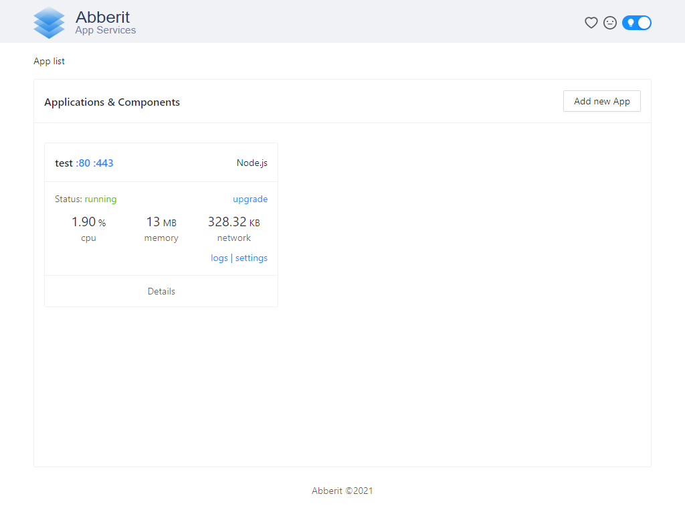
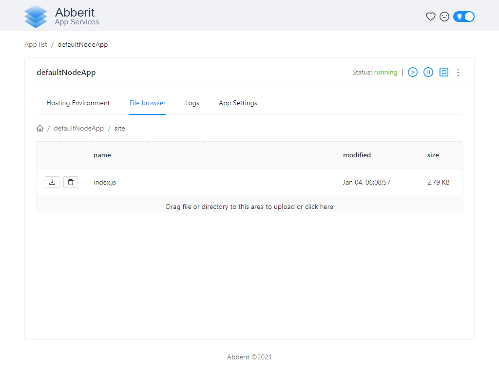

## Abberit Node.js Stack Marketplace App

[Node.js](https://nodejs.dev/) is a free, open-sourced, cross-platform JavaScript run-time environment that lets developers write command line tools and server-side scripts outside of a browser.

After you deploy your Abberit Node.js Marketplace App, you can upload your existing Node.js application code to it or use a Node.js framework to write a new application on your Linode.

## Deploy a Abberit Node.js Stack with Marketplace Apps



The [Abberit Node.js Stack Options](#node.js-stack-options) section of this guide provides details on all available configuration options for this app.

### Abberit Node.js Stack Options

| **Field** | **Description** |
|:--------------|:------------|
| **Admin Panel Username** | The username to the Administrator Panel used to manage your Abberit Node.js application. This is not the same as your Linode's root account username. *Required*. |
| **Admin Panel Password** | The password to the Administrator Panel used to manage your Abberit Node.js application. This is not the same as your Linode's root password. *Required*. |

### Linode Options

After providing the app-specific options, enter configuration values for your Linode server:

| **Configuration** | **Description** |
|:--------------|:------------|
| **Select an Image** | Debian 10 is currently the only image supported by the Abberit Node.js Marketplace App, and it is pre-selected on the Linode creation page. *Required*. |
| **Region** | The region where you would like your Linode to reside. In general, it's best to choose a location that's closest to you. For more information on choosing a DC, review the [How to Choose a Data Center](/docs/guides/how-to-choose-a-data-center) guide. You can also generate [MTR reports](/docs/guides/diagnosing-network-issues-with-mtr/) for a deeper look at the network routes between you and each of our data centers. *Required*. |
| **Linode Plan** | Your Linode's [hardware resources](/docs/guides/how-to-choose-a-linode-plan/#hardware-resource-definitions). The Linode plan you deploy your Node.js stack on should account for the estimated workload. If you are standing up a simple web page, you can use a 1GB Linode (Nanode) or 2GB Linode. If you are standing up a larger or more robust web app, then consider a plan with higher RAM and CPU allocations. If you decide that you need more or fewer hardware resources after you deploy your app, you can always [resize your Linode](/docs/guides/resizing-a-linode/) to a different plan. *Required*. |
| **Linode Label** | The name for your Linode, which must be unique between all of the Linodes on your account. This name is how you identify your server in the Cloud Manager’s Dashboard. *Required*. |
| **Root Password** | The primary administration password for your Linode instance. This password must be provided when you log in to your Linode via SSH. The password must meet the complexity strength validation requirements for a strong password. Your root password can be used to perform any action on your server, so make it long, complex, and unique. *Required*. |

When you've provided all required Linode Options, click on the **Create** button. **Your Node.js Stack app will complete installation anywhere between 2-3 minutes after your Linode has finished provisioning.**

## Getting Started After Deployment

### Accessing the Administration Panel

After the Abberit Node.js Marketplace app has finished installing, you can access the Administration panel. Navigate to your Linode's [public IP address](/docs/guides/getting-started/#find-your-linode-s-ip-address) in a browser. Your default Node.js app available at port 80 (the standard `http` port) and your Administration Panel is available at port 8081 (ie, `http://192.0.2.0:8081`).

CPU, Memory and Network realtime metrics are available in App List view of Administration Panel:

Logs are available in App Details view of Administration Panel:

### Update your Abberit Node.js Application

Use the File Browser tab in App Details view of Administration Panel to upload new version of Node.js application:

### Set up a Domain for Your Node.js App:
To add a domain to for Node.js app, consult [our DNS manager](docs/guides/common-dns-configurations/#set-up-a-domain) guide.

### Setting up SSL for Your Abberit Node.js App
A free SSL certificate can be obtained for your Node.js App by using Certbot. For more info, [visit Abberit's instructions on how to obtain a free SSL certificate](https://abberit.io/docs/app-https/#obtain-free-ssl-certificate-using-certbot).

## Software Included

The Abberit Node.js Stack Marketplace App installs the following software on your Linode:

| **Software** | **Description** |
|:--------------|:------------|
| [**Docker**](https://docker.com) | Modern platform which can be used to manage your Node.js application and its components such as Redis, MySQL, PostgreSQL, or Nginx.|
| [**Abberit App Services (Administration Panel)**](https://abberit.io/docs/) | Administration Panel which you can use to simplify day to day operations with your Node.js application and Docker platform. |

*The Abberit Node.js One-Click App was built for Linode by Abberit App Services. For support regarding app deployment, contact Linode Support. For support regarding the tool or software itself, contact the Abberit App Services Team.*