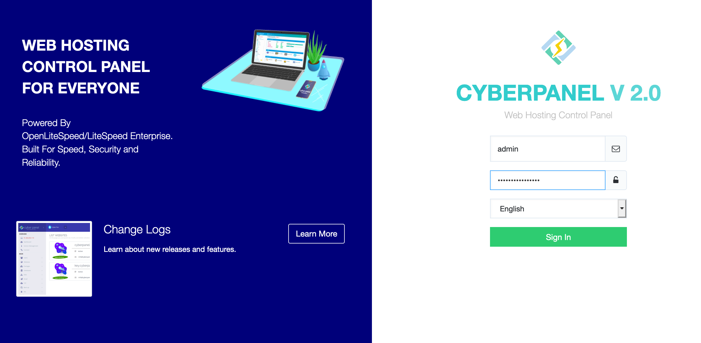

## CyberPanel Marketplace App

<!-- Intro paragraph describing the app and what it accomplishes -->
CyberPanel is a next-generation hosting control panel, which provides a friendly user interface.

The CyberPanel image provides a One-Click installer to automatically install OpenLiteSpeed, LSCache, WordPress, Prestashop, Joomla, Magento and git. It also automates the initial setup for components like Mail service and DNS, to reduce the time it takes to get set up for hosting.

### Deploy a CyberPanel Marketplace App

<!-- shortguide used by every Marketplace app to describe how to deploy from the Cloud Manger -->



### Linode Options

Provide configurations for your Linode server:
<!-- Be sure to edit the Select an Image and Linode Plan to match app's needs -->

| **Configuration** | **Description** |
|:--------------|:------------|
| **Select an Image** | Debian 10 is currently the only image supported by the CyberPanel Marketplace App, and it is pre-selected on the Linode creation page. *Required*. |
| **Region** | The region where you would like your Linode to reside. In general, it's best to choose a location that's closest to you. For more information on choosing a DC, review the [How to Choose a Data Center](/docs/platform/how-to-choose-a-data-center) guide. You can also generate [MTR reports](/docs/networking/diagnostics/diagnosing-network-issues-with-mtr/) for a deeper look at the network routes between you and each of our data centers. *Required*. |
| **Linode Plan** | Your Linode's [hardware resources](/docs/platform/how-to-choose-a-linode-plan/#hardware-resource-definitions). CyberPanel can be supported on any size Linode, but we suggest you deploy your CyberPanel App on a Linode plan that reflects how you plan on using it. If you decide that you need more or fewer hardware resources after you deploy your app, you can always [resize your Linode](/docs/platform/disk-images/resizing-a-linode/) to a different plan. *Required*. |
| **Linode Label** | The name for your Linode, which must be unique between all of the Linodes on your account. This name is how you identify your server in the Cloud Manager Dashboard. *Required*. |
| **Root Password** | The primary administrative password for your Linode instance. This password must be provided when you log in to your Linode via SSH. The password must meet the complexity strength validation requirements for a strong password. Your root password can be used to perform any action on your server, so make it long, complex, and unique. *Required*. |

<!-- the following disclaimer lets the user know how long it will take
     to deploy the app -->
After providing all required Linode options, click on the **Create** button. **Your CyberPanel App will complete installation anywhere between 10-20 minutes after your Linode has finished provisioning**.

## Getting Started after Deployment
<!-- the following headings and paragraphs outline the steps necessary
     to access and interact with the Marketplace app. -->
### Access your CyberPanel App
1. When the installation completes, you should see the CyberPanel welcome messsage when logging into the Linode via SSH. This will include instructions for accessing CyberPanel, phpMyAdmin, and Rainloop in your web browser. _Replace `192.0.2.0` with your [Linode's IP address](/docs/quick-answers/linode-platform/find-your-linodes-ip-address/)._

     ```
     Welcome to LiteSpeed One-Click CyberPanel Server.
     To keep this server secure, the firewalld is enabled.
     CyberPanel One-Click Quickstart guide:
     * https://docs.litespeedtech.com/cloud/images/cyberpanel/

     In a web browser, you can view:
     * CyberPanel: https://192.0.2.0:8090
     * phpMyAdmin: https://192.0.2.0:8090/phpmyadmin
     * Rainloop:   https://192.0.2.0:8090/rainloop

     On the server:
     * You can get the CyberPanel admin password with the following command:
     sudo cat /home/ubuntu/.litespeed_password
     * You can get the Mysql cyberpanel user password with the following command:
     sudo cat /home/ubuntu/.db_password

     System Status:
     Load : 0.06, 0.53, 0.43
     CPU  : 30.0763%
     RAM  : 355/3936MB (9.02%)
     Disk : 7/79GB (10%)

     Your CyberPanel is up to date
     ********************************************************************************

     Do you wish to update the system now? This will update the web server as well. [Y/n]?
     ```

1. Obtain your CyberPanel admin password from the command line and then login by visiting your Linode's IP in a web browser on port 8090.
     
     CyberPanel uses a self-signed certificate issued by LiteSpeedCommunity. Because it is not signed by a common Certificate Authority, your browser may warn aout the security of the connection and require you to add a security exception.

    ```
    cat .litespeed_password
    ...
    admin_pass=qN1Jo7XKCekN8ZAV
    ```

    
    

 Now that you've accessed your dashboard, checkout the [official CyberPanel documentation](https://docs.litespeedtech.com/cloud/images/cyberpanel/) to learn how to further configure your instance.


<!-- the following shortcode informs the user that Linode does not provide automatic updates
     to the Marketplace app, and that the user is responsible for the security and longevity
     of the installation. -->
