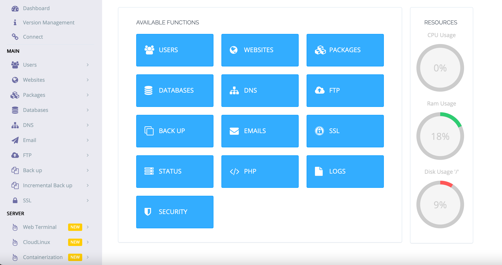

## CyberPanel Marketplace App

CyberPanel is a next-generation hosting control panel, which provides a friendly user interface. The CyberPanel app provides a One-Click installer for OpenLiteSpeed, LSCache, WordPress, Prestashop, Joomla, Magento, and Git. It also automates the initial setup for components like Mail service and DNS, to reduce the time it takes to get set up for hosting.

### Deploy a CyberPanel Marketplace App



### Linode Options

Provide configurations for your Linode server:

| **Configuration** | **Description** |
|:--------------|:------------|
| **Select an Image** | The image or Distro you would like the Marketplace App to be built on. The Cyberpanel Marketplace App is currently supported by CentOS 8, CentOS 7, Ubuntu 18.04, and Ubuntu 20.04. *Required*. |
| **Region** | The region where you would like your Linode to reside. In general, it's best to choose a location that's closest to you. For more information on choosing a DC, review the [How to Choose a Data Center](/docs/platform/how-to-choose-a-data-center) guide. You can also generate [MTR reports](/docs/networking/diagnostics/diagnosing-network-issues-with-mtr/) for a deeper look at the network routes between you and each of our data centers. *Required*. |
| **Linode Plan** | Your Linode's [hardware resources](/docs/platform/how-to-choose-a-linode-plan/#hardware-resource-definitions). CyberPanel can be supported on any size Linode, but we suggest you deploy your CyberPanel App on a Linode plan that reflects how you plan on using it. If you decide that you need more or fewer hardware resources after you deploy your app, you can always [resize your Linode](/docs/platform/disk-images/resizing-a-linode/) to a different plan. *Required*. |
| **Linode Label** | The name for your Linode, which must be unique between all of the Linodes on your account. This name is how you identify your server in the Cloud Manager Dashboard. *Required*. |
| **Root Password** | The primary administrative password for your Linode instance. This password must be provided when you log in to your Linode via SSH. The password must meet the complexity strength validation requirements for a strong password. Your root password can be used to perform any action on your server, so make it long, complex, and unique. *Required*. |

After providing all required Linode options, click on the **Create** button. **Your CyberPanel App will complete installation anywhere between 10-20 minutes after your Linode has finished provisioning**.

## Getting Started after Deployment

### Access your CyberPanel App
1.  When the installation completes, log into your Linode via SSH, replacing `192.0.2.0` with your [Linode's IP address](/docs/quick-answers/linode-platform/find-your-linodes-ip-address/), and entering your Linode's root password when prompted:

         ssh root@192.0.2.0

1.  You should see the CyberPanel welcome messsage when logging into the Linode. This will include instructions for accessing CyberPanel, phpMyAdmin, and Rainloop in your web browser. Replace `192.0.2.0` with your Linode's IP address.

    
Welcome to LiteSpeed One-Click CyberPanel Server.
To keep this server secure, the firewalld is enabled.
CyberPanel One-Click Quickstart guide:
* https://docs.litespeedtech.com/cloud/images/cyberpanel/

In a web browser, you can view:
* CyberPanel: https://192.0.2.0:8090
* phpMyAdmin: https://192.0.2.0:8090/phpmyadmin
* Rainloop:   https://192.0.2.0:8090/rainloop

On the server:
* You can get the CyberPanel admin password with the following command:
sudo cat /root/.litespeed_password
* You can get the Mysql cyberpanel user password with the following command:
sudo cat /root/.db_password

System Status:
Load : 0.06, 0.53, 0.43
CPU  : 30.0763%
RAM  : 355/3936MB (9.02%)
Disk : 7/79GB (10%)

Your CyberPanel is up to date
********************************************************************************

Do you wish to update the system now? This will update the web server as well. [Y/n]?


1.  Obtain your CyberPanel administrator password from the command line.

        cat .litespeed_password

     You should see output similar to the following:

    
admin_pass=qN1Jo7XKCekN8ZAV


    In the above example, the password is `qN1Jo7XKCekN8ZAV`.

1.  Visit the CyberPanel administration panel by visiting your Linode's IP in a web browser on port 8090. For example, if your IP address is `192.0.2.0`, you would visit `https://192.0.20:8090`.

    
CyberPanel uses a self-signed certificate issued by LiteSpeedCommunity. Because it is not signed by a common Certificate Authority, your browser may warn about the security of the connection and require you to add a security exception.


1.  Log in to the administration panel using the username `admin` and the password you obtained in step three.

    

1.  You should now see the administration panel.

    

     Now that you've accessed your dashboard, checkout the [official CyberPanel documentation](https://docs.litespeedtech.com/cloud/images/cyberpanel/) to learn how to further configure your instance.

