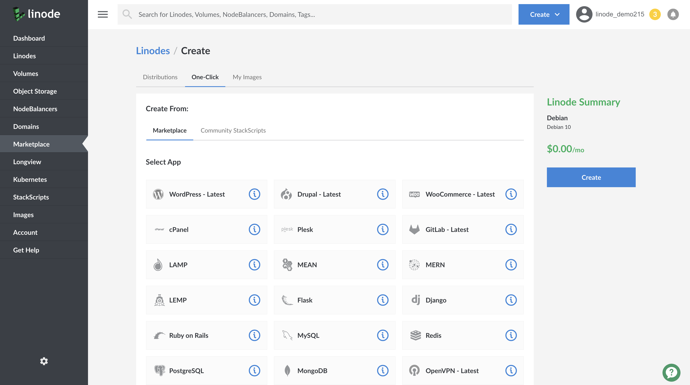

<!-- Use title convention: Deploy a X Marketplace App. -->

Linode's App Marketplace allows you to easily deploy software on a Linode using the Linode Cloud Manager. To access Linode's App Marketplace:

1. Log in to your [Linode Cloud Manager](https://cloud.linode.com) account.

1. From the Linode dashboard, click on the **Marketplace** button in the left-hand navigation menu.

1. The Linode creation page appears, with the **Marketplace** tab pre-selected.

1. Under the **Select App** section, select the app you would like to deploy:

    

1. Once you have selected the app, proceed to the app's **Options** section and provide values for the required fields.
