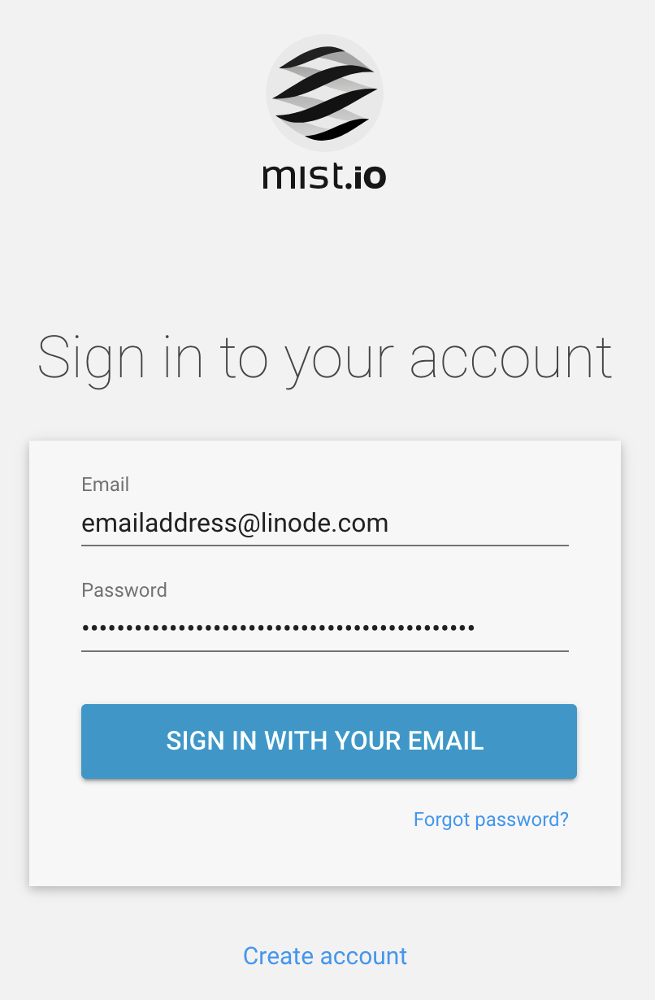

## Mist.io Marketplace App

Mist.io is an open-source multi-cloud management platform that can help users to control their cloud infrastructure across a number of different sources.

## Deploy Mist.io with Marketplace Apps



### Linode Options

After providing the app-specific options, provide configurations for your Linode server:

| **Configuration** | **Description** |
|-------------------|-----------------|
| **Select an Image** | Ubuntu 20.04 and Ubuntu 18.04 are currently the only images supported by the Mist.io Marketplace App, and are pre-selected on the Linode creation page. *Required* |
| **Region** | The region where you would like your Linode to reside. In general, it's best to choose a location that's closest to you. For more information on choosing a DC, review the [How to Choose a Data Center](/docs/platform/how-to-choose-a-data-center) guide. You can also generate [MTR reports](/docs/networking/diagnostics/diagnosing-network-issues-with-mtr/) for a deeper look at the network routes between you and each of our data centers. *Required*. |
| **Linode Plan** | Your Linode's [hardware resources](/docs/platform/how-to-choose-a-linode-plan/#hardware-resource-definitions). A 4GB Linode is recommended for your FileCloud App. The Linode plan that you select should be appropriate for the amount of data transfer, users, storage, and other stress that may affect the performance of server.  *Required* |
| **Linode Label** | The name for your Linode, which must be unique between all of the Linodes on your account. This name will be how you identify your server in the Cloud Manager’s Dashboard. *Required*. |
| **Root Password** | The primary administrative password for your Linode instance. This password must be provided when you log in to your Linode via SSH. The password must meet the complexity strength validation requirements for a strong password. Your root password can be used to perform any action on your server, so make it long, complex, and unique. *Required* |

When you've provided all required Linode Options, click on the **Create** button. **Your Mist.io app will complete installation anywhere between 3-5 minutes after your Linode has finished provisioning**.

## Setting up the Mist.io Server

Once the Mist.io server is successfully created, a few additional steps must be completed to be able to begin using the application. Enter the [public IP address](/docs/guides/find-your-linodes-ip-address/) of the Mist.io Linode into a web browser to access the application and proceed.

### Create a New Account

1. Click on the **Get Started** button at the center of the page.

1. Enter your `Name` and `Email Address` in their respective fields, and click on the **Sign Up With Your Email** button to create an account.

1. The Mist.io application uses an internal mock mail server to retrieve all account creation emails. To receive your activation e-mail, [create an SSH connection to your Linode](https://www.linode.com/docs/guides/getting-started/#connect-to-your-linode-via-ssh) using the public IPv4 address and the root password you had set up prior to the app creation. Replace the example IP address with your Linode’s IP address:

        ssh root@198.51.100.4

1. Once you are connected, enter the following command to navigate the `mist` directory and search the mock mail server for your activation link:

        cd mist && sudo docker-compose logs mailmock | grep -o 'http://localhost/confirm.*'

1. You should see output similar to the following:

  
    http://localhost/confirm?key=2e7f315678c1fcdefd29c5d5d444444c492848238a1456670ed5a59ac9c85


Copy your own output to use in the next step.

1. Replace `localhost` in the url the output provides with your Linode's public IP address, and enter the address into your web browser:

        http://198.51.100.4/confirm?key=2e7f315678c1fcdefd29c5d5d004850c492848238afe44a5ce15ed5a59ac9c85

1. Enter a strong password and hit **Enter** to complete the account creation process.

### Next Steps

After creating your account, create a name for your organization, [Add Clouds](https://docs.mist.io/category/75-adding-clouds-bare-metal-and-containers) you'll be managing, as well as any separate [virtual machines, containers,](https://docs.mist.io/category/158-machines) and more.