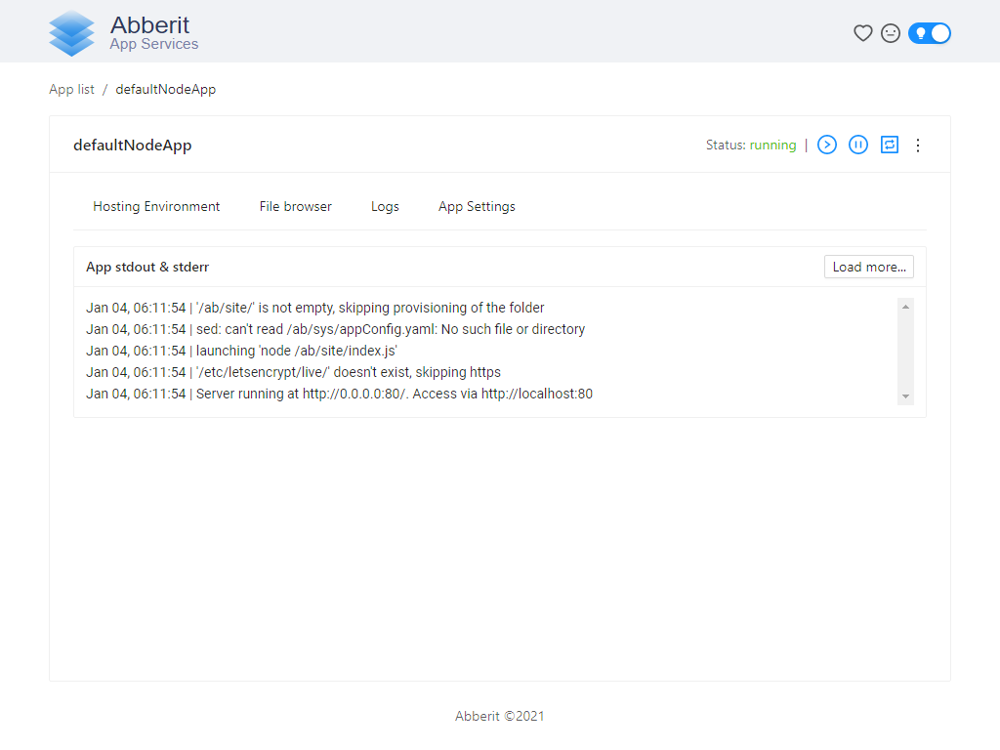

## Node.js Stack Marketplace App

[Node.js](https://nodejs.dev/) is a free, open-sourced, cross-platform JavaScript run-time environment that lets developers write command line tools and server-side scripts outside of a browser.

After you deploy your Node.js Marketplace App, you can upload your existing Node.js application code to it or use a Node.js framework to write a new application on your Linode.

### Deploy a Node.js Stack with Marketplace Apps



The [Node.js Stack Options](#node.js-stack-options) section of this guide provides details on all available configuration options for this app.

### Node.js Stack Options

| **Field** | **Description** |
|:--------------|:------------|
| **Admin Panel Username** | The username to your Admin Panel used to manage your Node.js application. This is not the same as your Linode's root account. *Required*. |
| **Admin Panel Password** | The password to your Admin Panel used to manage your Node.js application. This is not the same as your Linode's root password. *Required*. |

### Linode Options

After providing the app-specific options, enter configuration values for your Linode server:

| **Configuration** | **Description** |
|:--------------|:------------|
| **Select an Image** | Debian 10 is currently the only image supported by the Node.js Marketplace App, and it is pre-selected on the Linode creation page. *Required*. |
| **Region** | The region where you would like your Linode to reside. In general, it's best to choose a location that's closest to you. For more information on choosing a DC, review the [How to Choose a Data Center](/docs/guides/how-to-choose-a-data-center) guide. You can also generate [MTR reports](/docs/guides/diagnosing-network-issues-with-mtr/) for a deeper look at the network routes between you and each of our data centers. *Required*. |
| **Linode Plan** | Your Linode's [hardware resources](/docs/guides/how-to-choose-a-linode-plan/#hardware-resource-definitions). The Linode plan you deploy your Node.js stack on should account for the estimated workload. If you are standing up a simple web page, you can use a 1GB Linode (Nanode) or 2GB Linode. If you are standing up a larger or more robust web app, then consider a plan with higher RAM and CPU allocations. If you decide that you need more or fewer hardware resources after you deploy your app, you can always [resize your Linode](/docs/guides/resizing-a-linode/) to a different plan. *Required*. |
| **Linode Label** | The name for your Linode, which must be unique between all of the Linodes on your account. This name will be how you identify your server in the Cloud Manager’s Dashboard. *Required*. |
| **Root Password** | The primary administrative password for your Linode instance. This password must be provided when you log in to your Linode via SSH. The password must meet the complexity strength validation requirements for a strong password. Your root password can be used to perform any action on your server, so make it long, complex, and unique. *Required*. |

When you've provided all required Linode Options, click on the **Create** button. **Your Node.js Stack app will complete installation anywhere between 2-3 minutes after your Linode has finished provisioning.**

### Getting Started After Deployment

After your Node.js stack has finished deploying, you can:

- [Navigate to the public IP address](/docs/guides/getting-started/#find-your-linode-s-ip-address) of your Linode in a browser. You will see default Node.js app available at the port :80 and your Admin Panel available at the port :8081.

- See logs and metrics of your Node.js application in Admin Panel.
    - CPU, Memory and Network realtime metrics are available in App List view of Admin Panel:
    
    - Logs are available in App Details view of Admin Panel:
    

- Update your Node.js application using Admin Panel.
    - Use File Browser tab in App Details view of Admin Panel to upload new version of Node.js application:
    

- [Connect to your Linode via SSH](/docs/guides/getting-started/#connect-to-your-linode-via-ssh). You will need your Linode's root password to proceed.

-   Set up a domain for your NodeJS App:
    - Add your domain to [our DNS manager](docs/guides/common-dns-configurations/#set-up-a-domain)
    
- Set up free SSL using certbot:
    - Obtain free SSL certificate:
      1. Stop your Node.js application in Admin Panel.
      1. Login to your VM via SSH.
      2. Execute docker image of certbot: `docker run -it --rm --name certbot -p 80:80 -p 443:443 -v "/etc/letsencrypt:/etc/letsencrypt" -v "/var/lib/letsencrypt:/var/lib/letsencrypt" certbot/certbot certonly`
      4. Start your Node.js application in Admin Panel.
    - Update your Node.js application to use the SSL certificate:
```javascript
const dir = "/etc/letsencrypt/live/" + <your domain name>
const options = {
  key: fs.readFileSync(`${dir}/privkey.pem`),
  cert: fs.readFileSync(`${dir}/cert.pem`)
};
const httpsServer = options !== null ? https.createServer(options, requestListener) : undefined;
httpsServer.listen(httpsPort, hostname, () => {
  console.log(`Server running at https://${hostname}:${httpsPort}/. Access via https://localhost:${httpsPort}`);
});
```

### Software Included

The Node.js Stack Marketplace App will install the following software on your Linode:

| **Software** | **Description** |
|:--------------|:------------|
| [**Docker**](https://docker.com) | Modern platform which can be used to manage your Node.js application and its components such as Redis, MySQL, PostgreSQL, or Nginx.|
| [**Abberit App Services (Admin Panel)**](https://abberit.io) | Admin Panel which you can use to simplify day to day operations with your Node.js application and Docker platform. |

*The NodeJS One-Click App was built for Linode by Abberit App Services. Support regarding app deployment, contact Linode Support. For support regarding the tool or software itself, use the information in the sidebar to contact the Abberit App Services Team.*