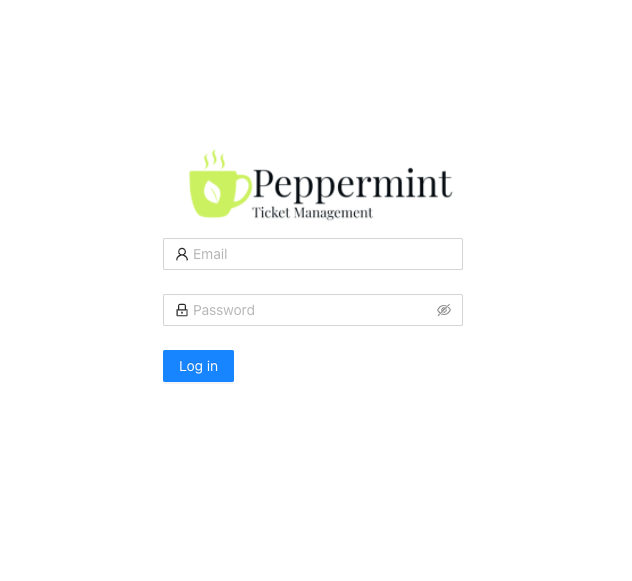

## Peppermint Marketplace App

<!-- Intro paragraph describing the app and what it accomplishes. -->
Peppermint Ticket Management is a ticket management system that allows teams and solo users the ability create & track tickets, todo items, and more. The project is meant to provide help desks and services desks manage internal and customer requests, but Peppermint is a good solution for anyone looking for a ticket management system that is free and easy to use.


Peppermint is still in Alpha and is not recommended for production use yet.


### Deploy a Peppermint Marketplace App

<!-- shortguide used by every Marketplace app to describe how to deploy from the Cloud Manger -->



### Linode Options

After providing the App-specific options, provide configurations for your Linode server:
<!-- Be sure to edit the Select an Image and Linode Plan to match app's needs -->

| **Configuration** | **Description** |
|:--------------|:------------|
| **Select an Image** | Debian 10 is currently the only image supported by the Peppermint Marketplace App, and it is pre-selected on the Linode creation page. *Required*. |
| **Region** | The region where you would like your Linode to reside. In general, it's best to choose a location that's closest to you. For more information on choosing a DC, review the [How to Choose a Data Center](/docs/platform/how-to-choose-a-data-center) guide. You can also generate [MTR reports](/docs/networking/diagnostics/diagnosing-network-issues-with-mtr/) for a deeper look at the network routes between you and each of our data centers. *Required*. |
| **Linode Plan** | Your Linode's [hardware resources](/docs/platform/how-to-choose-a-linode-plan/#hardware-resource-definitions). Peppermint can be supported on any size Linode, but we suggest you deploy your Peppermint App on a Linode plan that reflects how you plan on using it. If you decide that you need more or fewer hardware resources after you deploy your app, you can always [resize your Linode](/docs/platform/disk-images/resizing-a-linode/) to a different plan. *Required*. |
| **Linode Label** | The name for your Linode, which must be unique between all of the Linodes on your account. This name is how you identify your server in the Cloud Manager Dashboard. *Required*. |
| **Root Password** | The primary administrative password for your Linode instance. This password must be provided when you log in to your Linode via SSH. The password must meet the complexity strength validation requirements for a strong password. Your root password can be used to perform any action on your server, so make it long, complex, and unique. *Required*. |

<!-- the following disclaimer lets the user know how long it will take
     to deploy the app -->
After providing all required Linode Options, click on the **Create** button. **Your Peppermint App will complete installation anywhere between 2-5 minutes after your Linode has finished provisioning**.

## Getting Started after Deployment
<!-- the following headings and paragraphs outline the steps necessary
     to access and interact with the Marketplace app. -->
### Access your Peppermint App
After Peppermint has finished installing, you can access your Peppermint server with your Linode's IPv4 address. Copy your Linode’s IPv4 address from the [Linode Cloud Manager](https://cloud.linode.com), and then connect to the server in your browser using your Linode's IPv4 address and port `5000`(for example `192.0.2.0:5000`).



The default credentials to login to your Peppermint Peppermint Ticket Management Panel are:

```
email: admin@admin.com
password: 1234
```

Once you login to the Peppermint Ticket Management Panel, you need to update the email and password you used to log in. You can do so by clicking the settings gear logo in the top right corner.


For more on Peppermint, consult the following resources:

- [Peppermint Github](https://github.com/Peppermint-Lab/Peppermint/blob/master/README.md)
- [Peppermint Documentation](https://docs.pmint.dev/)

