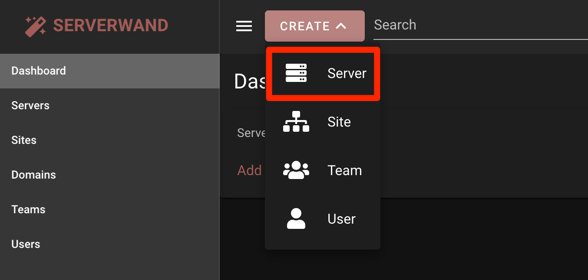
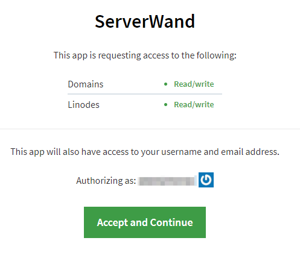

## ServerWand Marketplace App

[ServerWand](https://serverwand.com) is a magical control panel for managing websites and servers. Host multiple sites on a single server, manage apps, firewall, databases, backups, system users, cron jobs, SSL and email with an intuitive interface.

## Deploy ServerWand with Marketplace Apps



### Linode Options

After providing the app-specific options, provide configurations for your Linode server:

| **Configuration** | **Description** |
|-------------------|-----------------|
| **Select an Image** | Ubuntu 18.04 LTS is currently the only images supported by the ServerWand Marketplace App, and it is pre-selected on the Linode creation page. *Required* |
| **Region** | The region where you would like your Linode to reside. In general, it's best to choose a location that's closest to you. For more information on choosing a DC, review the [How to Choose a Data Center](/docs/platform/how-to-choose-a-data-center) guide. You can also generate [MTR reports](/docs/networking/diagnostics/diagnosing-network-issues-with-mtr/) for a deeper look at the network routes between you and each of our data centers. *Required*. |
| **Linode Plan** | Your Linode's [hardware resources](/docs/platform/how-to-choose-a-linode-plan/#hardware-resource-definitions). You can use any size Linode for your ServerWand App. The Linode plan that you select should be appropriate for the amount of data transfer, users, storage, and other stress that may affect the performance of server.  *Required* |
| **Linode Label** | The name for your Linode, which must be unique between all of the Linodes on your account. This name will be how you identify your server in the Cloud Manager’s Dashboard. *Required*. |
| **Root Password** | The primary administrative password for your Linode instance. This password must be provided when you log in to your Linode via SSH. The password must meet the complexity strength validation requirements for a strong password. Your root password can be used to perform any action on your server, so make it long, complex, and unique. *Required* |

When you've provided all required Linode Options, click on the **Create** button. **Your ServerWand app will complete installation anywhere between 2-5 minutes after your Linode has finished provisioning**.

## Getting Started After Deployment

Once your ServerWand is up and running, you can connect it to your ServerWand account and manage it through the ServerWand control panel.

### Connect your Linode to ServerWand

1. Register or Sign in to the [ServerWand Control Panel](https://manage.serverwand.com/).

1. Click the **Create** button and select **Server**.

    

1. On the Server details page, click **Choose** and then select **Linode**.

1. When prompted for access permissions, click **Accept and Continue**.

    

1. After returning to ServerWand, select your Linode from the **Server** dropdown menu.

1. Give your server a name and click **Save**.

1. ServerWand will connect to your Linode and install all the necessary software so that it can then be managed in ServerWand.


