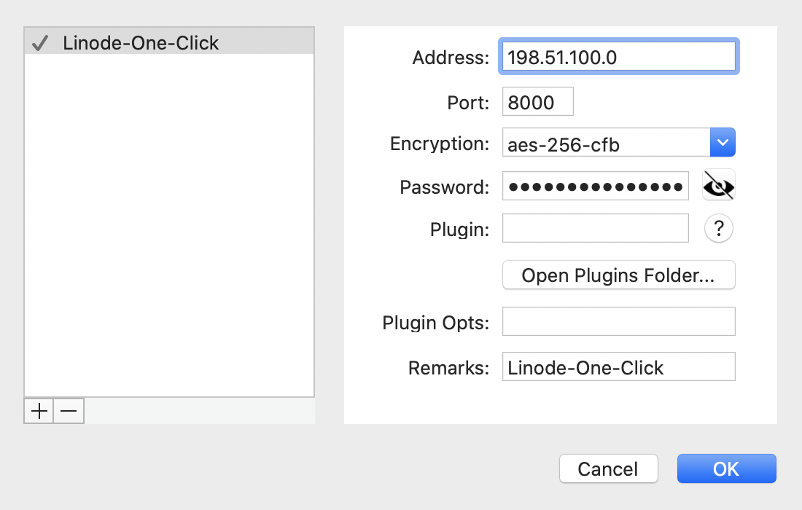

## Shadowsocks Marketplace App

Shadowsocks is a lightweight SOCKS5 web proxy tool primarily utilized to bypass network censorship and blocking on certain websites and web protocols. A full setup requires a Linode server to host the Shadowsocks daemon, and a client installed on PC, Mac, Linux, or a mobile device. Unlike other proxy software, Shadowsocks traffic is designed to be both indiscernible from other traffic to third-party monitoring tools, and also able to disguise itself as a normal direct connection. Data passing through Shadowsocks is encrypted for additional security and privacy.

## Deploy Shadowsocks with Marketplace Apps



### Shadowsocks Options

The Shadowsocks proxy requires a separate `Shadowsocks Password` to authenticate to the service from your client. Enter a unique password into `Shadowsock Password` field to be used in a later step.

### Linode Options

After providing the app-specific options, provide configurations for your Linode server:

| **Configuration** | **Description** |
|-------------------|-----------------|
| **Select an Image** | Debian 9 is currently the only image supported by the Shadowsocks Marketplace App, and it is pre-selected on the Linode creation page. *Required* |
| **Region** | The region where you would like your Linode to reside. In general, it's best to choose a location that's closest to you. For more information on choosing a DC, review the [How to Choose a Data Center](/docs/platform/how-to-choose-a-data-center) guide. You can also generate [MTR reports](/docs/networking/diagnostics/diagnosing-network-issues-with-mtr/) for a deeper look at the network routes between you and each of our data centers. *Required*. |
| **Linode Plan** | Your Linode's [hardware resources](/docs/platform/how-to-choose-a-linode-plan/#hardware-resource-definitions). You can use any size Linode for your Shadowsocks App. The Linode plan that you select should be appropriate for the amount of data transfer, users, and other stress that may affect the performance of your VPN. You can create your VPN on a 1GB Linode (Nanode) or a Linode 2GB with low risk for performance hits, unless you expect intensive data transfer to happen on your VPN. *Required* |
| **Linode Label** | The name for your Linode, which must be unique between all of the Linodes on your account. This name will be how you identify your server in the Cloud Manager’s Dashboard. *Required*. |
| **Root Password** | The primary administrative password for your Linode instance. This password must be provided when you log in to your Linode via SSH. The password must meet the complexity strength validation requirements for a strong password. Your root password can be used to perform any action on your server, so make it long, complex, and unique. *Required* |

When you've provided all required Linode Options, click on the **Create** button. **Your Shadowsocks app will complete installation anywhere between 1-3 minutes after your Linode has finished provisioning**.

## Setting up the Shadowsocks Client

Once the Shadowsocks server is up and running, you must install the [Shadowsocks Client](https://shadowsocks.org/en/download/clients.html) on any device or devices that you'd like to have connect to the service. There are currently client services available for [Windows](https://github.com/shadowsocks/shadowsocks-windows/releases), [Mac OS X](https://github.com/Jigsaw-Code/outline-client/), [Linux](https://github.com/Jigsaw-Code/outline-client/), [Android](https://play.google.com/store/apps/details?id=com.github.shadowsocks), and [iOS](http://apt.thebigboss.org/onepackage.php?bundleid=com.linusyang.shadowsocks).

For a full set of instructions on how to install Shadowsocks on Windows and Mac OS X, see the [Install a Shadowsocks Client](/docs/networking/vpn/create-a-socks5-proxy-server-with-shadowsocks-on-ubuntu-and-centos7/#install-a-shadowsocks-client) section of our guide for [Creating a Shadowsocks Server Manually](/docs/networking/vpn/create-a-socks5-proxy-server-with-shadowsocks-on-ubuntu-and-centos7/).

When the client has completed the installation process, ensure that you're setting up your client to connect using the following unique information:

| **Configuration** | **Description** |
|-------------------|-----------------|
| **Address** | Your linodes IPv4 address. Can be found in the `Linodes` section of the [Cloud Manager](https://cloud.linode.com/linodes).
| **Port** | The Shadowsocks Marketplace App connects through port `8000` by default. |
| **Encryption** | Set to use the `aes-256-cfb` encryption mode. |
| **Password** | This is the `Shadowsocks Password` field you created when initially deploying your app. |

After configuration, your `Server Preferences` should be similar to the following image:


