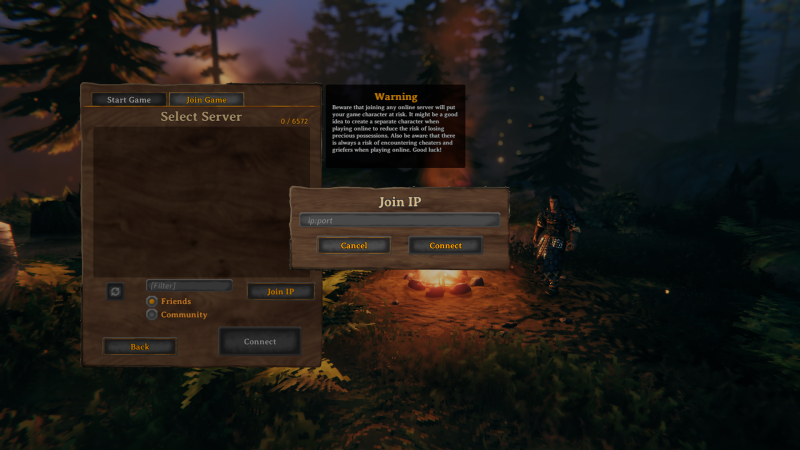

## Valheim Marketplace App

<!-- Intro paragraph describing the app and what it accomplishes. -->
Valheim is an open-world Viking-themed survival and sandbox game developed by [Iron Gate Studio](https://irongatestudio.se/). Play solo in single player mode, or invite your friends for player vs. environment multiplayer mode. With challenging combat, numerous boss battles, and a creative building system that lets you craft things like halls, forts, and even imposing Viking warships, there's always something to do. Explore, build, conquer, and survive. The further you travel the more challenging adventures await.

Install Valheim on Linode with the Valheim Game Server Marketplace App to maximize your gaming experience.

### Deploy a Valheim Marketplace App

<!-- shortguide used by every Marketplace app to describe how to deploy from the Cloud Manger -->



### Valheim Options

<!-- The following table has three parts. The UDF name, in bold and in one column, followed by
     UDF description in the second column. The description is in normal text, with an optional
     "Required." tag at the end of the description, in italics, if the field is mandatory. -->
You can configure your Valheim Game Server by providing values for the following fields:

| **Field** | **Description** |
|:--------------|:------------|
| **The username to be used with Valheim** | Your Valheim Username. This is used to log in to Valheim. *Required*. |
| **The server name to be used with Valheim** | Your Valheim server name. This is used to log in to Valheim. *Required* |

### Linode Options

After providing the App-specific options, provide configurations for your Linode server:
<!-- Be sure to edit the Select an Image and Linode Plan to match app's needs -->

| **Configuration** | **Description** |
|:--------------|:------------|
| **Select an Image** | Debian 10 is currently the only image supported by the Valheim Marketplace App, and it is pre-selected on the Linode creation page. *Required*. |
| **Region** | The region where you would like your Linode to reside. In general, it's best to choose a location that's closest to you. For more information on choosing a DC, review the [How to Choose a Data Center](/docs/guides/how-to-choose-a-data-center) guide. You can also generate [MTR reports](/docs/guides/diagnosing-network-issues-with-mtr/) for a deeper look at the network routes between you and each of our data centers. *Required*. |
| **Linode Plan** | Your Linode's [hardware resources](/docs/guides/how-to-choose-a-linode-plan/#hardware-resource-definitions). Valheim recommends 4 CPU cores and 2GB of RAM, so we suggest you deploy your Valheim Server on a 4GB Dedicated CPU Linode plan. If you decide that you need more or fewer hardware resources after you deploy your app, you can always [resize your Linode](/docs/guides/resizing-a-linode/) to a different plan. *Required*. |
| **Linode Label** | The name for your Linode, which must be unique between all of the Linodes on your account. This name is how you identify your server in the Cloud Manager Dashboard. *Required*. |
| **Root Password** | The primary administrative password for your Linode instance. This password must be provided when you log in to your Linode via SSH. The password must meet the complexity strength validation requirements for a strong password. Your root password can be used to perform any action on your server, so make it long, complex, and unique. *Required*. |

<!-- the following disclaimer lets the user know how long it will take
     to deploy the app -->
After providing all required Linode Options, click on the **Create** button. **Your Valheim Server will complete installation anywhere between 5-10 minutes after your Linode has finished provisioning**.

## Getting Started after Deployment

<!-- the following headings and paragraphs outline the steps necessary
     to access and interact with the Marketplace app. -->

### Access your Valheim Game Server

After Valheim has finished installing, you can access your server with your Linode's IPv4 address. Copy your Linode’s IPv4 address from the [Linode Cloud Manager](https://cloud.linode.com), and then connect to the server within the game using your Linode's IPv4 address and port `2456`(for example `192.0.2.0:2456`).

For more on Valheim, check out the following resources:

- [LinuxGSM Valheim Documentation](https://linuxgsm.com/lgsm/vhserver/)
- [Valheim official website](https://www.valheimgame.com/)

<!-- the following shortcode informs the user that Linode does not provide automatic updates
     to the Marketplace app, and that the user is responsible for the security and longevity
     of the installation. -->
