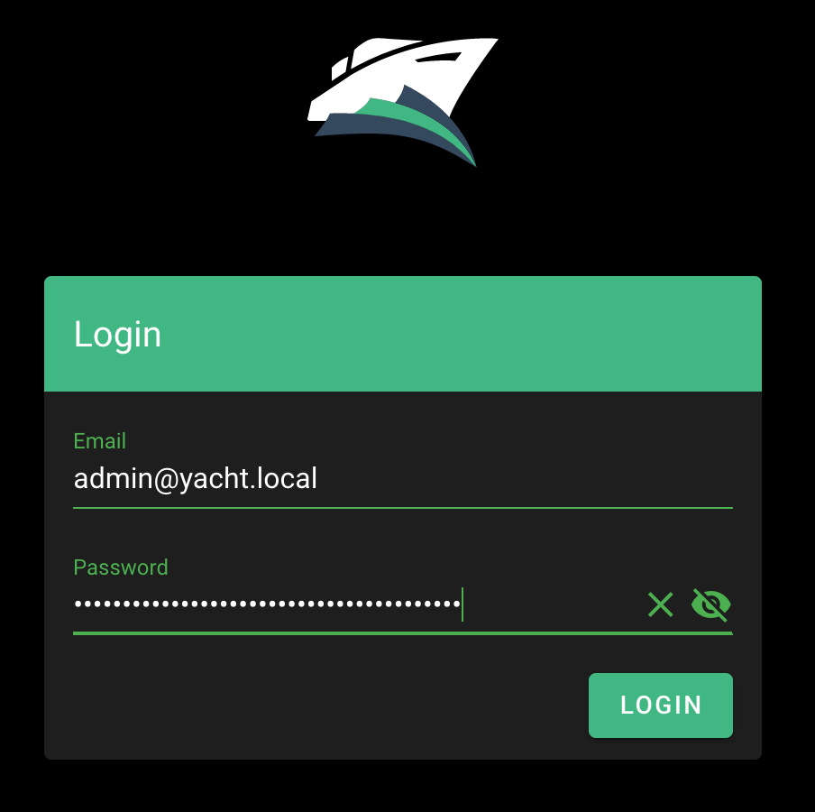
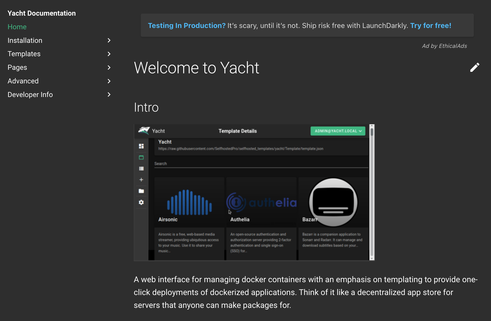

## Yacht Marketplace App

Yacht is a web interface for managing Docker containers, with an emphasis on templating to provide easy deployments. The ultimate goal of Yacht is to make Docker easy for anyone to use and manage with templates, template variables, and an intuitive UI.


Keep in mind, Yacht is still in alpha and is not recommended for production use.


### Deploy a Yacht Marketplace App



### Yacht Options

You can configure your Yacht App by providing values for the following fields:

| **Field** | **Description** |
|:--------------|:------------|
| **Yacht Email** | The email address for your Yacht login. The default is admin@yacht.local. *Required*. |
| **Yacht Password** | The password for your Yacht login. *Required*. |
| **Yacht Compose Support** | Support for using Yacht with [Docker Compose](https://yacht.sh/Advanced/docker-compose/). |
| **Yacht Theme** | Yacht theme options: Default, RED, and OMV. |

### Linode Options

After providing the App-specific options, provide configurations for your Linode server:

| **Configuration** | **Description** |
|:--------------|:------------|
| **Select an Image** | Debian 10 is currently the only image supported by the Yacht Marketplace App, and it is pre-selected on the Linode creation page. *Required*. |
| **Region** | The region where you would like your Linode to reside. In general, it's best to choose a location that's closest to you. For more information on choosing a DC, review the [How to Choose a Data Center](/docs/platform/how-to-choose-a-data-center) guide. You can also generate [MTR reports](/docs/networking/diagnostics/diagnosing-network-issues-with-mtr/) for a deeper look at the network routes between you and each of our data centers. *Required*. |
| **Linode Plan** | Your Linode's [hardware resources](/docs/platform/how-to-choose-a-linode-plan/#hardware-resource-definitions). Yacht can be supported on any size Linode, but we suggest you deploy your Yacht App on a Linode plan that reflects how you plan on using it. If you decide that you need more or fewer hardware resources after you deploy your app, you can always [resize your Linode](/docs/platform/disk-images/resizing-a-linode/) to a different plan. *Required*. |
| **Linode Label** | The name for your Linode, which must be unique between all of the Linodes on your account. This name is how you identify your server in the Cloud Manager Dashboard. *Required*. |
| **Root Password** | The primary administrative password for your Linode instance. This password must be provided when you log in to your Linode via SSH. The password must meet the complexity strength validation requirements for a strong password. Your root password can be used to perform any action on your server, so make it long, complex, and unique. *Required*. |

After providing all required Linode Options, click on the **Create** button. **Your Yacht App will complete installation anywhere between 2-5 minutes after your Linode has finished provisioning**.

## Getting Started after Deployment

### Access your Yacht App

1.  After Yacht has finished installing, you can access your Yacht instance by visiting your [Linode's IP address](/docs/quick-answers/linode-platform/find-your-linodes-ip-address/) at port 8000 (for example, `http://192.0.2.0:8000`) in a web browser.

    
By default Yacht is not configured to use SSL, meaning that your login credentials will be sent over plain text. See [Additional Steps for SSL](#additional-steps-for-ssl) for guidance on how to encrypt your connection.


1.  Enter your [Yacht email address and password](#yacht-options):

    

    You should see the Yacht administration panel:

    

Yacht provides elegant theme customization, templating, easy management of Docker resources (volumes, images, network), applications and projects. Click the page icon on the bottom-left corner to view a live demo and official [Yacht documentation](https://yacht.sh/).

### Additional Steps for SSL
Since Yacht is not configured for SSL, some additional steps are required to encrypt your connection. The following example uses [self-signed SSL certificates](/docs/guides/create-a-self-signed-tls-certificate/), but this can also work with a [commercially signed](/docs/guides/obtain-a-commercially-signed-tls-certificate/) or [Let's Encrypt certificates](/docs/guides/install-lets-encrypt-to-create-ssl-certificates/) if the server is configured with a FQDN.

1.  Login to the Linode's IP over `ssh`. Replace `192.0.2.0` with your [Linode's IP address](/docs/quick-answers/linode-platform/find-your-linodes-ip-address/).

         ssh root@192.0.2.0

1.  Create two local directories for SSL and the modified `nginx.conf`.

         mkdir -p local/nginx
         mkdir local/ssl

1.  Create the self-signed certificate and key.

         openssl req -new -newkey rsa:4096 -x509 -sha256 -days 365 -nodes -out yacht.crt -keyout yacht.key

     You should see output similar to the following:

     
Generating a RSA private key
...............................................................................................................................................+
......................++++
writing new private key to 'yacht.key'
-----
You are about to be asked to enter information that will be incorporated
into your certificate request.
What you are about to enter is what is called a Distinguished Name or a DN.
There are quite a few fields but you can leave some blank
For some fields there will be a default value,
If you enter '.', the field will be left blank.
-----
Country Name (2 letter code) [AU]:US
State or Province Name (full name) [Some-State]:Pennsylvania
Locality Name (eg, city) []:Philadelphia
Organization Name (eg, company) [Internet Widgits Pty Ltd]:
Organizational Unit Name (eg, section) []:
Common Name (e.g. server FQDN or YOUR name) []:yacht.local
Email Address []:admin@yacht.local


1.  Move the newly generated certificate and key into the `local/ssl` directory.

         mv yacht.* local/ssl

1.  Dump the Yacht `nginx.conf` to the `local/nginx` directory.

         docker exec -it yacht /bin/sh -c "cat /etc/nginx/nginx.conf" > local/nginx/nginx.conf

1.  Open the `local/nginx/nginx.conf` file using `vim` or another text editor of your choice and locate the server block for port 8000 (around line 30).

    
...
server {
     listen *:8000;
...


     Add the `ssl` parameter and paths for the certificate and key.

    
...

server {
     listen *:8000 ssl;
     ssl_certificate /etc/nginx/ssl/yacht.crt;
     ssl_certificate_key /etc/nginx/ssl/yacht.key;

...


1.   Copy `local/nginx/nginx.conf` and `local/ssl` to the `/etc/nginx/` directory in the Yacht container, and then reload Nginx.

         docker cp local/nginx/nginx.conf yacht:/etc/nginx/
         docker cp local/ssl yacht:/etc/nginx/

         # remove ^M characters
         docker exec -it yacht /bin/sh -c "sed -ie 's/\r//g' /etc/nginx/nginx.conf"

         # reload nginx
         docker exec -it yacht /bin/sh -c "nginx -s reload"

Your browser may give warnings because the certificate is not signed by a Certificate Authority, and require you to add a security exception, but the connection is now encrypted.


