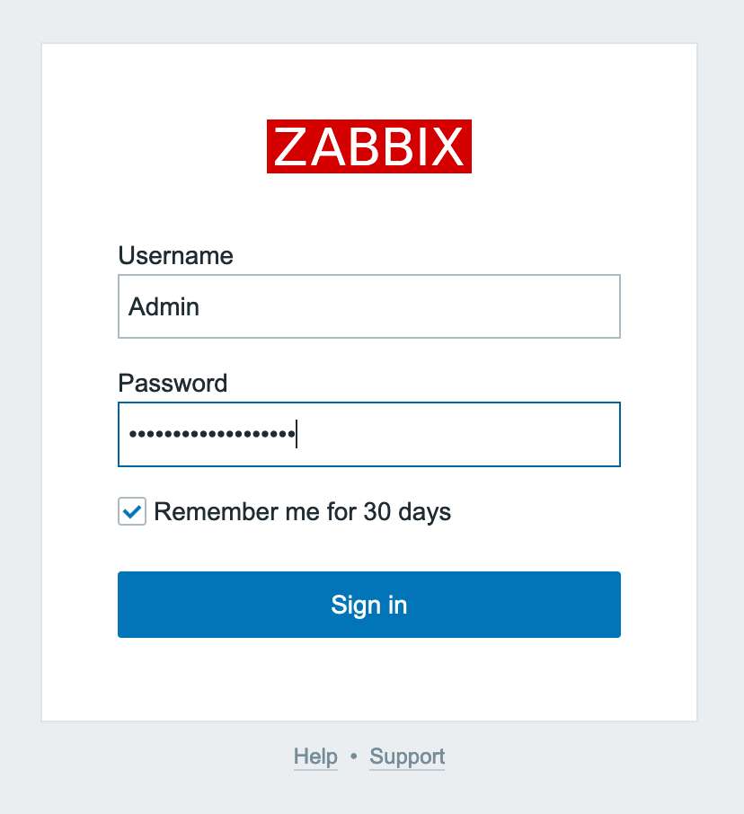
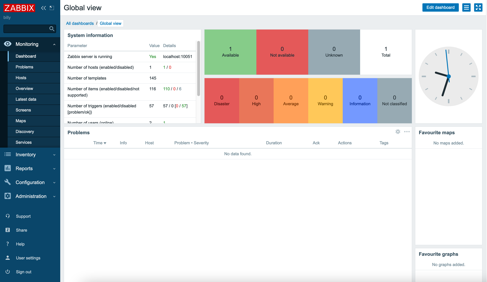

## Zabbix Marketplace App

<!-- Intro paragraph describing the app and what it accomplishes. -->
Zabbix is an enterprise-class, open source, distributed monitoring solution. Designed as an all-in-one monitoring solution, Zabbix can track performance and availability of network servers, devices, services, and other IT resources.

Zabbix empowers administrators to quickly respond to incidents with on-screen display capabilities and alerts by e-mail, SMS, or Jabber. Users can also collect, store, manage, and analyze information received from IT infrastructure.

Actively used by SMBs and large enterprises across all industries and in almost every country, Zabbix has a robust community driving its continued development.

### Deploy a Zabbix Marketplace App

<!-- shortguide used by every Marketplace app to describe how to deploy from the Cloud Manger -->



### Zabbix Options

<!-- The following table has three parts. The UDF name, in bold and in one column, followed by
     UDF description in the second column. The description is in normal text, with an optional
     "Required." tag at the end of the description, in italics, if the field is mandatory. -->
You can configure your Zabbix App by providing values for the following fields:

| **Field** | **Description** |
|:--------------|:------------|
| **Hostname** | Your Zabbix Linode's hostname. *Required*. |

### Linode Options

After providing the App-specific options, provide configurations for your Linode server:
<!-- Be sure to edit the Select an Image and Linode Plan to match app's needs -->

| **Configuration** | **Description** |
|:--------------|:------------|
| **Select an Image** | CentOS 7 is currently the only image supported by the Zabbix Marketplace App, and it is pre-selected on the Linode creation page. *Required*. |
| **Region** | The region where you would like your Linode to reside. In general, it's best to choose a location that's closest to you. For more information on choosing a DC, review the [How to Choose a Data Center](/docs/guides/how-to-choose-a-data-center) guide. You can also generate [MTR reports](/docs/guides/diagnosing-network-issues-with-mtr/) for a deeper look at the network routes between you and each of our data centers. *Required*. |
| **Linode Plan** | Your Linode's [hardware resources](/docs/guides/how-to-choose-a-linode-plan/#hardware-resource-definitions). Zabbix can be supported on any size Linode, but we suggest you deploy your Zabbix App on a Linode plan that reflects how you plan on using it. If you decide that you need more or fewer hardware resources after you deploy your app, you can always [resize your Linode](/docs/guides/resizing-a-linode/) to a different plan. *Required*. |
| **Linode Label** | The name for your Linode, which must be unique between all of the Linodes on your account. This name is how you identify your server in the Cloud Manager Dashboard. *Required*. |
| **Root Password** | The primary administrative password for your Linode instance. This password must be provided when you log in to your Linode via SSH. The password must meet the complexity strength validation requirements for a strong password. Your root password can be used to perform any action on your server, so make it long, complex, and unique. *Required*. |

<!-- the following disclaimer lets the user know how long it will take
     to deploy the app -->
After providing all required Linode Options, click on the **Create** button. **Your Zabbix App will complete installation anywhere between 5-10 minutes after your Linode has finished provisioning**.

## Getting Started after Deployment

<!-- the following headings and paragraphs outline the steps necessary
     to access and interact with the Marketplace app. -->

### Access your Zabbix App

After Zabbix has finished installing, you must first access your Zabbix Linode from the console via [SSH](/docs/guides/getting-started/#connect-to-your-linode-via-ssh), to obtain a randomly-generated administrative password. You can then use this password to log into your Zabbix App via web browser at your Linode's [IPv4 address](/docs/guides/find-your-linodes-ip-address/).

1. From your terminal, log into your Zabbix Linode as the `root` user with the following command, replacing `192.0.2.0` with your Linode's [IPv4 address](/docs/guides/find-your-linodes-ip-address/):

        ssh root@192.0.2.0

1. The Zabbix welome banner appears immediately after logging into your Zabbix Linode. Copy and save the randomly generated Admin password from the welcome banner in a secure manner for later. Here is an example welcome banner:

    
********************************************************************************
Zabbix frontend credentials:
Username: Admin
Password: abcdef0123456789
To learn about available professional services, including technical suppport and training, please visit https://www.zabbix.com/services
Official Zabbix documentation available at https://www.zabbix.com/documentation/current/
Note! Do not forget to change timezone PHP variable in /etc/php.d/99-zabbix.ini file.
********************************************************************************
    

1. Enter your Zabbix Linode's [IPv4 address](/docs/guides/find-your-linodes-ip-address/) into a browser window to access your Zabbix App's login page.

    
Zabbix uses a self-signed certificate. Because it is not signed by a common Certificate Authority, your browser may warn you about the security of the connection and require you to add a security exception.
    

    

1. Enter `Admin` as the username and the Admin password you saved from the welcome banner, then click **Sign in** to access the Zabbix control panel.

    

### Next Steps

For more on Zabbix, check out the following resources:

- [Learn from Zabbix Documentation](https://www.zabbix.com/documentation/5.0/manual)
- [Purchase Technical Support Contract](https://www.zabbix.com/support)
- [Visit the Zabbix Official Forum](https://www.zabbix.com/forum)

<!-- the following shortcode informs the user that Linode does not provide automatic updates
     to the Marketplace app, and that the user is responsible for the security and longevity
     of the installation. -->

