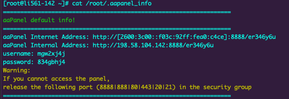
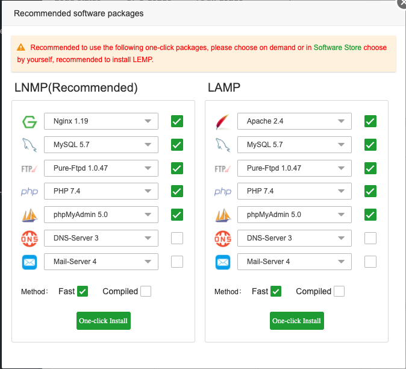

aaPanel is a free and open source web hosting control panel. It allows you to manage the server's web server, websites, databases, FTP, and more through a simple web-based interface. Through aaPanel, you can quickly install a LEMP (NGINX) or LAMP (Apache) stack on your server and start hosting your websites.

## Deploying the aaPanel Marketplace App



### Linode Configuration Options

| **Configuration** | **Description** |
|:--------------|:------------|
| **Select an Image** | CentOS 7 is currently the only image supported by the aaPanel Marketplace App, and it is pre-selected on the Linode creation page. *Required*. |
| **Region** | The region where you would like your Linode to reside. In general, it's best to choose a location that's closest to you. For more information on choosing a DC, review the [How to Choose a Data Center](/docs/platform/how-to-choose-a-data-center) guide. You can also generate [MTR reports](/docs/networking/diagnostics/diagnosing-network-issues-with-mtr/) for a deeper look at the network routes between you and each of our data centers. *Required*. |
| **Linode Plan** | Your Linode's [hardware resources](/docs/platform/how-to-choose-a-linode-plan/#hardware-resource-definitions). aaPanel can be supported on any size Linode, but we suggest you deploy your aaPanel App on a Linode plan that reflects how you plan on using it. If you decide that you need more or fewer hardware resources after you deploy your app, you can always [resize your Linode](/docs/platform/disk-images/resizing-a-linode/) to a different plan. *Required*. |
| **Linode Label** | The name for your Linode, which must be unique between all of the Linodes on your account. This name is how you identify your server in the Cloud Manager Dashboard. *Required*. |
| **Root Password** | The primary administrative password for your Linode instance. This password must be provided when you log in to your Linode via SSH. The password must meet the complexity strength validation requirements for a strong password. Your root password can be used to perform any action on your server, so make it long, complex, and unique. *Required*. |

After providing all required Linode Options, click on the **Create** button. **Your aaPanel App will complete installation anywhere between 5-10 minutes after your Linode has finished provisioning**.

## Getting Started after Deployment

### Access your aaPanel App

1.  After aaPanel has finished installing, log into your Linode via SSH, replacing `192.0.2.0` with your [Linode's IP address](/docs/quick-answers/linode-platform/find-your-linodes-ip-address/), and entering your Linode's root password when prompted:

        ssh root@192.0.2.0

2.  Once you login to the Linode, you will need to run the following command to obtain your login information for your aaPanel dashboard:

        cat /root/.aapanel_info

    

3.  Once you visit the URL and enter the login credentials you will be prompted to choose which One-Click services (LAMP/LNMP) you would like to install:

    

Now that you’ve accessed your dashboard, checkout [the official aaPanel documentation](https://doc.aapanel.com/) to learn how to further configure your instance.

