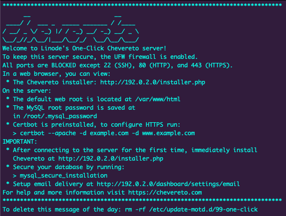
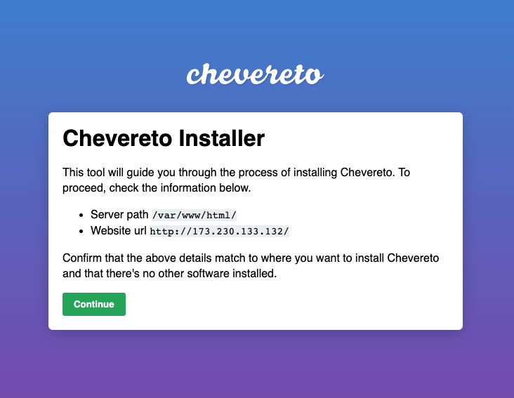
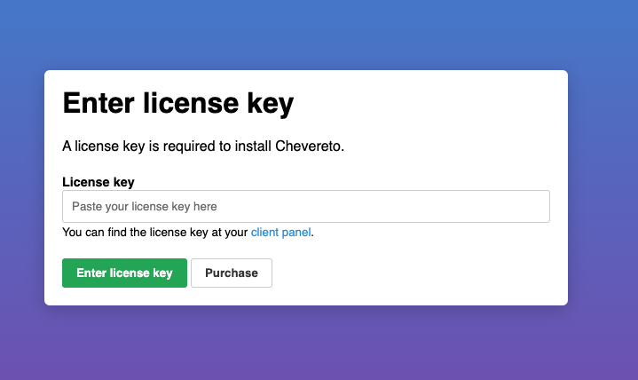
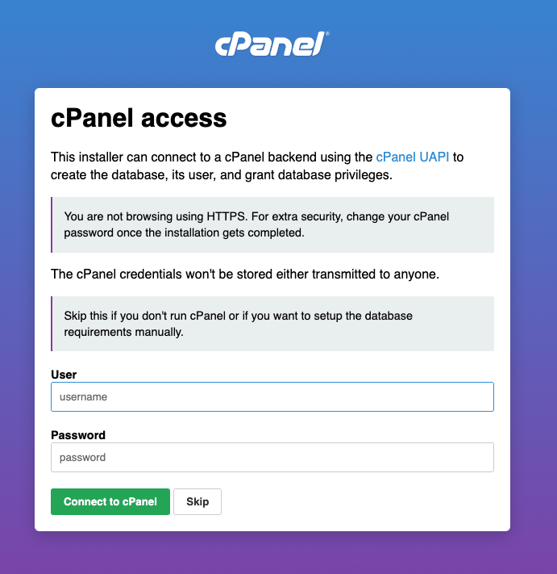
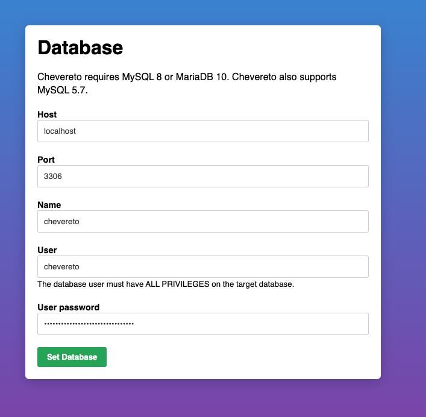
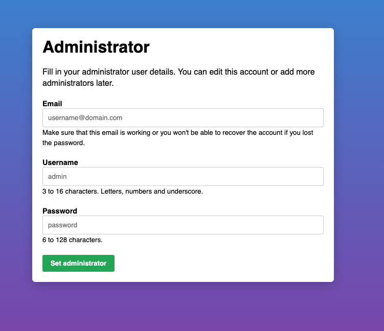
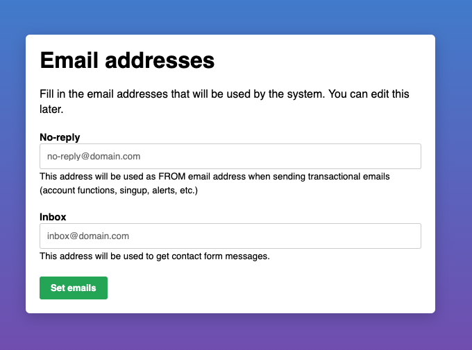
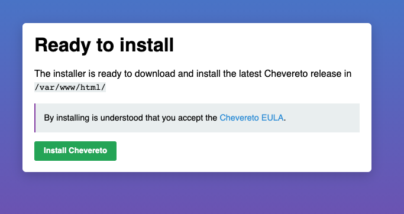

Chevereto is a self-hosted image sharing solution. It can be used to create a myriad of applications or to empower existing systems. Chevereto's features include multi-user support, multi-server support, bulk importing, integration with social media, and more.

## Deploying the Chevereto Marketplace App



### Linode Configuration Options

| **Configuration** | **Description** |
|:--------------|:------------|
| **Select an Image** | Ubuntu 20.04 LTS is currently the only image supported by the Chevereto Marketplace App, and it is pre-selected on the Linode creation page. *Required*. |
| **Region** | The region where you would like your Linode to reside. In general, it's best to choose a location that's closest to you. For more information on choosing a DC, review the [How to Choose a Data Center](/docs/platform/how-to-choose-a-data-center) guide. You can also generate [MTR reports](/docs/networking/diagnostics/diagnosing-network-issues-with-mtr/) for a deeper look at the network routes between you and each of our data centers. *Required*. |
| **Linode Plan** | Your Linode's [hardware resources](/docs/platform/how-to-choose-a-linode-plan/#hardware-resource-definitions). Chevereto can be supported on any size Linode, but we suggest you deploy your Chevereto App on a Linode plan that reflects how you plan on using it. If you decide that you need more or fewer hardware resources after you deploy your app, you can always [resize your Linode](/docs/platform/disk-images/resizing-a-linode/) to a different plan. *Required*. |
| **Linode Label** | The name for your Linode, which must be unique between all of the Linodes on your account. This name is how you identify your server in the Cloud Manager Dashboard. *Required*. |
| **Root Password** | The primary administrative password for your Linode instance. This password must be provided when you log in to your Linode via SSH. The password must meet the complexity strength validation requirements for a strong password. Your root password can be used to perform any action on your server, so make it long, complex, and unique. *Required*. |

<!-- the following disclaimer lets the user know how long it will take
     to deploy the app -->
After providing all required Linode Options, click on the **Create** button. **Your Chevereto App will complete installation anywhere between 2-5 minutes after your Linode has finished provisioning**.

## Getting Started after Deployment

### Access your Chevereto App

1.  After Chevereto has finished installing,log into your Linode via SSH, replacing `192.0.2.0` with your [Linode's IP address](/docs/quick-answers/linode-platform/find-your-linodes-ip-address/), and entering your Linode's root password when prompted:

        ssh root@192.0.2.0

1.  You should see the Chevereto welcome message when logging into the Linode. This includes instructions for accessing the Chevereto installation script in your web browser along with the location of the credentials to the application. Replace `192.0.2.0` with your Linode’s IP address.

    

1.  You will then be able to proceed through the Chevereto Installer.

    

1.  To utilize Chevereto, you need to obtain a license key. You can do so clicking the purchase button and entering the license key provided by Chevereto.

    

1.  Next, you will be presented with a page where you can enter your cPanel credentials. Since this Marketplace App does not include a cPanel installation, you can simply select skip.

    

1.  The next page allows you to input the database information for this application. It should be pre-filled with the user and password details.

    

1.  You are then prompted to create the Administrator account. This will be the credentials used to access your Chevereto dashboard.

    

1.  The next prompt will ask you for the email addresses that will be used for this service.

    

1.  You are now ready to complete the Chevereto installation. Click the **Install Chevereto** button.

    

Now that you’ve accessed your dashboard, checkout [the official Chevereto documentation](https://v3-docs.chevereto.com/) to learn how to further configure your instance.

