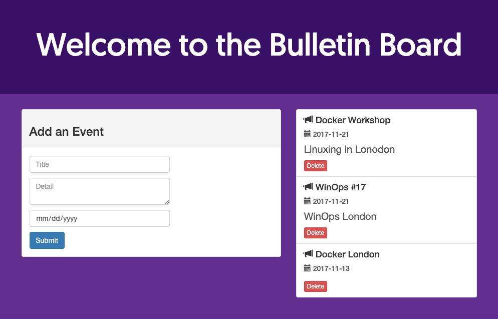

## Docker Marketplace App

Docker is a tool that enables you to create, deploy, and manage lightweight, stand-alone packages that contain everything needed to run an application (code, libraries, runtime, system settings, and dependencies). These packages are called containers.

Each container is deployed with its own CPU, memory, block I/O, and network resources, all without having to depend upon an individual kernel and operating system. While it may be easiest to compare Docker and virtual machines, they differ in the way they share or dedicate resources.

### Deploy a Docker Marketplace App



### Linode Options

Docker doesn't ask you to provide any app specific configurations. Provide configurations for your Linode server:

| **Configuration** | **Description** |
|:--------------|:------------|
| **Select an Image** | Debian 9 is currently the only image supported by Docker Marketplace Apps, and it is pre-selected on the Linode creation page. *Required*. |
| **Region** | The region where you would like your Linode to reside. In general, it's best to choose a location that's closest to you. For more information on choosing a DC, review the [How to Choose a Data Center](/docs/platform/how-to-choose-a-data-center) guide. You can also generate [MTR reports](/docs/networking/diagnostics/diagnosing-network-issues-with-mtr/) for a deeper look at the network routes between you and each of our data centers. *Required*. |
| **Linode Plan** | Your Linode's [hardware resources](/docs/platform/how-to-choose-a-linode-plan/#hardware-resource-definitions). Docker can be supported on any size Linode, but we suggest you choose a Linode plan that reflects how many resources you plan on using. For small applications, a 1GB Linode (Nanode) is sufficient. If you decide that you need more or fewer hardware resources after you deploy your app, you can always [resize your Linode](/docs/platform/disk-images/resizing-a-linode/) to a different plan. *Required*. |
| **Linode Label** | The name for your Linode, which must be unique between all of the Linodes on your account. This name will be how you identify your server in the Cloud Manager’s Dashboard. *Required*. |
| **Root Password** | The primary administrative password for your Linode instance. This password must be provided when you log in to your Linode via SSH. The password must meet the complexity strength validation requirements for a strong password. Your root password can be used to perform any action on your server, so make it long, complex, and unique. *Required*. |

When you've provided all required Linode Options, click on the **Create** button. **Your Docker app will complete installation anywhere between 2-5 minutes after your Linode has finished provisioning**.

## Getting Started after Deployment

Docker is now installed and ready to use. The following steps provide a sample application to get you started with an easy example to demonstrate some basic Docker functionality. It is not necessary for Docker set-up.

### Access Docker

After Docker has finished installing, you will be able to access Docker from the console via SSH with your Linode's IPv4 address:

1.  [SSH into your Linode](/docs/getting-started/#connect-to-your-linode-via-ssh) and [create a limited user account](/docs/security/securing-your-server/#add-a-limited-user-account).

1.  Log out and log back in as your limited user account.

1.  Install the unzip package from the package manager:

        sudo apt install unzip

1.  Download the example `node-bulletin-board` project and unzip it:

        curl -LO https://github.com/dockersamples/node-bulletin-board/archive/master.zip
        unzip master.zip

1.  Move into the example project directory:

        cd node-bulletin-board-master/bulletin-board-app

1.  Build the image with the following command:

        sudo docker image build -t bulletinboard:1.0 .

1.  Start a container with your image:

        sudo docker container run --publish 8000:8080 --detach --name bb bulletinboard:1.0

1.  Visit your application in the browser by going to `http://198.51.100.0:8000`, replacing the IP address with the public IP of your Linode.

    

1.  To delete the container run:

        sudo docker container rm --force bb

## Next Steps



For more on Docker, checkout the following guides:

- [An Introduction to Docker](/docs/applications/containers/introduction-to-docker/)
- [How to Use Docker Files](/docs/applications/containers/how-to-use-dockerfiles/)
- [How to Use Docker Compose](/docs/applications/containers/how-to-use-docker-compose/)
- [How to Connect Docker Containers](/docs/applications/containers/docker-container-communication/)
- [How to Create a Docker Swarm Manager and Nodes on a Linode](/docs/applications/containers/how-to-create-a-docker-swarm-manager-and-nodes-on-linode/)
- [Create and Deploy a Docker Container Image to a Kubernetes Cluster](/docs/kubernetes/deploy-container-image-to-kubernetes/)
- [Manage a Docker Cluster with Kubernetes](/docs/kubernetes/manage-a-docker-cluster-with-kubernetes/)
