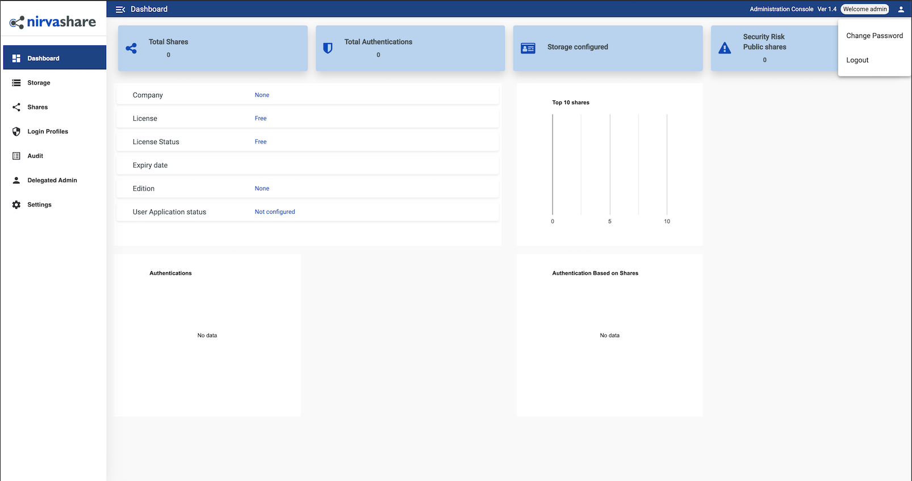

NirvaShare is a simplified and secure enterprise file sharing solution built on top of your existing file storage. Use NirvaShare with SFTP, local storage, or even S3-compatible storage like Linode's [Object Storage](https://www.linode.com/products/object-storage/). Collaborate with your internal or external users such as customers, partners, and vendors. NirvaShare provides fine-tuned access control in a very simplified manner. NirvaShare integrates with multiple many external identity providers such as Active Directory, GSuite, AWS SSO, KeyClock, and others.

## Deploying the NirvaShare Marketplace App



### NirvaShare Configuration Options

You can configure your NirvaShare App by providing values for the following fields:

| **Field** | **Description** |
|:--------------|:------------|
| **Database Password** | The database password for NirvaShare. *Required*. |

### Linode Configuration Options

After providing the App-specific options, provide configurations for your Linode server:

| **Configuration** | **Description** |
|:--------------|:------------|
| **Select an Image** | Ubuntu 20.04 LTS is currently the only image supported by the NirvaShare Marketplace App, and it is pre-selected on the Linode creation page. *Required*. |
| **Region** | The region where you would like your Linode to reside. In general, it's best to choose a location that's closest to you. For more information on choosing a DC, review the [How to Choose a Data Center](/docs/platform/how-to-choose-a-data-center) guide. You can also generate [MTR reports](/docs/networking/diagnostics/diagnosing-network-issues-with-mtr/) for a deeper look at the network routes between you and each of our data centers. *Required*. |
| **Linode Plan** | Your Linode's [hardware resources](/docs/platform/how-to-choose-a-linode-plan/#hardware-resource-definitions). NirvaShare can be supported on any size Linode, but we suggest you deploy your NirvaShare App on a Linode plan that reflects how you plan on using it. If you decide that you need more or fewer hardware resources after you deploy your app, you can always [resize your Linode](/docs/platform/disk-images/resizing-a-linode/) to a different plan. *Required*. |
| **Linode Label** | The name for your Linode, which must be unique between all of the Linodes on your account. This name is how you identify your server in the Cloud Manager Dashboard. *Required*. |
| **Root Password** | The primary administrative password for your Linode instance. This password must be provided when you log in to your Linode via SSH. The password must meet the complexity strength validation requirements for a strong password. Your root password can be used to perform any action on your server, so make it long, complex, and unique. *Required*. |

After providing all required Linode Options, click on the **Create** button. **Your NirvaShare App will complete installation anywhere between 5-10 minutes after your Linode has finished provisioning**.

## Getting Started after Deployment

After NirvaShare has finished installing, you can access your NirvaShare instance by visiting your [Linode's IP address](/docs/quick-answers/linode-platform/find-your-linodes-ip-address/) at port 8080. (for example, `http://192.0.2.0:8080`)

Once you visit the NirvaShare IP address you will be prompted with a Login page, you can enter `admin` as the *username* and `admin` as the *password*.

From here, you will want to change the default admin password, you can do so clicking the icon at the top right of the dashboard and select *Change Password* option as shown in the image below:

Now that you’ve accessed your dashboard, checkout [the official NirvaShare documentation](https://nirvashare.com/setup-guide/) to learn how to further configure your instance.

