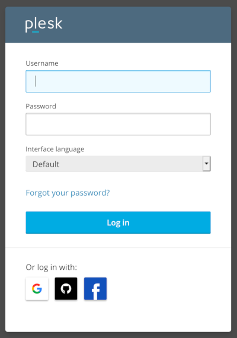

## Plesk Marketplace App

[Plesk](https://www.plesk.com) is a leading WordPress and website management platform and control panel. Plesk lets you build and manage multiple websites from a single dashboard to configure web services, email, and other applications. Plesk features hundreds of extensions, plus a complete WordPress toolkit. Use the Plesk Marketplace App to manage websites hosted on your Linode.

### Deploy a Plesk Marketplace App



The [Plesk Options](#plesk-options) section of this guide provides details on all available configuration options for this app.

### Plesk Options

You can configure your Plesk App by providing values for the following fields:

| **Field** | **Description** |
|:----------------|:------------|
| **Server Name** | Domain name for your server in the format servername.domain.com. Setting a value in this field will not also enable DNS for your app, which you should do as well. Read our [DNS Manager](/docs/platform/manager/dns-manager/) guide for instructions on creating DNS records in the Linode Cloud Manager. *Required*. |

### Linode Options

After providing the app specific options, provide configurations for your Linode server:

| **Configuration** | **Description** |
|:--------------|:------------|
| **Select an Image** | CentOS 7, Ubuntu 18.04 LTS, and Ubuntu 16.04 LTS are the images supported by Plesk Marketplace Apps. *Required*. |
| **Region** | The region where you would like your Linode to reside. In general, it's best to choose a location that's closest to you. For more information on choosing a DC, review the [How to Choose a Data Center](/docs/platform/how-to-choose-a-data-center) guide. You can also generate [MTR reports](/docs/networking/diagnostics/diagnosing-network-issues-with-mtr/) for a deeper look at the network routes between you and each of our data centers. *Required*. |
| **Linode Plan** | Your Linode's [hardware resources](/docs/platform/how-to-choose-a-linode-plan/#hardware-resource-definitions). Plesk runs on WordPress which is an extremely flexible CMS that can be supported on any size Linode, but we suggest you deploy your Plesk app on a Linode plan that reflects how much content you plan on featuring as well as how much traffic you expect for your site. You can always [resize your Linode](/docs/platform/disk-images/resizing-a-linode/) to a different plan. *Required*. |
| **Linode Label** | The name for your Linode, which must be unique between all of the Linodes on your account. This name will be how you identify your server in the Cloud Manager’s Dashboard. *Required*. |
| **Root Password** | The primary administrative password for your Linode instance. You will also use this password to log into Plesk as well as when you log in to your Linode via SSH. The password must meet the complexity strength validation requirements for a strong password. Your root password can be used to perform any action on your server, so make it long, complex, and unique. *Required*. |

When you've provided all required Linode Options, click on the **Create** button. **Your Plesk app will complete installation in about  15 minutes after your Linode has finished provisioning**.

## Getting Started after Deployment

### Access your Plesk Site

After Plesk has finished installing, you will be able to access your Plesk site over `http://` with your Linode's IPv4 address, or the domain name entered when deploying your Marketplace App:

1.  Access your Plesk app:

    **With your Linode's IP Address**

    You will be able to access your Plesk app by copying your Linode's IPv4 address and entering it in the browser of your choice. To find your Linode's IPv4 address:

    1. Click on the **Linodes** link in the sidebar. You will see a list of all your Linodes.

    1. Find the Linode you just created when deploying your app and select it.

    1. Navigate to the **Networking** tab.

    1. The IP address will be displayed under the **Address** column in the **IPv4** table.

    1. Copy and paste the IPv4 address into a browser window. You should see the Plesk welcome page appear.

        

    **With a Domain Name**

    If you deployed your Plesk Marketplace App with a domain name and it is pointing to the Linode's IP address that is hosting your Plesk instance, then you can enter the domain name in a browser window to access your Plesk site. Ensure you are using `http://`.

    For more details on registering your domain, see the [DNS Manager](/docs/platform/manager/dns-manager/) guide.

1.  Once you have accessed your Plesk app via the browser, you can log in using the admin credentials you created when deploying your app. This will be `root` for the username and the root password for the server. Then, begin configuring your site.

    

1.  After logging in you will be asked to setup an account. Here you will enter your `Contact Name`, `Email address`, `Password`, and choose a license agreement.

    

1.  After your account is setup you'll be signed into your dashboard and can get started.

    


