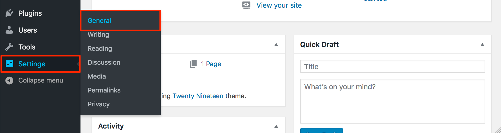



## WordPress Marketplace App

With 60 million users around the globe, WordPress provides an industry standard for content-focused websites such as blogs, news sites, and personal websites. Its focus on best-in-class usability and flexibility, makes it possible to have a customized website up and running in minutes.

### Deploy a WordPress Marketplace App



The [WordPress Options](#wordpress-options) section of this guide provides details on all available configuration options for this app.

### WordPress Options

You can configure your WordPress App by providing values for the following fields:

| **Field** | **Description** |
|:--------------|:------------|
| **Website Title** | Your WordPress site's title. |
| **E-Mail Address** | E-Mail address for your WordPress admin user. This is also used as the start of authority (SOA) email address for this server. This email address is added to the SOA record for the domain. This is a required field if you want the installer to create DNS records. *Required*. |
| **Admin Username** | Username for your WordPress admin user. *Required*. |
| **Admin Password** | Password for your WordPress admin user. *Required*. |
| **MySQL root Password** | The root password for your MySQL database. *Required*. |
| **WordPress Database Password** | The root password for your WordPress database. *Required*. |
| **The limited sudo user to be created for the Linode** | This is the limited user account to be created for the Linode. This account has sudo user privileges. |
| **The password for the limited sudo user** | Set a password for the limited sudo user. The password must meet the complexity strength validation requirements for a strong password. This password can be used to perform any action on your server, similar to root, so make it long, complex, and unique. |
| **The SSH Public Key that will be used to access the Linode** | If you wish to access [SSH via Public Key](/docs/security/authentication/use-public-key-authentication-with-ssh/) (recommended) rather than by password, enter the public key here. |
| **Enable passwordless sudo access for the limited user?** | If you entered an SSH Public Key above and it is for the limited user account, select `Yes`, this allows SSH to use Public Key login for the limited user. Select `No` if you want SSH to rely on using password login for the limited user account. |
| **Disable root access over SSH?** | Select `Yes` to block the root account from logging into the server via SSH. Select `No` to allow the root account to login via SSH. |
| **Configure automatic security updates** | Select `Yes` to have the system automatically update WordPress with the latest security updates. Select `No` to if you wish to manage all updates manually. |
| **Use fail2ban to prevent automated intrusion attemps?** | Select `Yes` to install fail2ban. Select `No` to not install fail2ban during installation. You [can install this at a later time](/docs/security/basics/using-fail2ban-to-secure-your-server-a-tutorial/). |
| **Your Linode API Token** | Your Linode `API Token` is needed to create DNS records. If this is provided along with the `subdomain` and `domain` fields, the installation attempts to create DNS records via the Linode API. If you don't have a token, but you want the installation to create DNS records, you must [create one](/docs/platform/api/getting-started-with-the-linode-api/#get-an-access-token) before continuing. |
| **Subdomain** | The subdomain you wish the installer to create a DNS record for during setup. The suggestion given is `www`. The subdomain should only be provided if you also provide a `domain` and `API Token`. |
| **Domain** | The domain name where you wish to host your WordPress site. The installer creates a DNS record for this domain during setup if you provide this field along with your `API Token`. |
| **Do you need an MX record for this domain?** | Check `Yes` if you plan on using WordPress to send email. The installer, along with your `API Token` (required) sets up the necessary MX records in the DNS Manager. Select `No` if you do not plan on using WordPress to send email. You can [add an MX record manually](/docs/networking/dns/dns-records-an-introduction/#mx) at a later time if you change your decision. |
| **Do you need an SPF record for this domain?** | Check `yes` if you plan on using WordPress to send email. The installer, along with your `API Token` (required) sets up the necessary SPF records in the DNS Manager. Select `No` if you do not plan on using WordPress to send email. You can [add an SPF record manually](/docs/networking/dns/dns-records-an-introduction/#spf) at a later time if you change your decision. |
| **Would you like to use a free Let's Encrypt SSL certificate?** | Select `Yes` if you would like the install to create an SSL certificate for you, or `No` if you do not. You cannot create secure, encrypted conferences without an SSL certificate. |

### Linode Options

After providing the app specific options, provide configurations for your Linode server:

| **Configuration** | **Description** &nbsp;&nbsp;&nbsp;&nbsp;&nbsp;&nbsp;&nbsp;&nbsp;&nbsp;&nbsp;&nbsp;&nbsp;&nbsp;&nbsp;&nbsp;&nbsp;&nbsp;&nbsp;&nbsp;&nbsp;&nbsp;&nbsp;&nbsp;&nbsp;&nbsp;&nbsp;&nbsp;&nbsp;&nbsp;&nbsp;&nbsp;&nbsp;&nbsp;&nbsp;&nbsp;&nbsp;&nbsp;&nbsp;&nbsp;&nbsp;&nbsp;&nbsp;&nbsp;&nbsp;&nbsp;&nbsp;&nbsp;&nbsp;&nbsp;&nbsp;&nbsp;&nbsp;&nbsp;&nbsp;&nbsp;&nbsp;&nbsp;&nbsp;&nbsp;&nbsp;&nbsp;&nbsp;&nbsp;&nbsp;&nbsp;&nbsp;&nbsp;&nbsp;&nbsp;&nbsp;&nbsp;&nbsp;&nbsp;&nbsp;&nbsp;&nbsp;&nbsp;&nbsp;&nbsp;&nbsp;&nbsp;&nbsp;&nbsp;&nbsp;&nbsp;&nbsp;&nbsp;&nbsp;&nbsp;&nbsp;&nbsp;&nbsp;&nbsp;&nbsp;&nbsp;&nbsp;&nbsp;&nbsp;&nbsp;&nbsp;|
|--------------|------------|
| **Select an Image** | Debian 10 is currently the only image supported by WordPress Marketplace Apps, and it is pre-selected on the Linode creation page. *Required*. |
| **Region** | The region where you would like your Linode to reside. In general, it's best to choose a location that's closest to you. For more information on choosing a DC, review the [How to Choose a Data Center](/docs/platform/how-to-choose-a-data-center) guide. You can also generate [MTR reports](/docs/networking/diagnostics/diagnosing-network-issues-with-mtr/) for a deeper look at the network routes between you and each of our data centers. *Required*. |
| **Linode Plan** | Your Linode's [hardware resources](/docs/platform/how-to-choose-a-linode-plan/#hardware-resource-definitions). WordPress is an extremely flexible CMS that can be supported on any size Linode, but we suggest you build your WordPress app on a Linode plan that reflects how much content you plan on featuring and how much traffic you expect on your site. For small websites, a 1GB Linode (Nanode) is sufficient. If you decide that you need more or fewer hardware resources after you deploy your app, you can always [resize your Linode](/docs/platform/disk-images/resizing-a-linode/) to a different plan. *Required*. |
| **Linode Label** | The name for your Linode, which must be unique between all of the Linodes on your account. This name is how you identify your server in the Cloud Manager’s Dashboard. *Required*. |
| **Root Password** | The primary administrative password for your Linode instance. This password must be provided when you log in to your Linode via SSH. The password must meet the complexity strength validation requirements for a strong password. Your root password can be used to perform any action on your server, so make it long, complex, and unique. *Required*. |

When you've provided all required Linode Options, click on the **Create** button. **Your WordPress app will complete installation anywhere between 2-5 minutes after your Linode has finished provisioning**.

## Getting Started After Deployment

### Access Your WordPress Site

After WordPress has finished installing, you can access your WordPress site by copying your Linode's IPv4 address and entering it in the browser of your choice. If you've set up DNS during installation, you can go to your domain name in the browser. To find your Linode's IPv4 address:

1. Click on the **Linodes** link in the sidebar to see a list of all your Linodes.

1. Find the Linode you just created when deploying your app and select it.

1. Navigate to the **Networking** tab.

1. Your IPv4 address is listed under the **Address** column in the **IPv4** table.

1. Copy and paste the IPv4 address into a browser window. You should see your WordPress site's home page.

1.  Once you have accessed your WordPress site via the browser, you can log in to the WordPress administrative interface and start personalizing your theme, creating posts, and configuring other parts of your site.

    - The address of the WordPress login page is `http://< your IP address >/wp-login.php`.
    - If you set up a domain during installation, you can access the login page at `http://< your domain >/wp-login.php`.
    - You can also click on the log in link that's visible on your site's home page, as highlighted below.

    Enter the credentials you previously specified in the **Admin Username** and **Admin Password** fields when you deployed the app.

    

### Set up a Domain for your Site

If you didn't set up a domain during the installation process, you can add it manually following the instructions in this section.

If you own a domain name, you can assign it (or a subdomain) to your WordPress site. Specifically, you need to set up an [*A record*](/docs/networking/dns/dns-records-an-introduction/#a-and-aaaa) that's associated with your Linode's IP address. To learn how to set up DNS records in the Cloud Manager, review the [DNS Manager](/docs/platform/manager/dns-manager/) guide. For more general information about how DNS works, review the [DNS Records: An Introduction](/docs/networking/dns/dns-records-an-introduction/) guide.

Once you have set up DNS for your site, you can visit it by entering your domain or subdomain in your browser. At this point, you should also update the [WordPress Address and Site URL settings](https://codex.wordpress.org/Changing_The_Site_URL) for your site:

1.  Log in to your WordPress site's admin interface as described in the previous section.

1.  Click on the **Settings** link in the sidebar, then click on the **General** option from the dropdown menu that appears.

    

1.  The **General Settings** form appears. Update the **WordPress Address (URL)** and **Site Address (URL)** fields with the domain or subdomain you assigned to your site. Specifically, the value for both fields should be `http://example.com`, where `example.com` is replaced by your domain or subdomain.

1.  Click the **Save Changes** button at the bottom of the form.

### Software Included

The WordPress Marketplace App installs the following required software on your Linode:

| **Software** | **Description** |
|:--------------|:------------|
| [**MySQL Server**](https://www.mysql.com/) | Relational database. |
| [**PHP 7**](https://www.php.net/) | WordPress is written in PHP and requires PHP to operate. |
| [**Apache HTTP Server**](https://httpd.apache.org/) | Web server used to serve the WordPress site. |
| [**WordPress**](https://wordpress.org/) | Content management system. |
| [**WP CLI**](https://wp-cli.org/) | The command line interface for WordPress. |




