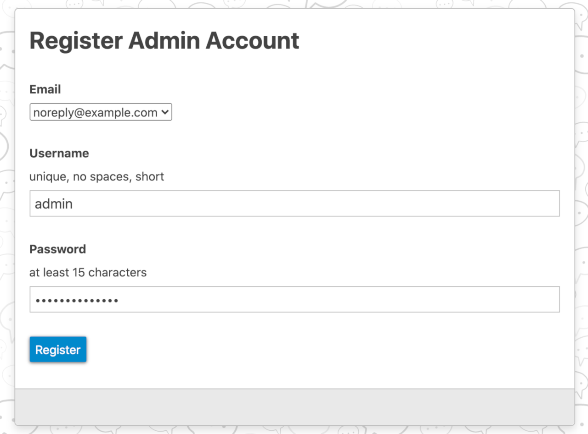
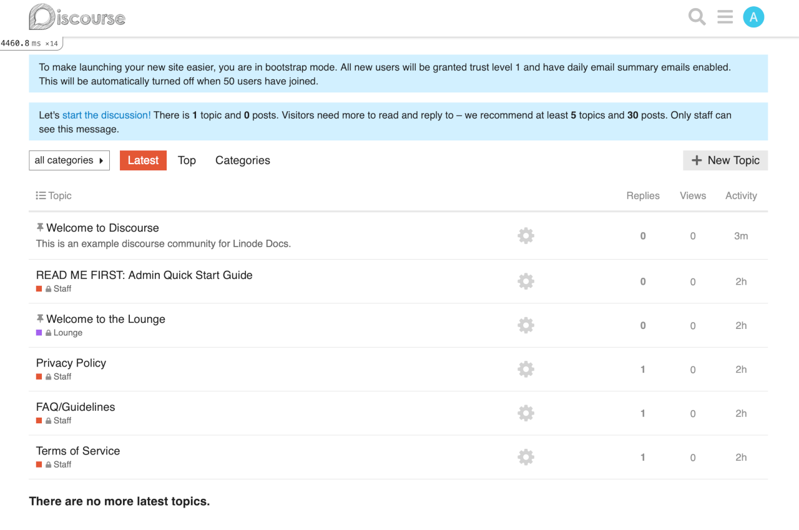

[Discourse](https://www.discourse.org/) is an open source discussion platform that provides a forum, mailing list, chat room, and more.

## Before You Begin

Discourse requires that you have a domain name and access to a personal SMTP email server before installation. This requires either having access to a pre-existing SMTP server, or setting up an [SMTP Relay](https://www.linode.com/community/questions/387/does-linode-offer-an-smtp-relay-service) through a third party. The Discourse Marketplace App **requires** an SMTP username and password for a server under your control in order to successfully complete the installation.

  - If you don't already have your domain hosted at Linode, the install creates A and AAAA domain records for you.

    - This means you need a Linode API token. If you don't have a token, you must [create one](/docs/platform/api/getting-started-with-the-linode-api/#get-an-access-token) before continuing.

    - Ensure that your domain registrar is [using Linode's name servers](/docs/guides/dns-manager/#use-linodes-name-servers-with-your-domain).

  - Additionally, the SMTP user must be able to send email from `noreply@your-domain.com` for administrator account verification.

    - For example, if you enter a subdomain of `discourse` and your domain name is `example.com`, then the SMTP user must be able to send email from `noreply@discourse.example.com`.

    - You are not required to use a subdomain. Therefore, if you only setup `example.com` with no subdomain, the email used for verification would be `noreply@example.com`.

## Deploying the Discourse Marketplace App



**Software installation should complete within 15-20 minutes after the Linode has finished provisioning.**

## Configuration Options

### Discourse Options

The Discourse Marketplace form includes advanced fields to setup your Discourse server's A and AAAA domain records and a free Let's Encrypt SSL certificate. Some of these fields are optional configurations and are not required for installation. The fields that are required are marked *Required*.


Discourse requires that you have a domain name and SMTP email. These fields are required for a successful installation and are marked *Required*. Additionally, the SMTP user must be able to send email from `noreply@your-fully-qualified-domain.com` for account verification.


| **Field** | **Description** |
|:--------------|:------------|
| **Your Linode API Token** | Your Linode API access token is needed to create your DNS records and to create the Let's Encrypt SSL certificate. If you don't have a token, you must [create one](/docs/platform/api/getting-started-with-the-linode-api/#get-an-access-token) before continuing. *Required* |
| **Subdomain** | The subdomain you wish the installer to create a DNS record for during setup. |
| **Domain** | The domain name where you wish to host your Discourse app. The installer creates a DNS record for this domain during setup. *Required* |
| **Email for Admin Account and Let's Encrypt certificate** | The email you wish to use for the administrator account and the SSL certificate. This email address receives notifications when the certificate needs to be renewed. *Required* |
| **SMTP Address** | The address for SMTP. Discourse uses this for sending email. *Required* |
| **SMTP Username** | The username for the SMTP account entered above. The SMTP user must be able to send email from `noreply@your-fully-qualified-domain.com` for account verification. *Required* |
| **Password for SMTP User** | The password for the SMTP account listed above. *Required* |
| **The limited sudo user to be created for the Linode** | This is the limited user account to be created for the Linode. This account has sudo user privileges. |
| **The password for the limited sudo user** | Set a password for the limited sudo user. The password must meet the complexity strength validation requirements for a strong password. This password can be used to perform any action on your server, similar to root, so make it long, complex, and unique. |
| **The SSH Public Key that will be used to access the Linode** | If you wish to access [SSH via Public Key](/docs/security/authentication/use-public-key-authentication-with-ssh/) (recommended) rather than by password, enter the public key here. |
| **Disable root access over SSH?** | Select `Yes` to block the root account from logging into the server via SSH. Select `No` to allow the root account to login via SSH. |

### General Options

For advice on filling out the remaining options on the **Create a Linode** form, see [Getting Started > Create a Linode](/docs/guides/getting-started/#create-a-linode). That said, some options may be limited or recommended based on this Marketplace App:

- **Supported distributions:** Ubuntu 20.04 LTS
- **Recommended minimum plan:** 4GB Shared Compute Instance

## Getting Started After Deployment

Discourse is now installed and ready to use.

1.  Your A and AAAA Domain records for the domain and subdomain, if you designated one, have been created and you should see them in the Cloud Manager.

    - In the Cloud Manager [DNS Manager](/docs/guides/dns-manager/#add-a-domain), confirm that there are now an entries for your domain and possible subdomain.
    - [Configure rDNS](/docs/guides/configure-your-linode-for-reverse-dns/) on your Linode to point to `subdomain.your-domain.com` or `your-domain.com` if you did not enter a subdomain.

1.  While the installation has created the A and AAAA domain records, it does not create the email records you need. In the Cloud Manager DNS Manager, [add the MX, TXT, and any other records](/docs/guides/dns-manager/#add-dns-records) required to send email as specified by your email provider.

1.  You can now navigate to the Discourse app in your browser with the fully qualified domain name you entered during configuration, `https://subdomain.your-domain.com` or `https://your-domain.com`.

1.  Discourse welcomes you with a "Congratulations" screen and a **Register** button. Click the **Register** button to create the administrator account.

    

1.  On the Register Admin Account page, select one of the email addresses you entered during installation and enter a Username and Password. Then click the **Register** button.

    

1.  Discourse sends a confirmation email for account verification from your SMTP server. After you receive the email and confirm, you are redirected to the welcome screen where you are walked through a wizard to setup your Discourse.

    

1.  Once you are finished the setup wizard, Discourse launches the main discussion listing page where you can start adding discussion topics.

    

## Software Included

The Discourse Marketplace App installs the following software on your Linode:

| **Software** | **Description** |
|:--------------|:------------|
| [**Discourse**](https://www.discourse.org/) | Discourse is an open source discussion platform that provides a forum, mailing list, chat room, and more. |
| [**ufw**](https://wiki.ubuntu.com/UncomplicatedFirewall) | ufw is the uncomplicated firewall, a frontend for iptables.  |





## Troubleshooting Email

If you did not get a confirmation email during setup it could be caused by several issues.

### Check DNS Records
Ensure that you have correctly setup the [email DNS records](/docs/guides/dns-manager/#add-dns-records) required to send email as specified from your email provider. The Installer does not do this for you as every email host has different required records and values.

### Change the Confirmation Email Sender
Discourse sends this email from `noreply@subdomain.your-domain.com`. The SMTP user you entered during setup must have permissions to send from this address. If this is not the case, and you did not receive the email, you can change this address in a configuration file.

1.  [Connect to your Marketplace App's Linode via SSH](/docs/getting-started/#connect-to-your-linode-via-ssh).

1.  Change into the directory `/var/discourse/containers/`:

        cd /var/discourse/containers

1.  Edit the file `app.yml` with the text editor of your choice. Uncomment the following line and edit the email address to the email you wish to send the confirmation email from. The SMTP user must have permissions to send email from this address.

    
...

## If you want to set the 'From' email address for your first registration, uncomment and change:
- exec: rails r "SiteSetting.notification_email='noreply@example.com'"
## After getting the first signup email, re-comment the line. It only needs to run once.

...


1.  Save the file and exit.

1.  Change directory into `/var/discourse` and rebuild Discourse.

        cd ..
        ./launcher rebuild app

1.  Once Discourse has finished rebuilding, return to the confirmation email page in the browser and try again.
