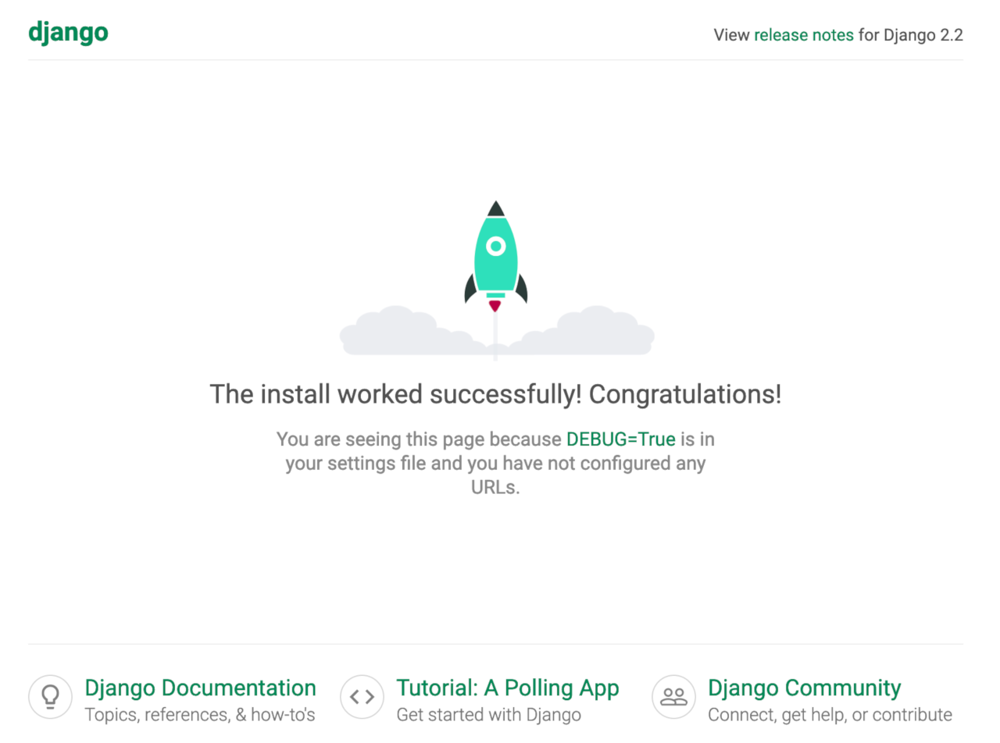
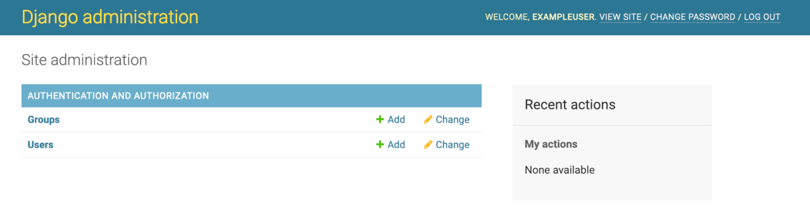

[Django](https://www.djangoproject.com/) is a web development framework for the Python programing language. It enables rapid development, while favoring pragmatic and clean design. Django was initially developed for use in a newspaper's website division, and as a result the Django framework is very well suited to developing content-centric applications. It's also very flexible in its ability to facilitate many complex content management operations.

## Deploying the Django Marketplace App



**Software installation should complete within 2-5 minutes after the Linode has finished provisioning.**

## Configuration Options

### Django Options

You can configure your Django App by providing values for the following fields:

| **Field** | **Description** |
|:--------------|:------------|
| **Django USER** | Username for your Django application. *Required*. |
| **Django Password** | Password for the Django USER. *Required*. |
| **Django USER email** | Email address for the Django USER. The format for the email must be in the form user@email.tld. *Required*. |

### General Options

For advice on filling out the remaining options on the **Create a Linode** form, see [Getting Started > Create a Linode](/docs/guides/getting-started/#create-a-linode). That said, some options may be limited or recommended based on this Marketplace App:

- **Supported distributions:** Debian 10
- **Recommended minimum plan:** All plan types and sizes can be used.

## Getting Started after Deployment

### Access Django


The Django Marketplace App will assign `DjangoApp` as the [Django project name](https://docs.djangoproject.com/en/3.0/intro/tutorial01/#creating-a-project).


After Django has finished installing, you will be able to access your Django site at your Linode's IPv4 address, for instance: `http://yourlinodeip:8000`.

1.  To find your Linode's IPv4 address. Click on the **Linodes** link in the sidebar. You will see a list of all your Linodes.

1. Find the Linode you just created when deploying your app and select it.

1. Navigate to the **Networking** tab.

1. The IP address will be displayed under the **Address** column in the **IPv4** table.

1. Copy and paste the IPv4 address into a browser window followed by `:8000`. You should see the Django test page appear.

    

1.  Once you have verified that you can access your Django site via the browser, you can log in using the admin credentials you created when deploying your app. Update the address in the browser to: `http://yourlinodeip:8000/admin`.

    

1.  Once logged in, you will have access to the Admin console. Now you can begin configuring your site.

    


