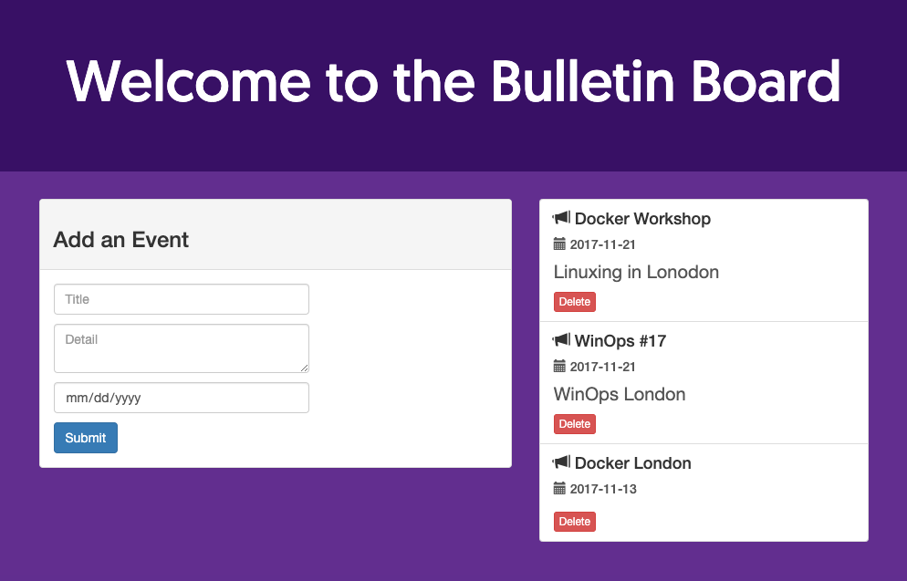

Docker is a tool that enables you to create, deploy, and manage lightweight, stand-alone packages that contain that contain code, libraries, runtime, system settings, and dependencies that are required to run an application. These packages are called containers.

Each container is deployed with its own CPU, memory, block I/O, and network resources, without having to depend upon an individual kernel and operating system. While it may be easiest to compare Docker and virtual machines, they differ in the way they share or dedicate resources.

## Deploying the Docker Marketplace App



**Software installation should complete within 2-5 minutes after the Linode has finished provisioning.**

## Configuration Options

### Docker Options

| **Configuration** | **Description** |
|:--------------|:------------|
| **Resource to Download** | The url to a hosted [Dockerfile](https://docs.docker.com/engine/reference/builder/) or [docker-compose.yml](/docs/guides/how-to-use-docker-compose/#Basic-Usage) file to be used to assemble an image as part of the application creation process. |
| **Command to run**| A [Docker Command](https://www.linode.com/docs/guides/docker-commands-quick-reference-cheat-sheet/) to be run as part of the application creation process.|
| **The limited sudo user to be created for the Linode** | This is the limited user account to be created for the Linode. This account has sudo user privileges. |
| **The password for the limited sudo user** | Set a password for the limited sudo user. The password must meet the complexity strength validation requirements for a strong password. This password can be used to perform any action on the server, similar to root, so make it long, complex, and unique. |
| **The SSH Public Key that will be used to access the Linode** | If you wish to access [SSH via Public Key](/docs/guides/use-public-key-authentication-with-ssh/) (recommended) rather than by password, enter the public key here. |
| **Disable root access over SSH?** | Select `Yes` to block the root account from logging into the server via SSH. Select `No` to allow the root account to login via SSH. |
| **Your Linode API Token.** | Linode API access token is needed to create any DNS records. If you don't have a token, you must [create one](/docs/guides/getting-started-with-the-linode-api/#get-an-access-token) to configure DNS. |
| **Subdomain** | The subdomain you want the installer to create a DNS record for during setup. The subdomain should only be provided if you also provide a `domain` and `API Token`. |
| **Domain** | The domain name you want to create as part of the application creation process. The installer creates a DNS record for this domain during setup if you provide this field along with your `API Token`. |
| **Do you need an MX record for this domain?** | Select `Yes` to create a basic [MX record](/docs/networking/dns/dns-records-an-introduction/#mx) for the domain. Select `No` to create no MX records.|
| **Do you need an SPF record for this domain?** | Select `Yes` to create a basic [SPF record](/docs/networking/dns/dns-records-an-introduction/#spf) for the domain. Select `No` to create no SPF records. |

### General Options

For advice on filling out the remaining options on the **Create a Linode** form, see [Getting Started > Create a Linode](/docs/guides/getting-started/#create-a-linode). That said, some options may be limited or recommended based on this Marketplace App:

- **Supported distributions:** Debian 9
- **Recommended minimum plan:** All plan types and sizes can be used.

## Getting Started after Deployment

Docker is now installed and ready to use. The following steps provide a sample application to get you started with an easy example to demonstrate some basic Docker functionality. It is not necessary for Docker set-up.

### Access Docker

After Docker has finished installing, you can access Docker from the console via SSH with the IPv4 address of the Linode:

1.  [SSH into the Linode](/docs/getting-started/#connect-to-your-linode-via-ssh) and [create a limited user account](/docs/security/securing-your-server/#add-a-limited-user-account).

1.  Log out and log back in with the limited user account.

1.  Install the unzip package from the package manager:

        sudo apt install unzip

1.  Download the example `node-bulletin-board` project and unzip it:

        curl -LO https://github.com/dockersamples/node-bulletin-board/archive/master.zip
        unzip master.zip

1.  Move into the example project directory:

        cd node-bulletin-board-master/bulletin-board-app

1.  Build the image with the following command:

        sudo docker image build -t bulletinboard:1.0 .

1.  Start a container with the image:

        sudo docker container run --publish 8000:8080 --detach --name bb bulletinboard:1.0

1.  Visit the application in the browser by going to `http://198.51.100.0:8000`, replacing the IP address with the public IP of the Linode.

    

1.  To delete the container run:

        sudo docker container rm --force bb

## Next Steps



For more on Docker, checkout the following guides:

- [An Introduction to Docker](/docs/applications/containers/introduction-to-docker/)
- [How to Use Docker Files](/docs/applications/containers/how-to-use-dockerfiles/)
- [How to Use Docker Compose](/docs/applications/containers/how-to-use-docker-compose/)
- [How to Connect Docker Containers](/docs/applications/containers/docker-container-communication/)
- [How to Create a Docker Swarm Manager and Nodes on a Linode](/docs/applications/containers/how-to-create-a-docker-swarm-manager-and-nodes-on-linode/)
- [Create and Deploy a Docker Container Image to a Kubernetes Cluster](/docs/kubernetes/deploy-container-image-to-kubernetes/)
- [Manage a Docker Cluster with Kubernetes](/docs/kubernetes/manage-a-docker-cluster-with-kubernetes/)
