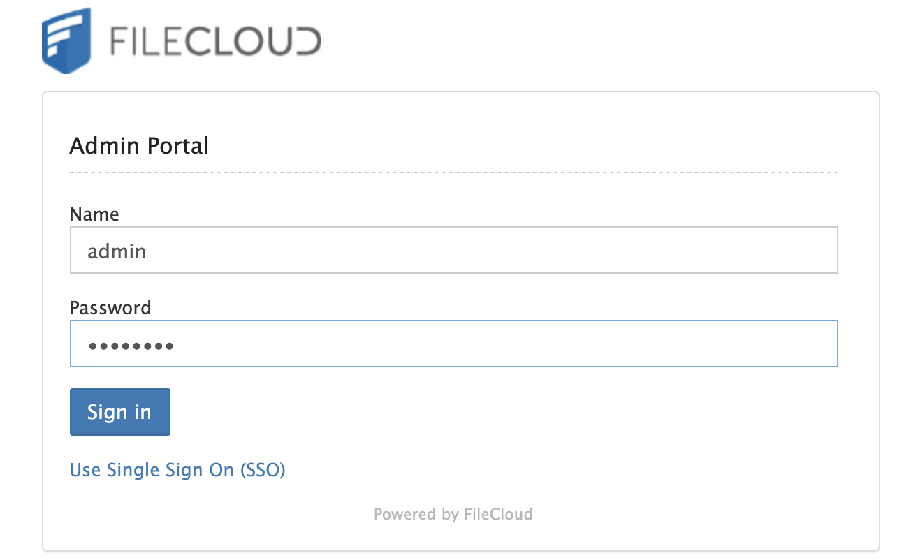
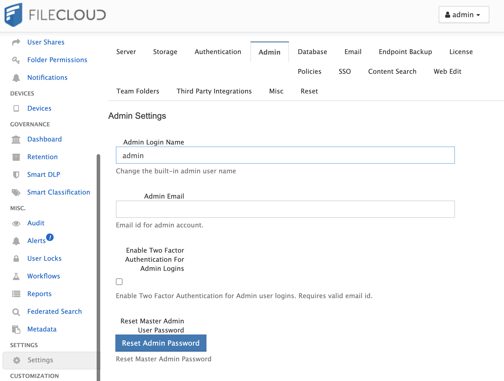
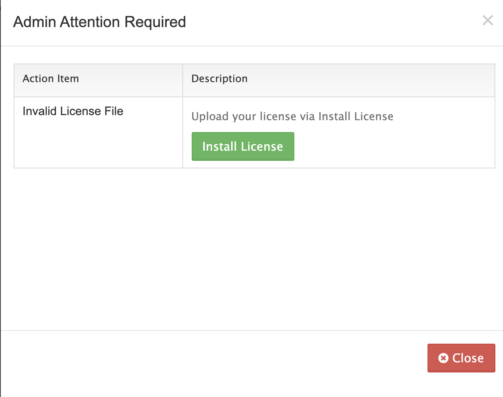

FileCloud is a cloud-based file-sharing application, similar to tools like Dropbox, that allows users to remotely access, upload, and sync hosted files.

## Deploying the FileCloud Marketplace App



**Software installation should complete within 2-5 minutes after the Linode has finished provisioning.**

## Configuration Options

### FileCloud Options

Here are the additional options available for this Marketplace App:

| **Configuration** | **Description** |
|-------------------|-----------------|
| **Your Linode API Token** | Your Linode `API Token` is needed to create DNS records. If this is provided along with the `subdomain` and `domain` fields, the installation attempts to create DNS records via the Linode API. If you don't have a token, but you want the installation to create DNS records, you must [create one](/docs/platform/api/getting-started-with-the-linode-api/#get-an-access-token) before continuing. |
| **The subdomain for Linode's DNS record** | The subdomain you wish the installer to create a DNS record for during setup. The suggestion given is `www`. The subdomain should only be provided if you also provide a `domain` and `API Token`. |
| **The domain for the Linode's DNS record** | The domain name where you wish to host your FileCloud server. The installer creates a DNS record for this domain during setup if you provide this field along with your `API Token`. |
| **Would you like to use a free CertBot SSL certificate?** | Select `Yes` if you would like the install to create an SSL certificate for you, or `No` if you do not. You cannot create secure, encrypted conferences without an SSL certificate. |
| **E-Mail Address for Let's Encrypt Certificate** |  E-mail address used as the start of authority (SOA) email address for this server and for Let's Encrypt installation. This email address is added to the SOA record for the domain. This is a required field if you want the installer to create DNS records. |
| **The SSH Public Key that will be used to access the Linode** | If you wish to access [SSH via Public Key](/docs/security/authentication/use-public-key-authentication-with-ssh/) (recommended) rather than by password, enter the public key here. |
| **Disable root access over SSH?** | Select `Yes` to block the root account from logging into the server via SSH. Select `No` to allow the root account to login via SSH. |

### General Options

For advice on filling out the remaining options on the **Create a Linode** form, see [Getting Started > Create a Linode](/docs/guides/getting-started/#create-a-linode). That said, some options may be limited or recommended based on this Marketplace App:

- **Supported distributions:** Debian 9 and Ubuntu 18.04 LTS
- **Recommended plan:** All plan types and sizes can be used with FileCloud. The Linode plan that you select should be appropriate for the amount of data transfer, users, storage, and other stress that may affect the performance of server.

## Getting Started after Deployment

Once the FileCloud server is up and running, a few additional steps must be completed before you can begin using your application.

### Creating Secure Login Credentials

A new administrator password must be created to secure the server:

1.  Log in to the FileCloud admin page with the default log-in information at the following URL, replacing `my-ip-or-domain` with the IP address of your Linode or domain you set up on initial installation:

        http://my-ip-or-domain/admin

1.  In the login fields that appear, enter the default credentials:

    - **Username:** admin
    - **Password:** password

    

1.  A number of messages and warnings appear. For now, dismiss them to clear your screen.

1.  Navigate to the **Settings** sidebar option, followed by the **Admin** tab. Click on the **Reset Admin Password** to reset your Admin Password to something more secure.

    

1.  Follow the prompts and select the **Reset Password** button to complete the password reset.

1.  If the password reset was successful, you are logged out and redirected to the administrator login page. Enter the administrator username and your new password to proceed.

### Obtain a new License Key

FileCloud by default is inaccessible without either a trial or paid license key provided by FileCloud.

1. To obtain a trial license key, sign on or create an account at [FileCloud's customer portal](https://portal.getfilecloud.com/ui/user/index.html). After logging in to your new account, click on the `Begin Trial` button and follow the prompts to obtain a new trial license key file.See [FileCloud - License Purchase And Renewal](https://www.getfilecloud.com/supportdocs/display/cloud/FileCloud+-+License+Purchase+And+Renewal) for full instructions on obtaining a license.

1. Once you have a valid license key, log in to the FileCloud administrator page at the Linode's IP address or the domain you specified during installation. After a new successful login, you will see the `Action Items` popup.

    
New Licenses can also be added at any time by selecting the `Settings` sidebar option followed by and the `License` tab.


1. Select the `Install License` button, followed by `Choose File` to upload your `license.xlm` file and tie your License Key to the FileCloud installation.

    

