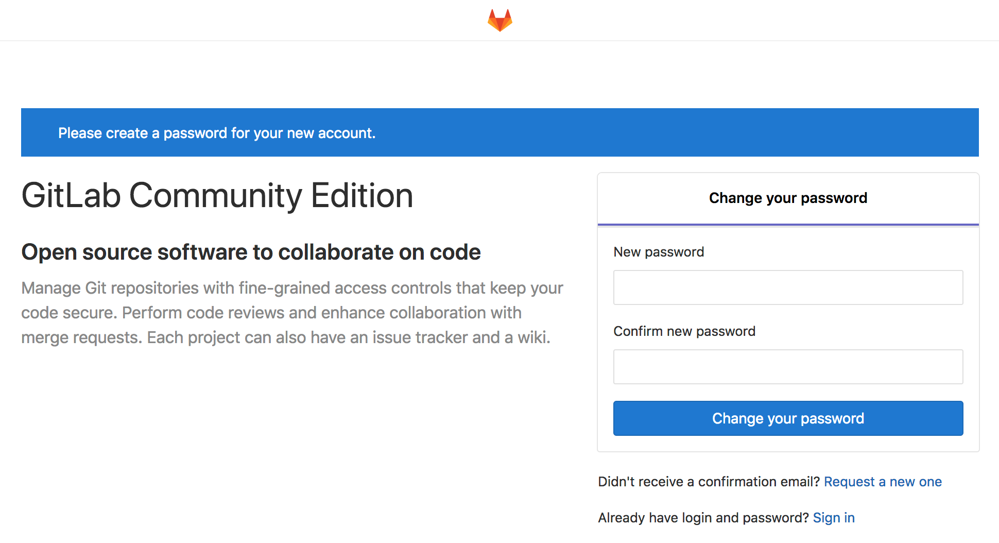

GitLab is a complete solution for all aspects of your software development. At its core, GitLab serves as your centralized remote Git repository. GitLab also features built-in tools that represent every task in your development workflow, from planning to testing to releasing.

Self-hosting your software development with GitLab offers total control of your codebase. At the same time, its familiar interface will ease collaboration for you and your team. GitLab is the most popular self-hosted Git repository software, so you'll benefit from a robust set of integrated tools and an active community.

## Deploying the GitLab Marketplace App



**Software installation should complete within 3-7 minutes after the Linode has finished provisioning.**

## Configuration Options

### GitLab Options

Here are the additional options available for this Marketplace App:

- **Domain** *(optional)*: Your GitLab site's domain name. This domain will also be used by Postfix to send mail. Setting a value for this field will not automatically set up DNS for your app, so be sure to follow the DNS instructions in the [Access your GitLab Site](#access-your-gitlab-site) section. If you do not have a domain name, you can leave this field blank and Postfix will use your Linode's default Reverse DNS to send email instead (i.e. `gitlab@li926-227.members.linode.com`).

### General Options

For advice on filling out the remaining options on the **Create a Linode** form, see [Getting Started > Create a Linode](/docs/guides/getting-started/#create-a-linode). That said, some options may be limited or recommended based on this Marketplace App:

- **Supported distributions:** Debian 9
- **Recommended minimum plan:** 8GB Dedicated CPU Compute Instance

## Getting Started after Deployment

### Access your GitLab Site

After GitLab has finished installing, you will be able to access your GitLab site over `http://` with your Linode's IPv4 address or the domain name entered when deploying your GitLab Marketplace App.

1. Access your GitLab instance:

    **With your Linode's IP Address**

    You will be able to access your GitLab site by copying your Linode's IPv4 address and entering it in the browser of your choice. To find your Linode's IPv4 address:

    1. Click on the **Linodes** link in the sidebar. You will see a list of all your Linodes.

    1. Find the Linode you just created when deploying your app and select it.

    1. Navigate to the **Networking** tab.

    1. Your IPv4 address will be listed under the **Address** column in the **IPv4** table.

    1. Copy and paste the IPv4 address into a browser window. Ensure you are using `http://`.

    **With a Domain Name**

    If you deployed your GitLab Marketplace App with a value set for the **Domain** field, you will need to separately set up DNS for your app. Specifically, you'll need to create an [*A record*](/docs/networking/dns/dns-records-an-introduction/#a-and-aaaa) associated with the IPv4 address for your Linode. Review the [DNS Manager](/docs/guides/dns-manager/) guide for instructions on setting up DNS records.

    Once your DNS records are created (and the changes have propagated to your internet service provider), you can then enter the domain name in a browser window to access your GitLab site. Ensure you are using `http://` when visiting your site.

    
For more general information about how DNS works, review the [DNS Records: An Introduction](/docs/networking/dns/dns-records-an-introduction/) guide.


1. Once you have accessed your GitLab site, you will be brought to GitLab's password reset screen. Provide a secure password for the administrator's account:

    

1. You will be redirected to the login screen. Enter `root` as the username and the password you just created to log in. You can now begin creating GitLab repositories, users, and more. See [GitLab's official documentation](https://docs.gitlab.com/ee/university/training/topics/getting_started.html) for more information.

### Add a Domain after Deploying your GitLab Instance

If you configured your GitLab Marketplace App without providing a domain, you can configure one after the app has been deployed. Begin by setting up DNS for your domain:

1.  Create an [*A record*](/docs/networking/dns/dns-records-an-introduction/#a-and-aaaa) associated with the IPv4 address for your Linode. Review the [DNS Manager](/docs/guides/dns-manager/) guide for instructions on setting up DNS records.

1.  Wait for your new DNS records to propagate to your internet service provider.

After setting up DNS, you will need to update your GitLab instance's `/etc/gitlab/gitlab.rb` file with your domain name. This will ensure that any emails sent to users by the GitLab instance will use your site's domain.

1.  [Connect to your Linode via SSH](/docs/getting-started/#connect-to-your-linode-via-ssh).

1.  With a text editor of your choice ([nano](/docs/quick-answers/linux/use-nano-to-edit-files-in-linux/), for example), open the `/etc/gitlab/gitlab.rb` file and modify the value of `external_url`. Ensure you replace `http://example.com` with your domain:

    
## GitLab URL
##! URL on which GitLab will be reachable.
##! For more details on configuring external_url see:
##! https://docs.gitlab.com/omnibus/settings/configuration.html#configuring-the-external-url-for-gitlab
external_url 'http://example.com'


1.  Issue the following command to enable your new configuration:

        gitlab-ctl reconfigure

1.  Navigate to the domain in a browser window and verify that you are directed to your GitLab instance.

## Software Included

The GitLab Marketplace App installs the following required software on your Linode:

| **Software** | **Description** |
|:--------------|:------------|
| [**GitLab**](https://about.gitlab.com/) | Remote Git repository software. |
| [**Postfix**](http://www.postfix.org/) | Postfix is a free and open-source mail transfer agent that routes and delivers electronic mail. |
| [**UFW**](https://wiki.ubuntu.com/UncomplicatedFirewall) | Firewall utility. Ports 22/tcp, 80/tcp, 443/tcp, 25, 587, and 110 for IPv4 and IPv6 will allow outgoing and incoming traffic. |
| [**Fail2ban**](https://www.fail2ban.org/wiki/index.php/Main_Page) | Fail2Ban is an intrusion prevention software framework that protects computer servers from brute-force attacks. |


