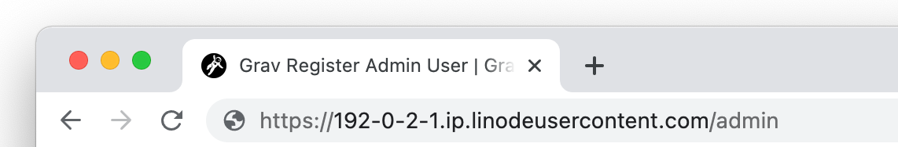
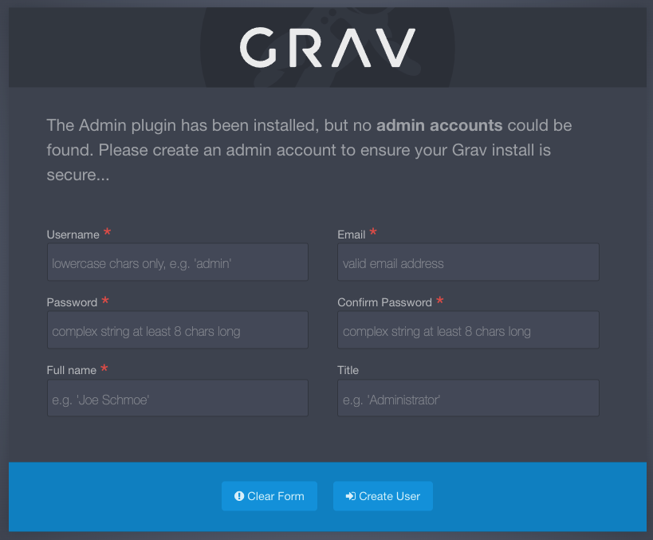
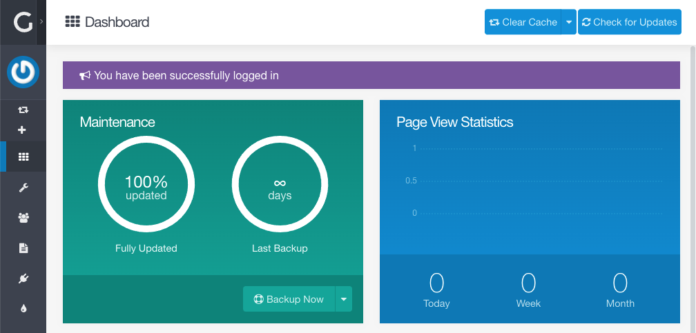

[Grav](https://getgrav.org/) is a flexible open source flat-file CMS (Content Management System). It can be used by both technical and non-technical people, allowing users to operate in the command line through its own [CLI](https://learn.getgrav.org/17/cli-console/command-line-intro) or in a web browser through its [Admin panel](https://learn.getgrav.org/17/admin-panel/introduction). Page templates in Grav are constructed using the highly customizable [Twig templating engine](https://twig.symfony.com/) and content can be written directly in Markdown. Using Grav also enables you to pull from a plethora of pre-built resources, including [starter templates](https://getgrav.org/downloads/skeletons), unique [themes](https://getgrav.org/downloads/themes), and quite a few [plugins](https://getgrav.org/downloads/plugins). If you need assistance getting started, there is an active [community form](https://discourse.getgrav.org/) and [extensive documentation](https://learn.getgrav.org/17/basics/what-is-grav).

## Deploying the Grav Marketplace App



**Software installation should complete within 5-10 minutes after the Linode has finished provisioning.**

## Configuration Options

### Grav Options

Here are the additional options available for this Marketplace App:

| **Field** | **Description** |
|:--------------|:------------|
| **Admin Email for the server** | This email is require to generate the SSL certificates. *Required* |
| **Your Linode API Token** | Your Linode `API Token` is needed to create DNS records. If this is provided along with the `subdomain` and `domain` fields, the installation attempts to create DNS records via the Linode API. If you don't have a token, but you want the installation to create DNS records, you must [create one](/docs/platform/api/getting-started-with-the-linode-api/#get-an-access-token) before continuing. |
| **Subdomain** | The subdomain you wish the installer to create a DNS record for during setup. The suggestion given is `www`. The subdomain should only be provided if you also provide a `domain` and `API Token`. |
| **Domain** | The domain name where you wish to host your Grav instance. The installer creates a DNS record for this domain during setup if you provide this field along with your `API Token`. |
| **The limited sudo user to be created for the Linode** | This is the limited user account to be created for the Linode. This account has sudo user privileges. |
| **The password for the limited sudo user** | Set a password for the limited sudo user. The password must meet the complexity strength validation requirements for a strong password. This password can be used to perform any action on your server, similar to root, so make it long, complex, and unique. |
| **The SSH Public Key that will be used to access the Linode** | If you wish to access [SSH via Public Key](/docs/security/authentication/use-public-key-authentication-with-ssh/) (recommended) rather than by password, enter the public key here. |
| **Disable root access over SSH?** | Select `Yes` to block the root account from logging into the server via SSH. Select `No` to allow the root account to login via SSH. |

### General Options

For advice on filling out the remaining options on the **Create a Linode** form, see [Getting Started > Create a Linode](/docs/guides/getting-started/#create-a-linode). That said, some options may be limited or recommended based on this Marketplace App:

- **Supported distributions:** Ubuntu 20.04 LTS
- **Recommended plan:** All plan types and sizes can be used.

## Getting Started after Deployment

### Accessing the Grav Admin Panel

1.  Open your web browser and navigate to `http://[domain]/admin`, where *[domain]* can be replaced with the custom domain you entered during deployment or your Compute Instance's rDNS domain (such as `192-0-2-1.ip.linodeusercontent.com`). You can also use your IPv4 address, though your connection will not be encrypted. See the [Managing IP Addresses](/docs/guides/managing-ip-addresses/) guide for information on viewing IP addresses and rDNS.

    

1.  You are now prompted to create a new admin user for Grav. Complete the form and click the **Create User** button.

    

1.  Once the admin user had been created, you are automatically logged in and taken to the Admin dashboard. From here, you can fully administer your new Grav site, including creating content, modifying your configuration, changing your theme, and much more.

    

Now that you’ve accessed your dashboard, check out [the official Grav documentation](https://learn.getgrav.org/) to learn how to further utilize your Grav instance.

