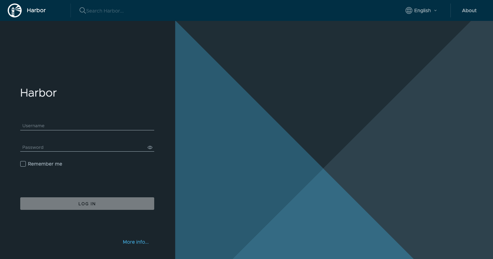

Harbor is an open source container registry platform, cloud-native content storage, and signing/scanning tool. Harbor enhances the open source Docker distribution by providing features like security, identification, and management. The image transfer efficiency can be improved by having a registry closer to the build and run environment. Harbor includes comprehensive security features like user administration, access control, and activity auditing, as well as image replication between registries.

Harbor is an excellent compliment to the [Linode Kubernetes Engine (LKE)](/docs/products/compute/kubernetes/).

## Deploying the Harbor Marketplace App



**Software installation should complete within 2-5 minutes after the Linode has finished provisioning.**

## Configuration Options

### Harbor Options

Here are the additional options available for this Marketplace App:

| **Field** | **Description** |
|:--------------|:------------|
| **Admin Password** | The Harbor admin password. *Required*. |
| **Database Password** | The Harbor database password. *Required*. |
| **Email Address** | This email is require to generate the SSL certificates. *Required* |
| **Your Linode API Token** | Your Linode `API Token` is needed to create DNS records. If this is provided along with the `subdomain` and `domain` fields, the installation attempts to create DNS records via the Linode API. If you don't have a token, but you want the installation to create DNS records, you must [create one](/docs/platform/api/getting-started-with-the-linode-api/#get-an-access-token) before continuing. |
| **Subdomain** | The subdomain you wish the installer to create a DNS record for during setup. The suggestion given is `www`. The subdomain should only be provided if you also provide a `domain` and `API Token`. |
| **Domain** | The domain name where you wish to host your Harbor instance. The installer creates a DNS record for this domain during setup if you provide this field along with your `API Token`. |
| **The limited sudo user to be created for the Linode** | This is the limited user account to be created for the Linode. This account has sudo user privileges. |
| **The password for the limited sudo user** | Set a password for the limited sudo user. The password must meet the complexity strength validation requirements for a strong password. This password can be used to perform any action on your server, similar to root, so make it long, complex, and unique. |
| **The SSH Public Key that will be used to access the Linode** | If you wish to access [SSH via Public Key](/docs/security/authentication/use-public-key-authentication-with-ssh/) (recommended) rather than by password, enter the public key here. |
| **Disable root access over SSH?** | Select `Yes` to block the root account from logging into the server via SSH. Select `No` to allow the root account to login via SSH. |

### General Options

For advice on filling out the remaining options on the **Create a Linode** form, see [Getting Started > Create a Linode](/docs/guides/getting-started/#create-a-linode). That said, some options may be limited or recommended based on this Marketplace App:

- **Supported distributions:** Ubuntu 20.04 LTS, Debian 11
- **Recommended plan:** All plan types and sizes can be used.

## Getting Started after Deployment

### Accessing the Harbor App

1.  Open a browser and navigate to the domain you created in the beginning of your deployment. You can also use your Compute Instance's rDNS, which may look like `li*.members.linode.com`. See the [Remote Access](/docs/guides/remote-access/) guide for information on viewing and setting the rDNS value.

1.  In the Harbor login screen that appears, enter `admin` as the username and use the *Admin password* you created in the beginning of your deployment.

    

Now that you’ve accessed your dashboard, check out [the official Harbor documentation](https://goharbor.io/docs/2.3.0/administration/) to learn how to further utilize your Harbor instance.

