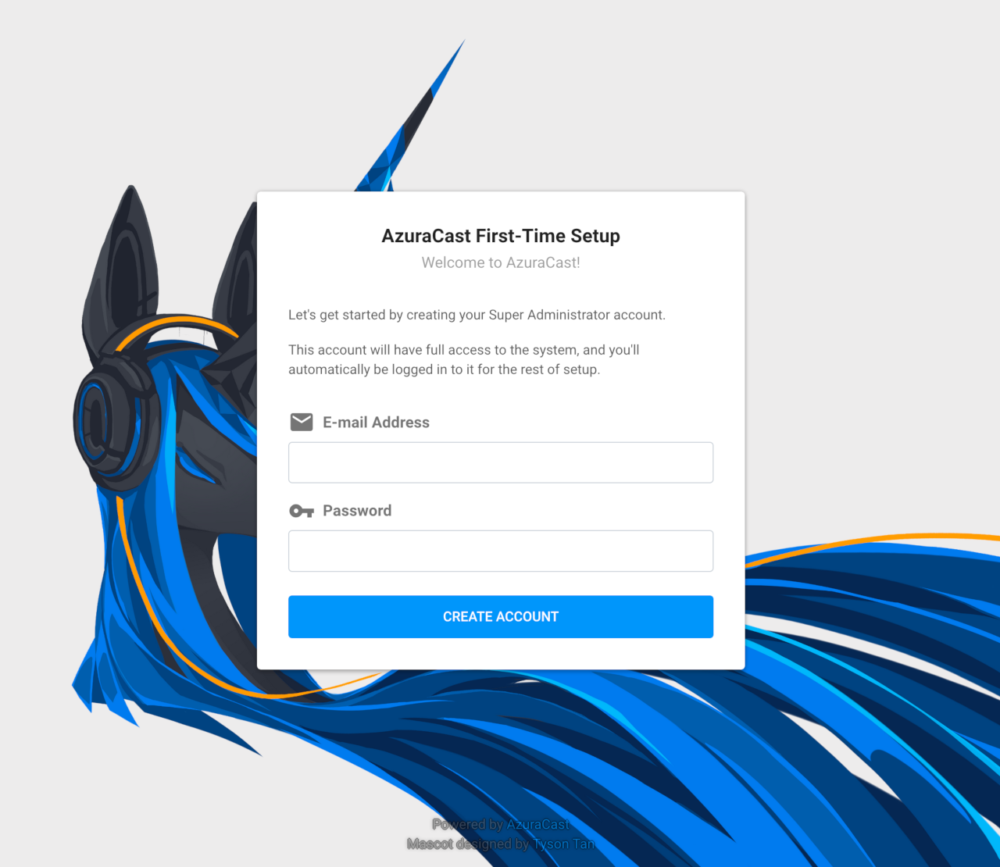
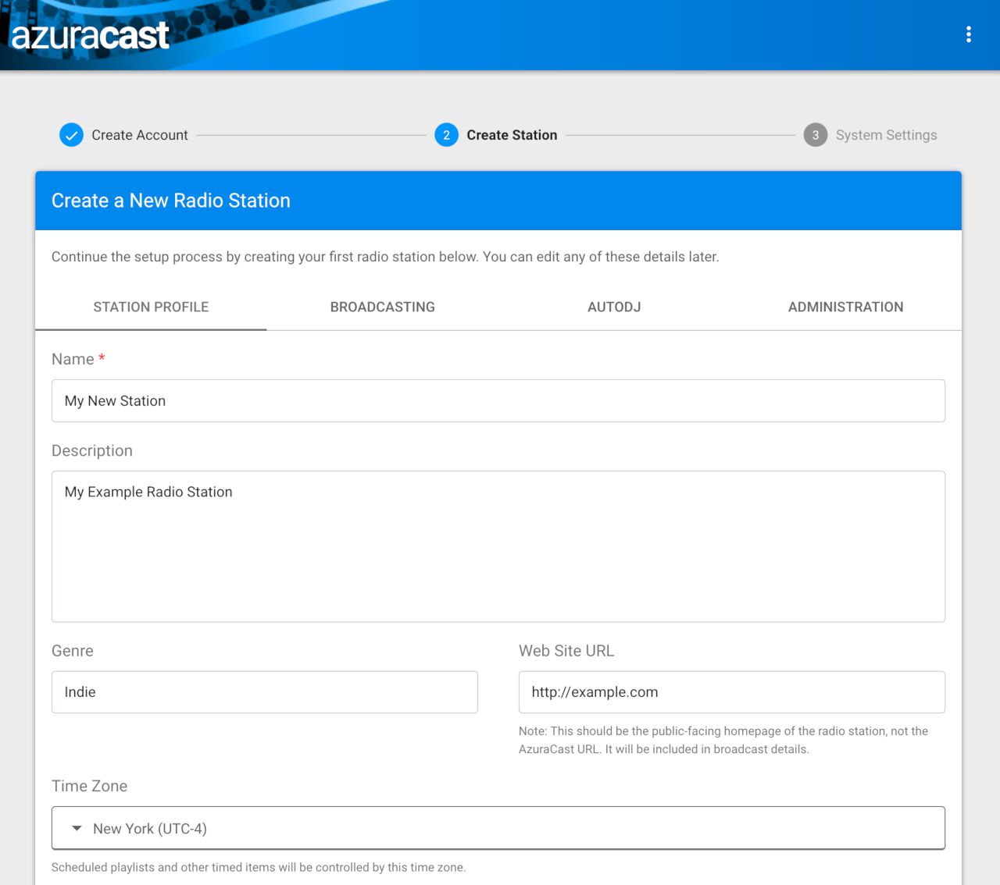
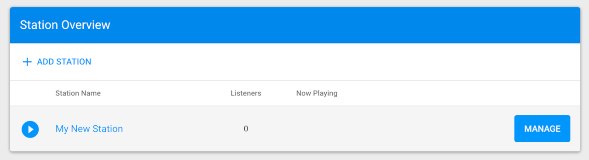

## AzuraCast Marketplace App

[AzuraCast](https://www.azuracast.com) is a self-hosted web radio station and management suite. Installation is simple with Marketplace Apps, and the intuitive web interface makes running a web station easy. After installation, you can be broadcasting within in minutes.

## Deploy AzuraCast with Marketplace Apps



### Linode Options

After providing the app-specific options, provide configurations for your Linode server:

| **Configuration** | **Description** |
|-------------------|-----------------|
| **Select an Image** | Select either Debian 10 or Ubuntu 20.04 LTS for your image. These are the only two images supported by the AzuraCast Marketplace App. *Required* |
| **Region** | The region where you would like your Linode to reside. In general, it's best to choose a location that's closest to you. For more information on choosing a DC, review the [How to Choose a Data Center](/docs/platform/how-to-choose-a-data-center) guide. You can also generate [MTR reports](/docs/networking/diagnostics/diagnosing-network-issues-with-mtr/) for a deeper look at the network routes between you and each of our data centers. *Required*. |
| **Linode Plan** | Your Linode's [hardware resources](/docs/platform/how-to-choose-a-linode-plan/#hardware-resource-definitions). You can use any size Linode for your AzuraCast App. The Linode plan that you select should be appropriate for the amount of data transfer, users, and other stress that may affect the performance of your station. You can create your station on a 1GB Linode (Nanode) or a Linode 2GB with low risk for performance hits. *Required* |
| **Linode Label** | The name for your Linode, which must be unique between all of the Linodes on your account. This name will be how you identify your server in the Cloud Manager’s Dashboard. *Required*. |
| **Root Password** | The primary administrative password for your Linode instance. This password must be provided when you log in to your Linode via SSH. The password must meet the complexity strength validation requirements for a strong password. Your root password can be used to perform any action on your server, so make it long, complex, and unique. *Required* |

When you've provided all required Linode Options, click on the **Create** button. **Your AzuraCast app will complete installation anywhere between 1-3 minutes after your Linode has finished provisioning**.

## Getting Started After Deployment

AzuraCast is now installed and ready to use.

1.  Navigate to the IP address of the Linode in your browser. You can find the IP address for your Linode on the Linode detail page in the [Cloud Manager](https://cloud.linode.com).

1.  The first thing you want to do is create a *Super Administrator* account that has has system-wide permissions.

    

1.  Next, AzuraCast prompts you to create a new radio station. Fill out the required fields, then click the **Save Changes** button at the bottom of the screen to continue.

    

1.  On the next page you can set other settings including using a custom URL if you have one set up. Learn more about using a custom URL with Linode DNS in our [DNS Manager](/docs/platform/manager/dns-manager/) guide. When you are finished, click the **Save Changes** button at the bottom of the screen to continue.

1.  Your station is now ready. On the following page, you are taken to the control panel, and you are ready to start broadcasting your station.

1.  To manage the station you just created click the **Manage** button in the **Station Overview** section. This will open the Station Dashboard for the station you created during setup.

    

1.  Here you can control your station, add songs, add DJs, take requests, and more.

### Software Included

The AzuraCast Marketplace App will install the following software on your Linode:

| **Software** | **Description** |
|:--------------|:------------|
| [**Lquidsoap**](https://www.liquidsoap.info/) | An AutoDJ that keeps the tunes streaming.|
| [**Icecast 2.4 (Icecast-KH on supported systems)**](https://icecast.org/) | A broadcasting frontend. |
| [**SHOUTcast 2 DNAS**](http://wiki.shoutcast.com/wiki/SHOUTcast_DNAS_Server_2) | An alternate broadcasting frontend. |
| [**NGINX**](https://www.nginx.com/) | A webserver a proxy. |
| [**MariaDB**](https://mariadb.org/) | A database. |
| [**PHP 7**](https://secure.php.net/) | General purpose programming language used for the website. |
| [**InfluxDB**](https://www.influxdata.com/) | A database for capturing time-series based statistics. |
| [**Redis**](https://redis.io/) | A database for session management and caching |


