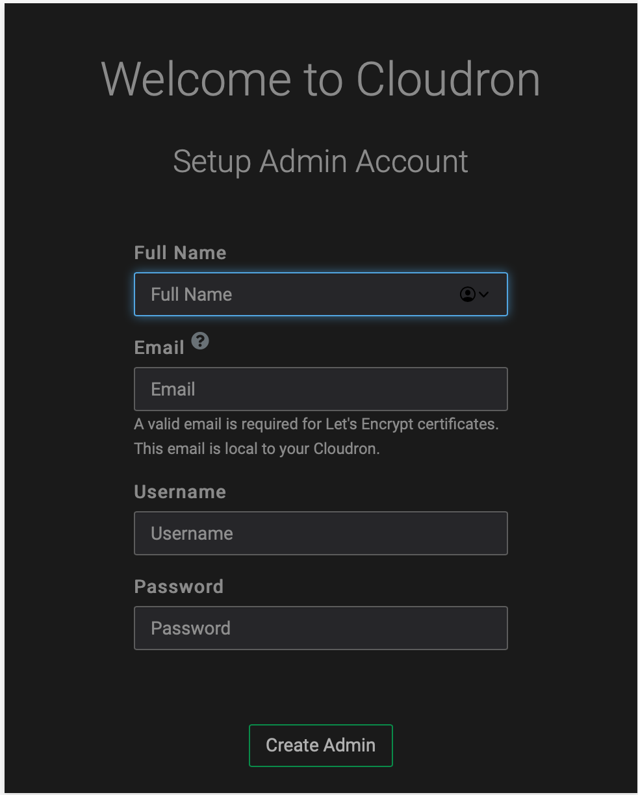

[Cloudron](https://www.cloudron.io) is a platform that makes it easy to install, manage and secure web apps on a server. Cloudron provides a centralized way to manage users and specify which apps they can access.
## Deploy Cloudron with Marketplace Apps



### Cloudron Options

The Cloudron Marketplace form includes advanced fields to setup your Cloudron server's limited user account and DNS records. These are optional configurations and are not required for installation.

| **Field&nbsp;&nbsp;&nbsp;&nbsp;&nbsp;&nbsp;&nbsp;&nbsp;&nbsp;&nbsp;&nbsp;&nbsp;&nbsp;&nbsp;&nbsp;&nbsp;&nbsp;&nbsp;&nbsp;&nbsp;&nbsp;&nbsp;&nbsp;&nbsp;&nbsp;&nbsp;&nbsp;&nbsp;&nbsp;&nbsp;&nbsp;&nbsp;&nbsp;&nbsp;&nbsp;&nbsp;&nbsp;&nbsp;&nbsp;&nbsp;&nbsp;&nbsp;** | **Description** |
|-----------|-----------------|
| **The limited sudo user to be created for the Linode** | This is the limited user account to be created for the Linode. This account has sudo user privileges. |
| **The password for the limited sudo user** | Set a password for the limited sudo user. The password must meet the complexity strength validation requirements for a strong password. This password can be used to perform any action on your server, similar to root, so make it long, complex, and unique. |
| **The SSH Public Key that will be used to access the Linode** | If you wish to access [SSH via Public Key](https://www.linode.com/docs/security/authentication/use-public-key-authentication-with-ssh/) (recommended) rather than by password, enter the public key here. |
| **Disable root access over SSH?** | Select `Yes` to block the root account from logging into the server via SSH. Select `No` to allow the root account to login via SSH. |

### Linode Options

After providing the app-specific options, provide configurations for your Linode server:

| **Configuration** | **Description** |
|-------------------|-----------------|
| **Select an Image** | Ubuntu 18.04 is currently the only image supported by the Cloudron Marketplace App, and it is pre-selected on the Linode creation page. *Required* |
| **Region** | The region where you would like your Linode to reside. In general, it's best to choose a location that's closest to you. For more information on choosing a DC, review the [How to Choose a Data Center](/docs/platform/how-to-choose-a-data-center) guide. You can also generate [MTR reports](/docs/networking/diagnostics/diagnosing-network-issues-with-mtr/) for a deeper look at the network routes between you and each of our data centers. *Required*. |
| **Linode Plan** | Your Linode's [hardware resources](/docs/platform/how-to-choose-a-linode-plan/#hardware-resource-definitions). You can use any size Linode for your Cloudron App as it uses minimal system resources. The minimum required memory is 1 GB (2GB recommended) and the minimum required free disk space is 5 GB (10 GB recommended). You can always [resize your Linode](/docs/platform/disk-images/resizing-a-linode/) to a different plan later if you feel you need to increase or decrease your system resources. *Required* |
| **Linode Label** | The name for your Linode, which must be unique between all of the Linodes on your account. This name is how you identify your server in the Cloud Manager’s Dashboard. *Required*. |
| **Add Tags** | A tag to help organize and group your Linode resources. [Tags](/docs/quick-answers/linode-platform/tags-and-groups/) can be applied to Linodes, Block Storage Volumes, NodeBalancers, and Domains. |
| **Root Password** | The primary administrative password for your Linode instance. This password must be provided when you log in to your Linode via SSH. The password must meet the complexity strength validation requirements for a strong password. Your root password can be used to perform any action on your server, so make it long, complex, and unique. *Required* |

When you've provided all required Linode Options, click the **Create** button. **The Cloudron app completes the installation anywhere between 10-12 minutes after the Linode has finished provisioning**.

The Cloudron application is served on the Linode, however it still requires a few additional steps to fully complete the installation process.

1.  The Cloudron setup wizard is served at the IP address of the Linode server . For example, `http://203.0.113.0 `, replacing the IP address with values for the Linode server and accept the self-signed certificate.

    
In Chrome, you can accept the self-signed certificate by clicking on Advanced and then click Proceed to <ip> (unsafe). In Firefox, click on Advanced, then Add Exception and then Confirm Security Exception. 

1.  At this point, the Cloudron Domain setup wizard appears.

    

1.  In the setup screen, fill in the fields and click the **Next** button. The **Setup Admin Account** page appears.

    

1.  After the account is created, Cloudron prompts you to proceed to the dashboard on completing the setup and displays a confirmation screen.

    


