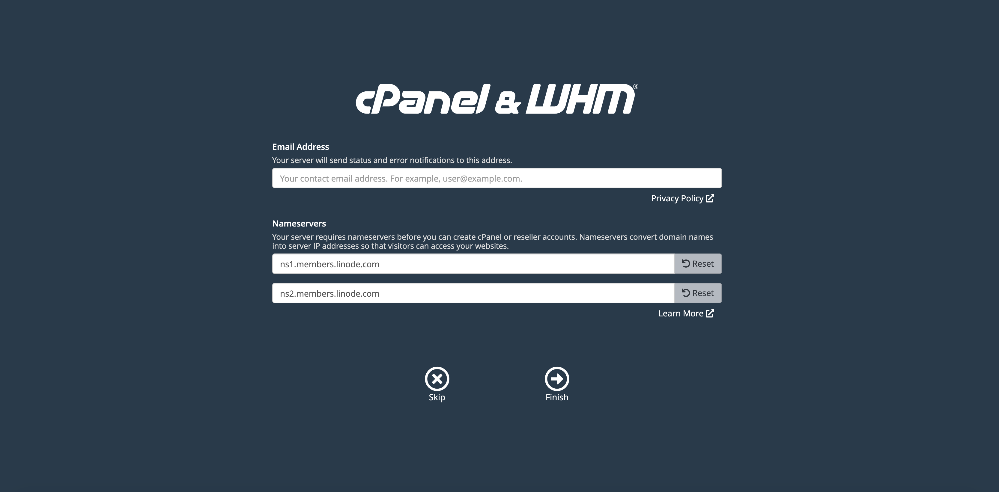

The [cPanel & WHM](https://cpanel.net/products/) Marketplace App streamlines publishing and managing a website on your Linode. cPanel & WHM is a Linux based web hosting control panel and platform that helps you create and manage websites, servers, databases, and more, with a suite of hosting automation and optimization tools.

## Linode Options

Provide configurations for your Linode server. The table below includes details about each configuration option.

| **Configuration** | **Description** |
|-------------------|-----------------|
| **Select an Image** | CentOS 7 is currently the only image supported by the cPanel Marketplace App, and it is pre-selected on the Linode creation page. *Required* |
| **Region** | The region where you would like your Linode to reside. In general, it's best to choose a location that's closest to you. For more information on choosing a DC, review the [How to Choose a Data Center](/docs/platform/how-to-choose-a-data-center) guide. You can also generate [MTR reports](/docs/networking/diagnostics/diagnosing-network-issues-with-mtr/) for a deeper look at the network routes between you and each of our data centers. *Required*. |
| **Linode Plan** | Your Linode's [hardware resources](/docs/platform/how-to-choose-a-linode-plan/#hardware-resource-definitions). cPanel recommends, at minimum, 2 GB of RAM and 40 GB of disk space. This means you should select a 2 GB Linode plan to meet the minimum requirements. See [cPanel's system requirements documentation](https://docs.cpanel.net/installation-guide/system-requirements/) for in-depth details. You can always [resize your Linode](/docs/platform/disk-images/resizing-a-linode/) to a different plan later if you feel you need to increase or decrease your system resources. *Required*. |
| **Linode Label** | The name for your Linode, which must be unique between all of the Linodes on your account. This name will be how you identify your server in the Cloud Manager’s Dashboard. *Required*. |
| **Add Tags** | A tag to help organize and group your Linode resources. [Tags](/docs/quick-answers/linode-platform/tags-and-groups/) can be applied to Linodes, Block Storage Volumes, NodeBalancers, and Domains. |
| **Root Password** | The primary administrative password for your Linode instance. This password must be provided when you log in to your Linode via SSH. The password must meet the complexity strength validation requirements for a strong password. Your root password can be used to perform any action on your server, so make it long, complex, and unique. *Required* |

When you've provided all required Linode Options, click on the **Create** button. **Your cPanel app will complete installation approximately 15 minutes after your Linode has finished provisioning**.

## Getting Started after Deployment

### Access your cPanel Web Hosting Manager

1. Once your cPanel app has finished its installation, open a browser and navigate to `http://192.0.2.0:2087/`. Replace `192.0.2.0` with your [Linode's IP address](/docs/quick-answers/linode-platform/find-your-linodes-ip-address/).

    This will bring you to the Web Hosting Manager (WHM) login page. Enter `root` as the username and the root password you created when deploying your app. Click the **Log In** button.

    

1. You will be presented with cPanel and WHM's terms. Read through the terms and click on **Agree to All** if you agree and would like to continue.

    

1. You will be prompted to enter in an email address to receive status and error notifications. Enter in your preferred email address.

    You will also be prompted to provide nameserver's for your cPanel instance to use. By default, cPanel will fill in the values for you. Update the values with the nameservers you would like to use. If you are managing your own nameservers, enter them into the form or, if you will be using [Linode's DNS manager](/docs/platform/manager/dns-manager/), enter in Linode's nameservers into the form. Click **Finish** to complete the initial login process.

    
Linode's nameservers are the following:

    ns1.linode.com.
    ns2.linode.com.
    ns3.linode.com.
    ns4.linode.com.
    ns5.linode.com.

See our [How do I set up DNS on cPanel?](https://www.linode.com/community/questions/19216/how-do-i-set-up-dns-on-cpanel) community question and answer for details related to cPanel and Linode nameservers.
    

    

1. You will be brought to your WHM's home page where you can continue to configure your cPanel instance.

    
Your cPanel Marketplace App installation will automatically receive a free 15-day trial license. You must [purchase a new cPanel & WHM license](https://documentation.cpanel.net/display/CKB/How+to+Purchase+a+cPanel+License) before the end of this trial period. At the end of your trial period your license will expire.
    

    

    Now that you've accessed your WHM homepage, read [cPanel and WHM's user documentation](https://documentation.cpanel.net/display/78Docs/WebHost+Manager+-+WHM+User+Documentation) to learn how to further configure your cPanel instance.


