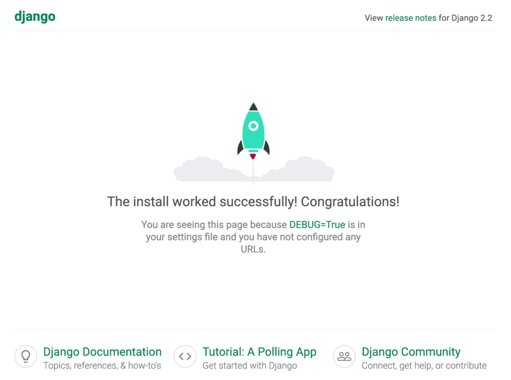

## Django Marketplace App

[Django](https://www.djangoproject.com/) is a web development framework for the Python programing language. It enables rapid development, while favoring pragmatic and clean design. Django was initially developed for use in a newspaper's website division, and as a result the Django framework is very well suited to developing content-centric applications. It's also very flexible in its ability to facilitate many complex content management operations.

### Deploy Django Marketplace App



The [Django Options](#django-options) section of this guide provides details on all available configuration options for this app.

### Django Options

You can configure your Django App by providing values for the following fields:

| **Field** | **Description** |
|:--------------|:------------|
| **Django USER** | Username for your Django application. *Required*. |
| **Django Password** | Password for the Django USER. *Required*. |
| **Django USER email** | Email address for the Django USER. The format for the email must be in the form user@email.tld. *Required*. |

### Linode Options

After providing the app specific options, provide configurations for your Linode server:

| **Configuration** | **Description** |
|:--------------|:------------|
| **Select an Image** | Debian 10 is currently the only image supported by Django Marketplace Apps, and it is pre-selected on the Linode creation page. *Required*. |
| **Region** | The region where you would like your Linode to reside. In general, it's best to choose a location that's closest to you. For more information on choosing a DC, review the [How to Choose a Data Center](/docs/platform/how-to-choose-a-data-center) guide. You can also generate [MTR reports](/docs/networking/diagnostics/diagnosing-network-issues-with-mtr/) for a deeper look at the network routes between you and each of our data centers. *Required*. |
| **Linode Plan** | Your Linode's [hardware resources](/docs/platform/how-to-choose-a-linode-plan/#hardware-resource-definitions). Django can be supported on any size Linode, but we suggest you choose a Linode plan that reflects how many resources you plan on using. For small applications, a 1GB Linode (Nanode) is sufficient. If you decide that you need more or fewer hardware resources after you deploy your app, you can always [resize your Linode](/docs/platform/disk-images/resizing-a-linode/) to a different plan. *Required*. |
| **Linode Label** | The name for your Linode, which must be unique between all of the Linodes on your account. This name will be how you identify your server in the Cloud Manager’s Dashboard. *Required*. |
| **Root Password** | The primary administrative password for your Linode instance. This password must be provided when you log in to your Linode via SSH. The password must meet the complexity strength validation requirements for a strong password. Your root password can be used to perform any action on your server, so make it long, complex, and unique. *Required*. |

When you've provided all required Linode Options, click on the **Create** button. **Your Django app will complete installation anywhere between 2-5 minutes after your Linode has finished provisioning**.

## Getting Started after Deployment

### Access Django


The Django Marketplace App will assign `DjangoApp` as the [Django project name](https://docs.djangoproject.com/en/3.0/intro/tutorial01/#creating-a-project).


After Django has finished installing, you will be able to access your Django site at your Linode's IPv4 address, for instance: `http://yourlinodeip:8000`.

1.  To find your Linode's IPv4 address. Click on the **Linodes** link in the sidebar. You will see a list of all your Linodes.

1. Find the Linode you just created when deploying your app and select it.

1. Navigate to the **Networking** tab.

1. The IP address will be displayed under the **Address** column in the **IPv4** table.

1. Copy and paste the IPv4 address into a browser window followed by `:8000`. You should see the Django test page appear.

    

1.  Once you have verified that you can access your Django site via the browser, you can log in using the admin credentials you created when deploying your app. Update the address in the browser to: `http://yourlinodeip:8000/admin`.

    

1.  Once logged in, you will have access to the Admin console. Now you can begin configuring your site.

    


