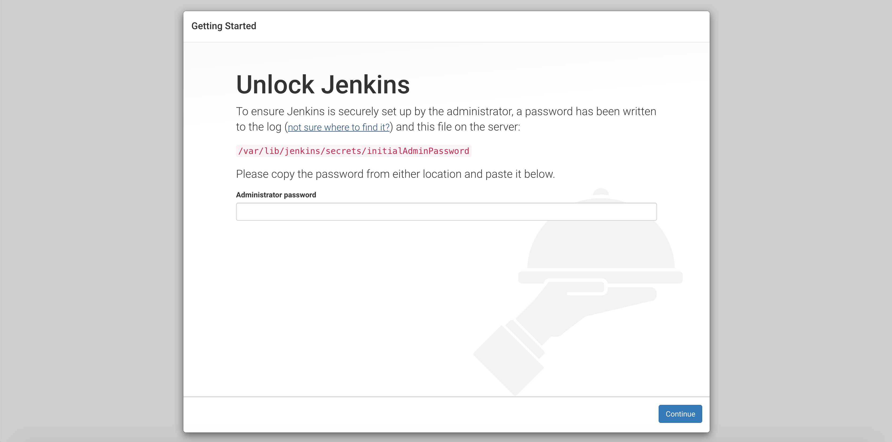

[Jenkins](https://jenkins.io/) is an open source automation tool which can build, test, and deploy your infrastructure. It gives you access to a massive library of plugins to support automation in your project's lifecycle. You can create a [continuous delivery pipeline](https://jenkins.io/doc/pipeline/tour/hello-world/#what-is-a-jenkins-pipeline) which automates the process for getting your software from version control to your users.

### Linode Options

After providing the app-specific options, provide configurations for your Linode server:

| **Configuration** | **Description** |
|-------------------|-----------------|
| **Select an Image** | Debian 9 is currently the only image supported by the Jenkins Marketplace App, and it is pre-selected on the Linode creation page. *Required* |
| **Region** | The region where you would like your Linode to reside. In general, it's best to choose a location that's closest to you. For more information on choosing a DC, review the [How to Choose a Data Center](/docs/platform/how-to-choose-a-data-center) guide. You can also generate [MTR reports](/docs/networking/diagnostics/diagnosing-network-issues-with-mtr/) for a deeper look at the network routes between you and each of our data centers. *Required*. |
| **Linode Plan** | Your Linode's [hardware resources](/docs/platform/how-to-choose-a-linode-plan/#hardware-resource-definitions). The resources needed for a Jenkins master can vary widely depending on your organization's needs (the RAM allotted for it can range from 200 MB for a small installation to 70+ GB for a single and massive Jenkins master). See [Jenkins' hardware recommendations](https://jenkins.io/doc/book/hardware-recommendations/#hardware-recommendations) page for a detailed outline about resource requirements. We recommend, at minimum, starting with a 4 GB Linode plan. You can always [resize your Linode](/docs/platform/disk-images/resizing-a-linode/) to a different plan later if you feel you need to increase or decrease your system resources. *Required* |
| **Linode Label** | The name for your Linode, which must be unique between all of the Linodes on your account. This name will be how you identify your server in the Cloud Manager’s Dashboard. *Required*. |
| **Add Tags** | A tag to help organize and group your Linode resources. [Tags](/docs/quick-answers/linode-platform/tags-and-groups/) can be applied to Linodes, Block Storage Volumes, NodeBalancers, and Domains. |
| **Root Password** | The primary administrative password for your Linode instance. This password must be provided when you log in to your Linode via SSH. The password must meet the complexity strength validation requirements for a strong password. Your root password can be used to perform any action on your server, so make it long, complex, and unique. *Required* |

When you've provided all required Linode Options, click on the **Create** button. **Your Jenkins app will complete installation anywhere between 2-5 minutes after your Linode has finished provisioning**.

## Getting Started after Deployment

After deploying your Jenkins instance, you are ready to log in and continue the configuration process. Follow the steps in the next section to get started.

### Access Your Jenkins Instance

1. [Connect to your Linode via SSH](/docs/getting-started/#connect-to-your-linode-via-ssh).

1. Retrieve your Jenkins admin password by viewing the contents of the `/var/lib/jenkins/secrets/initialAdminPassword` file.

        cat /var/lib/jenkins/secrets/initialAdminPassword

    You should see a similar output

    
0f6fed516bc4ceab24373fe5de513dc
    

1. Open a browser and navigate to `http://192.0.2.0:8080/`. Replace `192.0.2.0` with your [Linode's IP address](/docs/quick-answers/linode-platform/find-your-linodes-ip-address/). This will bring you the *Unlock Jenkins* page. Enter the password you retrieved in the previous step and click **continue**.

    

1. You are now ready to continue to configure Jenkins by installing the community suggested plugins or manually selecting plugins to install. Select the option you prefer.

    

1. After you have installed the desired plugins, you will be prompted to create your first admin user. Since the login password retrieved in the beginning of this section is temporary, you should create your admin user now.

    


