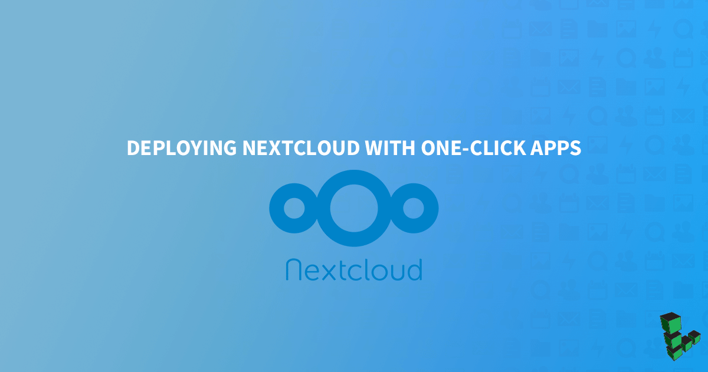
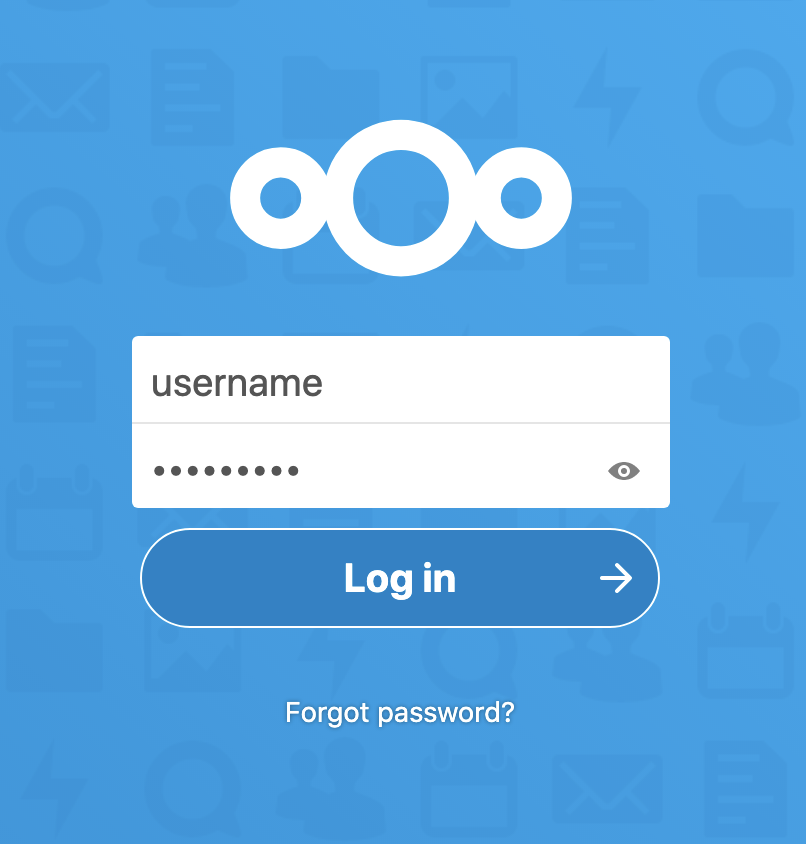
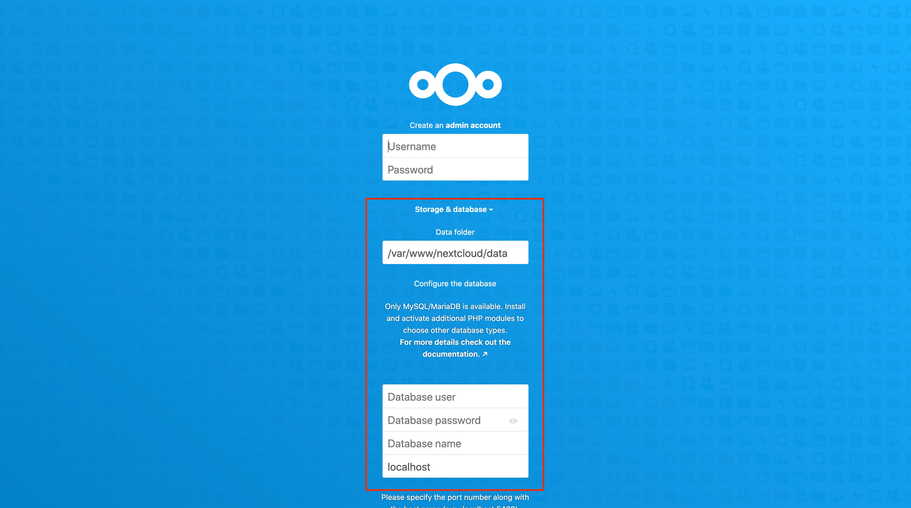

[Nextcloud](https://nextcloud.com/) is an open source solution to file hosting and sharing. With Nextcloud, you can synchronize files from a local computer to the Linode server and share them with collaborators. Nextcloud’s customizable security features and intuitive user interface help to keep files safe and easy to manage.

## Before You Begin

While a Domain Name is not strictly required, it is recommended. If you plan to use a domain name for the deployment, complete the following steps:

1. [Create a Linode API v4 access token](/docs/platform/api/getting-started-with-the-linode-api/#get-an-access-token). The Nextcloud Marketplace App needs a Linode API v4 token to create a domain name system (DNS) record for the Nextcloud instance.

1. Register (purchase) a domain name.

1. Set the domain name to [use Linode’s name servers](/docs/platform/manager/dns-manager/#use-linode-s-name-servers-with-your-domain). You need to do this on the domain registrar’s website and then wait up to 24 hours for the change to take effect.

### Deploy a NextCloud Marketplace App



### NextCloud Options

| **Field** | **Description** |
|-----------|-----------------|
| **MySQL database root password** | The root user's password for the Nextcloud database. *Required*. |
| **MySQL user password** | Your new MySQL user's password. *Required*. |

#### Advanced Options
##### LAMP Stack Options
| **Field** | **Description** |
|-----------|-----------------|
| **MySQL database username** | The name of a new MySQL user to create. If no value is provided, the user is named `nextcloud`. *Required*. |
| **MySQL database name** | The name to assign to the Nextcloud instance's MySQL database. If no value is provided, the database is named `nextcloud`. *Required*. |

##### Linode Server Security Options

| **Field** | **Description** |
|-----------|-----------------|
| **Linode limited sudo username** | The username for a new limited user account with sudo privileges. *Advanced Configuration*. |
| **Linode limited user password** | The password for the new limited user account. *Advanced Configuration*. |
| **SSH Public Key** | A public key belonging to the user that accesses the Linode. If you do not have an authentication key-pair see the [Securing Your Server](/docs/security/securing-your-server/#create-an-authentication-key-pair) guide for steps on creating one. *Advanced Configuration*. |
| **Enable passwordless sudo** | Enable passwordless sudo access for the limited user account. *Advanced Configuration*. |
| **Disable root access** | Disable root user access for the Linode server. *Advanced Configuration*. |

##### Domain Options

| **Field** | **Description** |
|-----------|-----------------|
| **Linode API v4 token** | The [Linode API v4](https://developers.linode.com/api/v4) token is required to create a domain name system (DNS) record for the Nextcloud instance. See the [Getting Started with the Linode API](/docs/platform/api/getting-started-with-the-linode-api/#get-an-access-token) guide to learn how to generate an API token. *Advanced Configuration*. |
| **Linode hostname** | The hostname to assign to the Linode server. If no value is provided, the hostname is set as `nextcloud`. *Advanced Configuration*. |
| **Domain name** | The domain name to use when creating a DNS record for the Linode. The Marketplace app creates a subdomain named `nextcloud`. You can access the Nextcloud instance using the `nextcloud` subdomain; for example, `www.nextcloud.example.com`. *Advanced Configuration*. |
| **Admin email address** | The email address to use for the Nextcloud instance's admin user. *Advanced Configuration*. |
| **Enable SSL** |  Enable a free [HTTPS CertBot SSL certificate](https://certbot.eff.org/) on the Nextcloud domain. If you do not provide a value, `no` is set by default.  *Advanced Configuration*. |
| **Timezone** | The timezone to use for the Linode server. If you do not provide a value, the Linode data center's timezone is used. Refer to [TZ database names](https://en.wikipedia.org/wiki/List_of_tz_database_time_zones) for possible timezone values. *Advanced Configuration*. |

### Linode Options

After providing the app specific options, provide configurations for the Linode server:

| **Configuration** | **Description** |
|:--------------|:------------|
| **Select an Image** | Debian 10 is currently the only image supported by the Nextcloud Marketplace App, and it is pre-selected on the Linode creation page. *Required*. |
| **Region** | The region where you would like the Linode to reside. In general, it's best to choose a location that is closest to you. For more information on choosing a DC, review the [How to Choose a Data Center](/docs/platform/how-to-choose-a-data-center) guide. You can also generate [MTR reports](/docs/networking/diagnostics/diagnosing-network-issues-with-mtr/) for a deeper look at the network routes between the Linode server and each of our data centers. *Required*. |
| **Linode Plan** | Your Linode's [hardware resources](/docs/platform/how-to-choose-a-linode-plan/#hardware-resource-definitions). You should select a Linode plan type based on the amount of data you would like to store on the Nextcloud instance. You can always [resize your Linode](/docs/platform/disk-images/resizing-a-linode/) to a different plan later if you feel you need to increase or decrease the system resources. *Required*. |
| **Linode Label** | The name for the Linode server, which must be unique between all of the Linodes on your account. This name helps you identify the server in the Cloud Manager’s Dashboard. *Required*. |
| **Add Tags** | A tag to help organize and group the Linode resources. [Tags](/docs/quick-answers/linode-platform/tags-and-groups/) can be applied to Linodes, Block Storage Volumes, NodeBalancers, and Domains. |
| **Root Password** | The primary administrative password for the Linode instance. This password must be provided when you log in to the Linode using SSH. The password must meet the complexity strength validation requirements for a strong password. The root password can be used to perform any action on the server, so make it long, complex, and unique. *Required*. |

When you've provided all required Linode Options, click the **Create** button.


Your Nextcloud app completes installation anywhere **between 5-7 minutes** after your Linode has finished provisioning. It is recommended that you wait the full 5-7 minutes prior to beginning the steps in the [Getting Started after Deployment](#getting-started-after-deployment) section of this guide. You may experience unexpected behavior if you begin those steps while your Nextcloud instance is still being deployed and setup by the Marketplace App on the Linode instance.


## Getting Started after Deployment
### Log Into Your Nextcloud Instance

1. Open a browser window and navigate to the Nextcloud instance's domain. For example, enter `nextcloud.example.com` into the browser, replacing `example.com` with the value of your own domain. If you do not install the App with a domain name, the domain is the public IP address of the Linode appended with a forward slash and "nextcloud. For example, `192.168.17.43/nextcloud/`.

1. Create a Nextcloud admin account by providing values in the presented form.

      

1. In the **Storage & database** section, provide the MySQL database values that you used in the [Nextcloud Options](#nextcloud-options) section.

      

1. Click the **Finish setup** button to complete the configuration. The set up takes a couple of minutes to complete. The Nextcloud Hub page appears where you can upload files to the Nextcloud server.

      

### Next Steps



- [Configure Nextcloud to use Linode Object Storage as an External Storage Mount](/docs/platform/object-storage/how-to-configure-nextcloud-to-use-linode-object-storage-as-an-external-storage-mount/).  You can use Object Storage as a secondary place to store your Nextcloud files. Using Linode Object Storage to store files prevents you from running out of storage space that is limited by your Linode's plan size.
- Install the [Nextcloud desktop synchronization client](https://docs.nextcloud.com/desktop/2.3/installing.html) on a local computer to easily synchronize the desktop files to the Nextcloud server.

