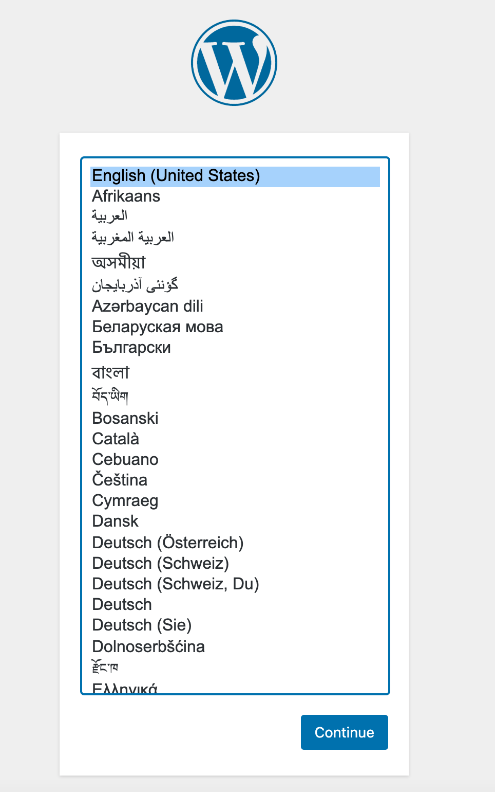

## OpenLiteSpeed Marketplace App

[OpenLiteSpeed](https://openlitespeed.org/) is the Open Source edition of LiteSpeed cache for WordPress plugin that provides accelerated hosting platform for WordPress. OpenLiteSpeed combines speed, security, scalability, optimization and simplicity in one friendly open-source package.

## Before you begin

You need a registered domain name to assign it the Linode server.

## Deploy OpenLiteSpeed with Marketplace Apps



### Linode Options

After providing the app-specific options, provide configurations for your Linode server:

| **Configuration** | **Description** |
|-------------------|-----------------|
| **Select an Image** | CentOS 7 and 8, Debian 10, and Ubuntu 18.04 and 20.04 are currently the only images supported by the OpenLiteSpeed Marketplace App. *Required* |
| **Region** | The region where you would like your Linode to reside. In general, it's best to choose a location that's closest to you. For more information on choosing a DC, review the [How to Choose a Data Center](/docs/platform/how-to-choose-a-data-center) guide. You can also generate [MTR reports](/docs/networking/diagnostics/diagnosing-network-issues-with-mtr/) for a deeper look at the network routes between you and each of our data centers. *Required*. |
| **Linode Plan** | Your Linode's [hardware resources](/docs/platform/how-to-choose-a-linode-plan/#hardware-resource-definitions). You can use any size Linode for your OpenLiteSpeed plugin. The Linode plan that you select should be appropriate for the amount of data transfer, users, storage, and other stress that may affect the performance of server.  *Required* |
| **Linode Label** | The name for your Linode, which must be unique between all of the Linodes on your account. This name will be how you identify your server in the Cloud Manager’s Dashboard. *Required*. |
| **Root Password** | The primary administrative password for your Linode instance. This password must be provided when you log in to your Linode via SSH. The password must meet the complexity strength validation requirements for a strong password. Your root password can be used to perform any action on your server, so make it long, complex, and unique. *Required* |

When you've provided all required Linode Options, click on the **Create** button. **Your OpenLiteSpeed plugin will complete installation anywhere between 2-5 minutes after your Linode has finished provisioning**.

## Getting Started After Deployment

1. Find your Linode's IPv4 address:

    1. Click on the **Linodes** link in the sidebar to see a list of all your Linodes.

    1. Find the Linode you just created when deploying your app and select it.

    1. Navigate to the **Networking** tab.

    1. Your IPv4 address is listed under the **Address** column in the **IPv4** table.

1. Add a domain name to the server. You can assign it (or a subdomain) to your WordPress site. Specifically, you need to set up an [*A record*](/docs/networking/dns/dns-records-an-introduction/#a-and-aaaa) that's associated with your Linode's IP address. To learn how to set up DNS records in the Cloud Manager, review the [DNS Manager](/docs/platform/manager/dns-manager/) guide. For more general information about how DNS works, review the [DNS Records: An Introduction](/docs/networking/dns/dns-records-an-introduction/) guide.

1. From a terminal on your local computer, connect to the server as root:

        ssh root@ipaddress

    An output similar to the following appears:
        
Linux localhost 4.19.0-13-amd64 #1 SMP Debian 4.19.160-2 (2020-11-28) x86_64
********************************************************************************

Welcome to One-Click OpenLiteSpeed WordPress Server.
To keep this server secure, the firewall is enabled.
All ports are BLOCKED except 22 (SSH), 80 (HTTP) and 443 (HTTPS).

WordPress One-Click Quickstart guide:
* https://docs.litespeedtech.com/cloud/images/wordpress/

In a web browser, you can view:
* The new WordPress site: http://192.46.208.62
* The phpMyAdmin: http://192.46.208.62/phpmyadmin

On the server:
* The default web root is located at /var/www/html
* You can get the MySQL root password and MySQL WordPress user password with command:
   sudo cat .db_password
* You can get the Web Admin admin password with the following command:
   sudo cat .litespeed_password
* The WordPress Cache plugin, LSCache, is located at
   /var/www/html/wp-content/plugins/litespeed-cache
* The phpMyAdmin is located at /var/www/phpmyadmin
* A script will run that will allow you to add a domain to the web server and implement SSL.

System Status:
  Load : 0.00, 0.00, 0.00
  CPU  : 0.440664%
  RAM  : 169/1995MB (8.47%)
  Disk : 2/49GB (5%)

********************************************************************************

The programs included with the Debian GNU/Linux system are free software;
the exact distribution terms for each program are described in the
individual files in /usr/share/doc/*/copyright.

Debian GNU/Linux comes with ABSOLUTELY NO WARRANTY, to the extent
permitted by applicable law.
To visit your apps by domain instead of IP, please enter a valid domain.
If you don't have one yet, you may cancel this process by pressing CTRL+C and continuing to SSH.
This prompt will open again the next time you log in, and will continue to do so until you finish the setup.
Make sure the domain's DNS record has been properly pointed to this server.
Enter the root domain only, then the system will add both the root domain and the www domain for you.
Your domain: example.com
The domain you put is: example.com
Please verify it is correct. [y/N] y

Domain has been added into OpenLiteSpeed listener.

        

1. Type the root domain name in place of `example.com`.

1. Apply the Let's Encrypt SSL if your domain is pointed to the server already. Enter `y` and the the email address to add Let's Encrypt SSL.

    A message that reads **Certificate has been successfully installed.....** appears

    
Do you wish to force HTTPS rewrite rule for this domain? [y/N]


1. Enter `y` and force HTTPS rules are applied.

    
Do you wish to update the system which include the web server? [Y/n]


### Install WordPress

1. After OpenLiteSpeed script has finished installing, you can install the WordPress site by typing your Linode's IPv4 address or the domain name that you added in a browser of your choice.

    The following page appears:

    

1. Select the language and click the **Continue** button.

The Welcome page appears:

Type the required details to complete the installation, save the password in a secure location and click the **Install WordPress** button.

### Software Included

The WordPress Marketplace App installs the following required software on your Linode:

| **Software** | **Description** |
|:--------------|:------------|
| [**MariaDB Server**](https://www.mysql.com/) | Relational database. |
| [**PHP 7**](https://www.php.net/) | WordPress is written in PHP and requires PHP to operate. |
| [**Apache HTTP Server**](https://httpd.apache.org/) | Web server used to serve the WordPress site. |
| [**OpenLiteSpeed**](https://openlitespeed.org/) | Open source plugin for WordPress. |
| [**LiteSpeed Cache**](https://www.litespeedtech.com/) | The cache management for WordPress. |


