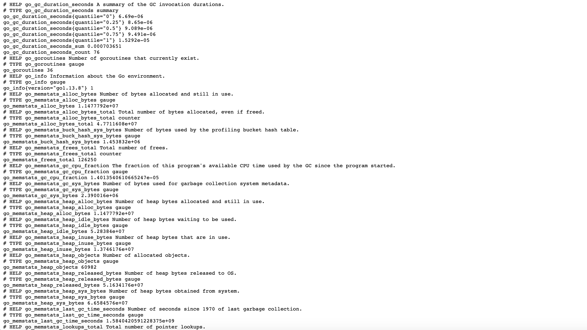

Use [Prometheus](https://prometheus.io/docs/introduction/overview/) to collect metrics and receive alerts with this open-source monitoring tool. Prometheus monitors targets that you define at given intervals by scraping their metrics HTTP endpoints. This tool is particularly well-suited for numeric time series data, which makes it ideal for machine-centric monitoring as well as monitoring of highly dynamic service-oriented architectures.

## Deploy Prometheus with Marketplace Apps



### Linode Options

Provide configurations for your Linode server. The table below includes details about each configuration option.

| **Configuration** | **Description** |
|-------------------|-----------------|
| **Select an Image** | Debian 9 is currently the only image supported by the Prometheus Marketplace App, and it is pre-selected on the Linode creation page. *Required* |
| **Region** | The region where you would like your Linode to reside. In general, it's best to choose a location that's closest to you. For more information on choosing a DC, review the [How to Choose a Data Center](/docs/platform/how-to-choose-a-data-center) guide. You can also generate [MTR reports](/docs/networking/diagnostics/diagnosing-network-issues-with-mtr/) for a deeper look at the network routes between you and each of our data centers. *Required*. |
| **Linode Plan** | Your Linode's [hardware resources](/docs/platform/how-to-choose-a-linode-plan/#hardware-resource-definitions). Prometheus' default settings require 3 GBs of memory. We recommend, at minimum, that you start with a 4 GB Linode plan. You can always [resize your Linode](/docs/platform/disk-images/resizing-a-linode/) to a different plan later if you feel you need to increase or decrease your system resources. *Required*  |
| **Linode Label** | The name for your Linode, which must be unique between all of the Linodes on your account. This name will be how you identify your server in the Cloud Manager’s Dashboard. *Required*. |
| **Add Tags** | A tag to help organize and group your Linode resources. [Tags](/docs/quick-answers/linode-platform/tags-and-groups/) can be applied to Linodes, Block Storage Volumes, NodeBalancers, and Domains. |
| **Root Password** | The primary administrative password for your Linode instance. This password must be provided when you log in to your Linode via SSH. The password must meet the complexity strength validation requirements for a strong password. Your root password can be used to perform any action on your server, so make it long, complex, and unique. *Required* |

When you've provided all required Linode Options, click on the **Create** button. **Your Prometheus app will complete installation anywhere between 2-5 minutes after your Linode has finished provisioning**.

## Getting Started after Deployment
## Access Your Prometheus Instance

Now that your Prometheus Marketplace App is deployed, you can log into Prometheus to access its [expression browser](https://prometheus.io/docs/prometheus/latest/getting_started/#using-the-graphing-interface), alerts, status, and more.

1. Open a browser and navigate to `http://192.0.2.0:9090/`. Replace `192.0.2.0` with your [Linode's IP address](/docs/quick-answers/linode-platform/find-your-linodes-ip-address/). This will bring you to your Prometheus instance's expression browser.

1. Verify that Prometheus is serving metrics by navigating to `http://192.0.2.0:9090/metrics`. Replace `192.0.2.0` with your [Linode's IP address](/docs/quick-answers/linode-platform/find-your-linodes-ip-address/). You should see a page of metrics similar to the example below.

    

1. [Grafana](https://grafana.com/), the open source analytics and metric visualization tool, supports querying Prometheus. Consider [deploying a Grafana instance with Marketplace Apps](/docs/platform/marketplace/how-to-deploy-grafana-with-marketplace-apps/) to [create visualizations for your Prometheus metrics](https://prometheus.io/docs/visualization/grafana/#using).

### Prometheus Default Settings

- Prometheus' main configuration is located in the `/etc/prometheus/prometheus.yml` file.
- This file includes a scrape configuration for Prometheus itself.
- The [scraping interval](https://prometheus.io/docs/prometheus/latest/configuration/configuration/#scrape_config) and evaluation interval are configured globally to be `15s`. The `scrape_interval` parameter defines the time between each Prometheus scrape, while the `evaluation_interval` parameter is the time between each evaluation of [Prometheus' alerting rules](https://prometheus.io/docs/prometheus/latest/configuration/alerting_rules/).
- The [Prometheus Node Exporter](https://github.com/prometheus/node_exporter) is added and enabled. This [third-party system exporter](https://prometheus.io/docs/instrumenting/exporters/) is used to collect hardware and OS metrics. Your Node Exporter metrics are sent to port `9100` of your Linode.


