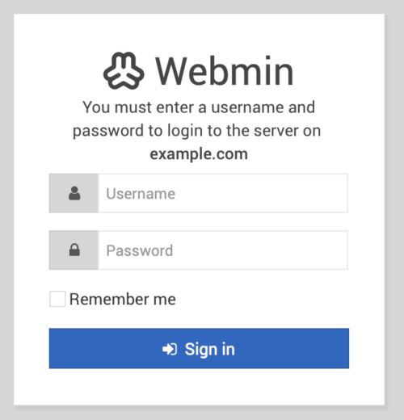
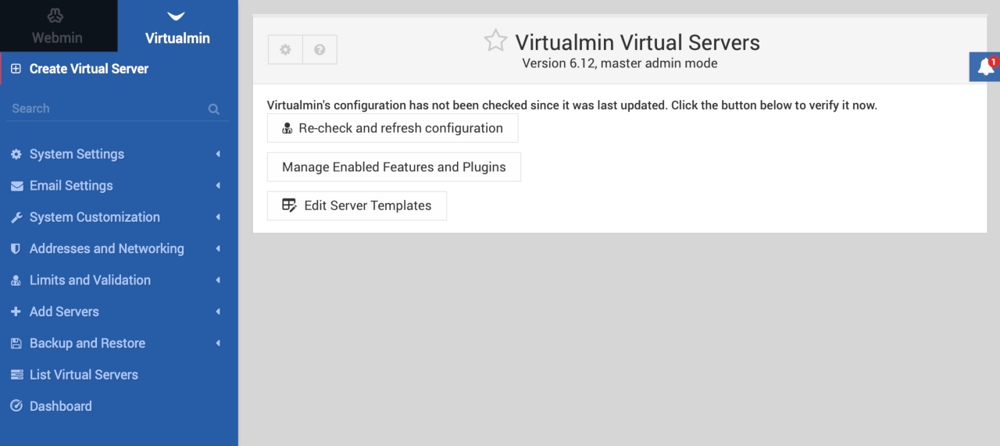
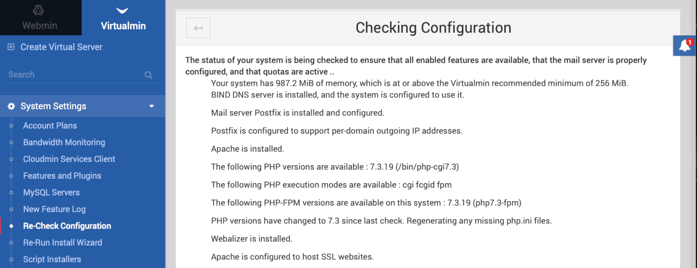

[Virtualmin](https://www.virtualmin.com) is an open source control panel for web hosting management. It offers an easy to use graphical interface for managing websites, email, and databases. It's built on top of and integrated with the popular Webmin.

## Deploy Virtualmin with Marketplace Apps



### Virtualmin Options

The Virtualmin Marketplace form includes advanced fields to setup your Virtualmin server's limited user account and DNS records. These are optional configurations and are not required for installation.

| **Field&nbsp;&nbsp;&nbsp;&nbsp;&nbsp;&nbsp;&nbsp;&nbsp;&nbsp;&nbsp;&nbsp;&nbsp;&nbsp;&nbsp;&nbsp;&nbsp;&nbsp;&nbsp;&nbsp;&nbsp;&nbsp;&nbsp;&nbsp;&nbsp;&nbsp;&nbsp;&nbsp;&nbsp;&nbsp;&nbsp;&nbsp;&nbsp;&nbsp;&nbsp;&nbsp;&nbsp;&nbsp;&nbsp;&nbsp;&nbsp;&nbsp;&nbsp;** | **Description** |
|-----------|-----------------|
| **The limited sudo user to be created for the Linode** | This is the limited user account to be created for the Linode. This account will have sudo user privileges. |
| **The password for the limited sudo user** | Set a password for the limited sudo user. The password must meet the complexity strength validation requirements for a strong password. This password can be used to perform any action on your server, similar to root, so make it long, complex, and unique. |
| **The SSH Public Key that will be used to access the Linode** | If you wish to access [SSH via Public Key](https://www.linode.com/docs/security/authentication/use-public-key-authentication-with-ssh/) (recommended) rather than by password, enter the public key here. |
| **Enable passwordless sudo access for the limited user?** | If you entered an SSH Public Key above and it is for the limited user account, select `Yes`, this will allow SSH to use Public Key login for the limited user. Select `No` if you want SSH to rely on using password login for the limited user account. |
| **Disable root access over SSH?** | Select `Yes` to block the root account from logging into the server via SSH. Select `No` to allow the root account to login via SSH. |
| **Your Linode API Token** | Your Linode `API Token` is needed to create DNS records. If this is provided along with the `subdomain` and `domain` fields, the installation will attempt to create DNS records via the Linode API. If you don't have a token, but you want the installation to create DNS records, you must [create one](/docs/platform/api/getting-started-with-the-linode-api/#get-an-access-token) before continuing. |
| **Subdomain** | The subdomain you wish the installer to create a DNS record for during setup. The suggestion given is `www`. The subdomain should only be provided if you also provide a `domain` and `API Token`. |
| **Domain** | The domain name where you wish to host your Virtualmin server. The installer creates a DNS record for this domain during setup if you provide this field along with your `API Token`. |
| **Admin Email for the server** | The start of authority (SOA) email address for this server. This email address will be added to the SOA record for the domain. This is a required field if you want the installer to create DNS records. |
| **Do you need an MX record for this domain?** | Check `yes` if you plan on using Virtualmin to setup email. The installer, along with your `API Token` (required) will setup the necessary MX records in the DNS Manager. Select `no` if you do not plan on using Virtualmin to manage email. You can [add an MX record manually](/docs/networking/dns/dns-records-an-introduction/#mx) at a later time if you change your decision. |
| **Do you need an SPF record for this domain?** | Check `yes` if you plan on using Virtualmin to setup email. The installer, along with your `API Token` (required) will setup the necessary SPF records in the DNS Manager. Select `no` if you do not plan on using Virtualmin to manage email. You can [add an SPF record manually](/docs/networking/dns/dns-records-an-introduction/#spf) at a later time if you change your decision. |

### Linode Options

After providing the app-specific options, provide configurations for your Linode server:

| **Configuration** | **Description** |
|-------------------|-----------------|
| **Select an Image** | Debian 10 is currently the only image supported by the Virtualmin Marketplace App, and it is pre-selected on the Linode creation page. *Required* |
| **Region** | The region where you would like your Linode to reside. In general, it's best to choose a location that's closest to you. For more information on choosing a DC, review the [How to Choose a Data Center](/docs/platform/how-to-choose-a-data-center) guide. You can also generate [MTR reports](/docs/networking/diagnostics/diagnosing-network-issues-with-mtr/) for a deeper look at the network routes between you and each of our data centers. *Required*. |
| **Linode Plan** | Your Linode's [hardware resources](/docs/platform/how-to-choose-a-linode-plan/#hardware-resource-definitions). You can use any size Linode for your Virtualmin App as it uses minimal system resources. The minimum recommended memory is 1 GB and the minimum recommended free disk space is 1 GB. You can always [resize your Linode](/docs/platform/disk-images/resizing-a-linode/) to a different plan later if you feel you need to increase or decrease your system resources. *Required* |
| **Linode Label** | The name for your Linode, which must be unique between all of the Linodes on your account. This name will be how you identify your server in the Cloud Manager’s Dashboard. *Required*. |
| **Add Tags** | A tag to help organize and group your Linode resources. [Tags](/docs/quick-answers/linode-platform/tags-and-groups/) can be applied to Linodes, Block Storage Volumes, NodeBalancers, and Domains. |
| **Root Password** | The primary administrative password for your Linode instance. This password must be provided when you log in to your Linode via SSH. The password must meet the complexity strength validation requirements for a strong password. Your root password can be used to perform any action on your server, so make it long, complex, and unique. *Required* |

When you've provided all required Linode Options, click on the **Create** button. **Your Virtualmin app will complete installation anywhere between 2-5 minutes after your Linode has finished provisioning**.

## Getting Started after Deployment

Virtualmin is now installed and ready to use.

1.  Before you go to our app, if you filled out the optional Virtualmin configuration fields:

    - In the Cloud Manager [DNS Manager](/docs/platform/manager/dns-manager/#add-a-domain) there is now an entry for your domain with possible subdomain, MX, and SPF records pointing to your new server.
    - [Configure the rDNS](/docs/networking/dns/configure-your-linode-for-reverse-dns/) on your Linode.

1.  Virtualmin is served on port 10000, to access it, navigate to either the IP address of your server or to your domain name followed by port 10000. For example, `http://example.com:10000` or `http://203.0.113.0:10000`, replacing the domain name or IP address with values for your server.

    

1.  At the login screen, login using either:

    - The system root username and password
    - The sudo username and password if you set that up in the Virtualmin optional configuration during installation.

1.  After logging in for the first time, a Post-Installation Wizard walks you through some initial setup to optimize your system. If you choose `Cancel` the wizard will use the default settings.

    

1.  On the main dashboard, Virtualmin must check its configuration before virtual servers can be added. Click the **Re-check and refresh configuration** button.

    

1.  Virtualmin checks your system and returns a list of statuses and recommendations that you can choose to take action on if desired.

    

1.  Click the **Return to virtual servers list** button at the bottom of the screen when you are finished. You are now ready to start administering your server.

    


