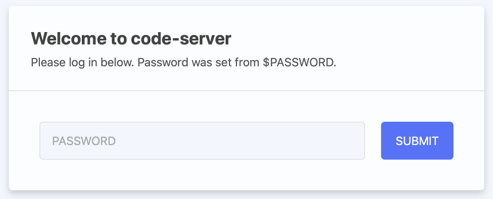
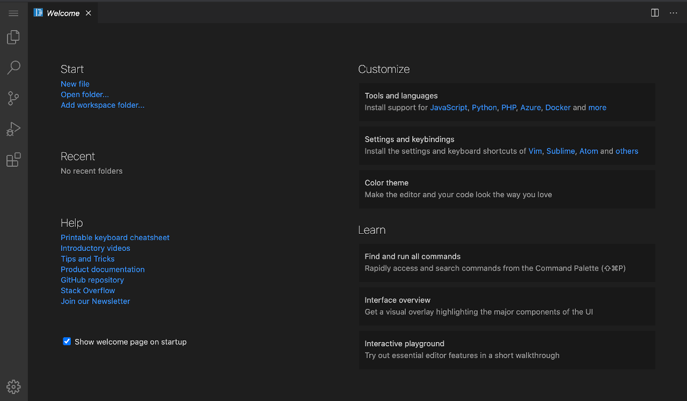

Run [VS Code Server](https://github.com/cdr/code-server) in the browser with the VS Code Marketplace App. Code Server uses the open source code from Microsoft's VS Code to provide a web interface for VS Code.

## Deploy VS Code with Marketplace Apps



### VS Code Options

The VS Code Marketplace app has the following required configuration fields.

| **Field&nbsp;&nbsp;&nbsp;&nbsp;&nbsp;&nbsp;&nbsp;&nbsp;&nbsp;&nbsp;&nbsp;&nbsp;&nbsp;&nbsp;&nbsp;&nbsp;&nbsp;&nbsp;&nbsp;&nbsp;&nbsp;&nbsp;&nbsp;&nbsp;&nbsp;&nbsp;&nbsp;&nbsp;&nbsp;&nbsp;&nbsp;&nbsp;&nbsp;&nbsp;&nbsp;&nbsp;&nbsp;&nbsp;&nbsp;&nbsp;&nbsp;&nbsp;** | **Description** |
|-----------|-----------------|
| **The password to login to the VS Code Web UI** | This is the password you use to log into the VS Code web interface. The password must meet the complexity strength validation requirements for a strong password. **Required** |

### VS Code Advanced Options

The VS Code Marketplace form includes advanced fields to setup your VS Code server's limited user account and DNS records. These are optional configurations and are not required for installation.

| **Field&nbsp;&nbsp;&nbsp;&nbsp;&nbsp;&nbsp;&nbsp;&nbsp;&nbsp;&nbsp;&nbsp;&nbsp;&nbsp;&nbsp;&nbsp;&nbsp;&nbsp;&nbsp;&nbsp;&nbsp;&nbsp;&nbsp;&nbsp;&nbsp;&nbsp;&nbsp;&nbsp;&nbsp;&nbsp;&nbsp;&nbsp;&nbsp;&nbsp;&nbsp;&nbsp;&nbsp;&nbsp;&nbsp;&nbsp;&nbsp;&nbsp;&nbsp;** | **Description** |
|-----------|-----------------|
| **The version of VS Code Server you'd like installed** | This is the version of VS Code Server that is installed during setup. The default at the time of this guide was written is 3.4.1 and is the latest version available. This field is filled in for you and it is recommended that you use this value. If you do not fill in this field, the latest version is used. |
| **The limited sudo user to be created for the Linode** | This is the limited user account to be created for the Linode. This account has sudo user privileges. |
| **The password for the limited sudo user** | Set a password for the limited sudo user. The password must meet the complexity strength validation requirements for a strong password. This password can be used to perform any action on your server, similar to root, so make it long, complex, and unique. |
| **The SSH Public Key that will be used to access the Linode** | If you wish to access [SSH via Public Key](/docs/guides/use-public-key-authentication-with-ssh/) (recommended) rather than by password, enter the public key here. |
| **Disable root access over SSH?** | Select `Yes` to block the root account from logging into the server via SSH. Select `No` to allow the root account to login via SSH. |
| **Your Linode API Token** | Your Linode `API Token` is needed to create DNS records. If this is provided along with the `subdomain` and `domain` fields, the installation attempts to create DNS records via the Linode API. If you don't have a token, but you want the installation to create DNS records, you must [create one](/docs/guides/getting-started-with-the-linode-api/#get-an-access-token) before continuing. |
| **Domain** | The domain name where you wish to host your Virtualmin server. The installer creates a DNS record for this domain during setup if you provide this field along with your `API Token`. |
| **Subdomain** | The subdomain you wish the installer to create a DNS record for during setup. The subdomain should only be provided if you also provide a `domain` and `API Token`. |
| **Your email address** | This email address is used for VirtualHost configuration and is added to the SOA record for the domain if you add one. This is a required field if you want the installer to create DNS records. It is also used if you choose to create an SSL certificate. |
| **Would you like to use a free Let's Encrypt SSL certificate?** | Select `Yes` if you would like the install to create an SSL certificate for you, or `No` if you do not. If `No` is selected, the VS Code app triggers security warnings in most web browsers. If you create a certificate and do not create a domain, the installer uses the Linode rDNS assigned name for the certificate. |

### Linode Options

After providing the app-specific options, provide configurations for your Linode server:

| **Configuration** | **Description** |
|-------------------|-----------------|
| **Select an Image** | Debian 10 is currently the only image supported by the VS Code Marketplace App, and it is pre-selected on the Linode creation page. *Required* |
| **Region** | The region where you would like your Linode to reside. In general, it's best to choose a location that's closest to you. For more information on choosing a DC, review the [How to Choose a Data Center](/docs/guides/how-to-choose-a-data-center) guide. You can also generate [MTR reports](/docs/guides/diagnosing-network-issues-with-mtr/) for a deeper look at the network routes between you and each of our data centers. *Required*. |
| **Linode Plan** | Your Linode's [hardware resources](/docs/guides/how-to-choose-a-linode-plan/#hardware-resource-definitions). The minimum memory recommendation is 1 GB with 2 cores. You can always [resize your Linode](/docs/guides/resizing-a-linode/) to a different plan later if you feel you need to increase or decrease your system resources. *Required* |
| **Linode Label** | The name for your Linode, which must be unique between all of the Linodes on your account. This name is how you identify your server in the Cloud Manager’s Dashboard. *Required*. |
| **Add Tags** | A tag to help organize and group your Linode resources. [Tags](/docs/guides/tags-and-groups/) can be applied to Linodes, Block Storage Volumes, NodeBalancers, and Domains. |
| **Root Password** | The primary administrative password for your Linode instance. This password must be provided when you log in to your Linode via SSH. The password must meet the complexity strength validation requirements for a strong password. Your root password can be used to perform any action on your server, so make it long, complex, and unique. *Required* |

When you've provided all required Linode Options, click on the **Create** button. **Your VS Code app will complete installation anywhere between 2-5 minutes after your Linode has finished provisioning**.

## Getting Started after Deployment

VS Code is now installed and ready to use.

1.  Before you go to your app, if you filled out the optional VS Code configuration fields for domain:

    - In the Cloud Manager [DNS Manager](/docs/guides/dns-manager/#add-a-domain) there is now an entry for your domain with possible subdomain records pointing to your new server.
    - [Configure the rDNS](/docs/guides/configure-your-linode-for-reverse-dns/) on your Linode.

1.  VS Code is accessed via your domain name if you entered one, or by the rDNS name if you did not. For example, `http://example.com` or `http://li1234-555.members.linode.com`, replacing the domain name or rDNS name with values for your server.

1.  At the login screen, login using the password you entered during installation.

    

1.  After logging in, the VS Code Welcome screen appears in your browser and you're ready to code.

    

### Software Included

The VS Code Marketplace App installs the following software on your Linode:

| **Software** | **Description** |
|:--------------|:------------|
| [**Code Server**](https://github.com/cdr/code-server) | Code Server which hosts the open source web interface of VS Code.|
| [**NGINX**](https://www.nginx.com) | An open source web server. |
| [**ufw**](https://wiki.ubuntu.com/UncomplicatedFirewall) | ufw is the uncomplicated firewall, a frontend for iptables. |


