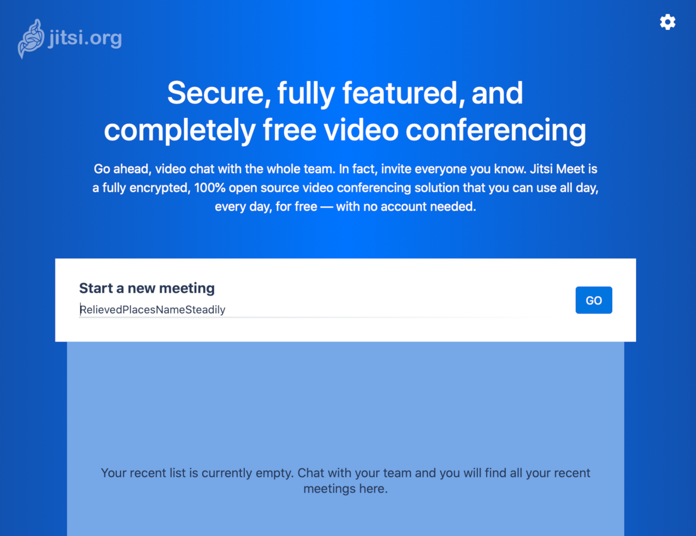

[Jitsi](https://jitsi.org) is a suite of open source projects that allows you to host your own virtual video conferences.

## Deploying the Jitsi Marketplace App



**Software installation should complete within 3-5 minutes after the Linode has finished provisioning.**

## Configuration Options

### Jitsi Options

The Jitsi Marketplace form includes advanced fields to setup your Jitsi server's domain records and a free Let's Encrypt SSL certificate. These are optional configurations and are not required for installation.


To use Jitsi with encrypted connections, you need an SSL certificate. If you choose to create the free SSL certificate during setup, you must have a fully qualified domain name registered prior to installation.

If Jitsi is not created with the SSL option enabled, it uses a self-signed certificate which may trigger an `invalid certificate` response in some browsers.


| **Field** | **Description** |
|:--------------|:------------|
| **The hostname for your server** | The [hostname](/docs/guides/getting-started/#set-the-hostname) for the server. The default value "meet" is filled in when you select Jitsi from the Marketplace Apps; feel free to change this. |
| **Your domain** | The domain name where you wish to host your Jitsi server. For example, `example.com`. |
| **Your Linode API Token.** | Your Linode API access token is needed to create your DNS records and to create the Let's Encrypt SSL certificate. If you don't have a token, you must [create one](/docs/guides/getting-started-with-the-linode-api/#get-an-access-token) before continuing. |
| **Would you like to use a free Let's Encrypt SSL certificate?** | Select `Yes` if you would like the install to create an SSL certificate for you, or `No` if you do not. You cannot create secure, encrypted conferences without an SSL certificate. If `No` is selected, the Jitsi app triggers security warnings in most web browsers. |
| **Admin Email for Let's Encrypt certificate** | The email you wish to use for the SSL certificate. This email address receives notifications when the certificate needs to be renewed. |


If you enter a domain name, the address to access Jitsi is `hostname`.`domain name`. For example, if you kept the default hostname, `meet`, and your domain name is `example.com`, to access Jitsi, the address is: `https://meet.example.com`.


### General Options

For advice on filling out the remaining options on the **Create a Linode** form, see [Getting Started > Create a Linode](/docs/guides/getting-started/#create-a-linode). That said, some options may be limited or recommended based on this Marketplace App:

- **Supported distributions:** Ubuntu 20.04 LTS
- **Recommended minimum plan:** All plan types and sizes can be used, though we recommend a 8GB Dedicated CPU or Shared Compute Instance for hosting large meetings or multiple simultaneous meetings.

## Getting Started After Deployment

Jitsi is now installed and ready to use.

1.  Before you go to your app, if you filled out the optional Jitsi configuration fields:

    - In the Cloud Manager [DNS Manager](/docs/guides/dns-manager/#add-a-domain) there is now an entry for your domain with two `A/AAAA` records pointing to your new server. One for the domain name and one for the hostname.
    - [Configure the rDNS](/docs/guides/configure-your-linode-for-reverse-dns/) on your Linode.

1.  If you didn't setup a domain, navigate to the rDNS address of the Linode in your browser. You can find the rDNS address in the **Networking** tab for your Linode in the [Cloud Manager](https://cloud.linode.com). If you did setup a domain, navigate to the address as described in the [Jitsi Options](#jitsi-options) section above.

1.  Jitsi prompts you to start a meeting.

## Software Included

The Jitsi Marketplace App installs the following software on your Linode:

| **Software** | **Description** |
|:--------------|:------------|
| [**Jitsi Meet**](https://jitsi.org/jitsi-meet) | The WebRTC compatible JavaScript application that enables the video conferencing.|
| [**Jitsi Videobridge (jvb)**](https://jitsi.org/jitsi-videobridge) | WebRTC compatible server that routes the video streams between participants in the conference. |
| [**Jitsi Conference Focus (jicofo)**](https://github.com/jitsi/jicofo) | The server-side focus component that manages sessions between participants. |
| [**Jitsi Gateway to SIP (jigasi)**](https://github.com/jitsi/jigasi) | A server-side application enabling regular SIP clients to join the conference. |
| [**Jibri**](https://github.com/jitsi/jibri) | Tools for recording and streaming the conference. |
| [**Prosody**](https://prosody.im/) | XMPP server for signalling. |


