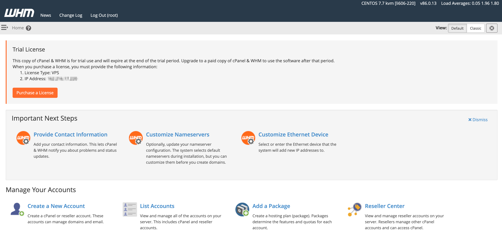

The LiteSpeed cPanel App automatically installs WHM/cPanel, performance LiteSpeed Web Server, and WHM LiteSpeed Plugin.

**LiteSpeed Web Server Features:** HTTP/2, QUIC, HTTP/3, event driven architecture, Apache drop-in replacement, LSCache Engine with ESI, server-level reCAPTCHA, one-click cache acceleration

**WHM LiteSpeed Plugin Features:** Version management, one-click switch between Apache and LiteSpeed Web Server, build PHP with LSAPI, quick PHP suExec and LiteSpeed cache setups, license management

**Auto configuration:** Enable PHP_SUEXEC, enable EasyApache integration, switch to LiteSpeed Web Server, cache root setup, disable Apache mod_ruid2, Apache port offset 0

## Deploying the LiteSpeed cPanel Marketplace App



**Software installation should complete within 10-15 minutes after the Linode has finished provisioning.**

## Configuration Options

For advice on filling out the remaining options on the **Create a Linode** form, see [Getting Started > Create a Linode](/docs/guides/getting-started/#create-a-linode). That said, some options may be limited or recommended based on this Marketplace App:

- **Supported distributions:** CentOS 7, CentOS 8, AlmaLinux 8
- **Recommended plan:** All plan types and sizes can be used.

## Getting Started after Deployment

### Accessing the LiteSpeed cPanel App

1.  Open a browser and navigate to port `2087` on your IP address. This should look like `http://192.0.2.0:2087/`, replace `192.0.2.0` with your [Compute Instance's IP address](/docs/quick-answers/linode-platform/find-your-linodes-ip-address/).

1.  The WHM login page appears. Enter `root` as the username and the root password you created when deploying your app. Click the **Log In** button.

    

1.  You are presented with cPanel and WHM's terms. Read through the terms and click on **Agree to All** if you agree and would like to continue.

    

1.  In the next screen, enter in an email address to receive status and error notifications.

    You are also prompted to provide nameserver's for your cPanel instance. By default, cPanel will fill in the values for you. Update the values with the nameservers you would like to use. If you are managing your own nameservers, enter them into the form or, if you will be using [Linode's DNS manager](/docs/guides/dns-manager/), enter in Linode's nameservers into the form. Click **Finish** to complete the initial login process.

    
Linode's nameservers are the following:

    ns1.linode.com.
    ns2.linode.com.
    ns3.linode.com.
    ns4.linode.com.
    ns5.linode.com.

See our [How do I set up DNS on cPanel?](https://www.linode.com/community/questions/19216/how-do-i-set-up-dns-on-cpanel) community question and answer for details related to cPanel and Linode nameservers.
    

    

4. You are then brought to your WHM's home page where you can continue to configure your cPanel instance.

    

Now that you’ve accessed your LiteSpeed instance, check out [the official LiteSpeed documentation](https://www.litespeedtech.com/support/wiki/doku.php/litespeed_wiki) to learn how to further utilize your LiteSpeed instance.


Your LiteSpeed cPanel App installation will automatically receive a free 15-day trial license on both [LiteSpeed](https://docs.litespeedtech.com/licenses/trial/) and [cPanel](https://cpanel.net/products/trial/). You must purchase a new LiteSpeed and cPanel/WHM license before the end of this trial period. At the end of your trial period your license will expire.


