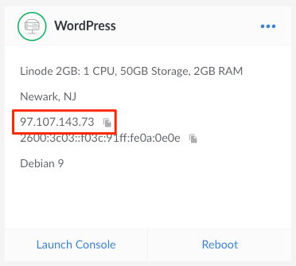
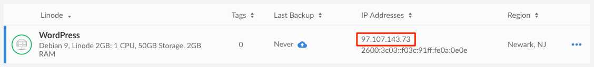

Depending on the type of app you created, the app will be accessible in different ways. All the ways to access your app require the IP address of your Linode. Follow the instructions below to find your IP address.

1.  Log in to the [Cloud Manager](https://cloud.linode.com).

1.  Navigate to the Linodes page by clicking on the **Linodes** link in the sidebar.

1.  Find the Linode that you created. The IP address is a series of four numbers separated by periods. In the grid view of the Linodes page, your IP address will be located underneath the data center name for your Linode:

    

1.  In list view, your IP address will be under the **IP Addresses** column in the row that lists your Linode:

    

1.  Alternatively, you can find your IP address by navigating to the **Networking** tab of your Linode's detail page. The address is displayed under the **Address** column in the **IPv4** table:

    

1. Copy your IP address. For apps like WordPress, WooCommerce, and Drupal, you can navigate to the IP address in your browser to visit your installation. For game servers, connect to the IP address in-game to play on your new server. Other apps like MERN, LAMP, and WireGuard will require you to SSH into your Linode to access or provide more customized configurations.
