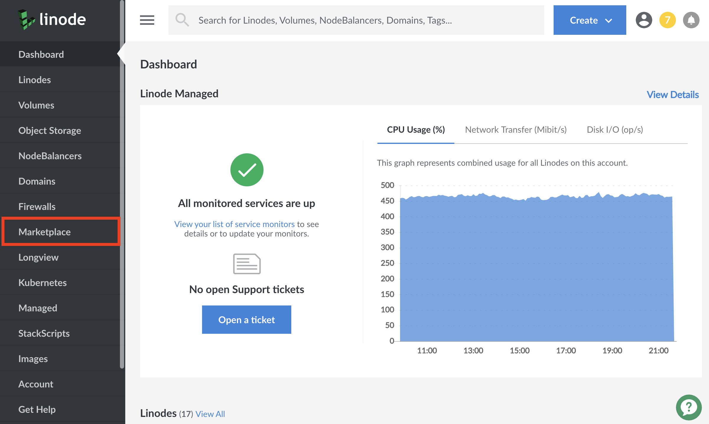
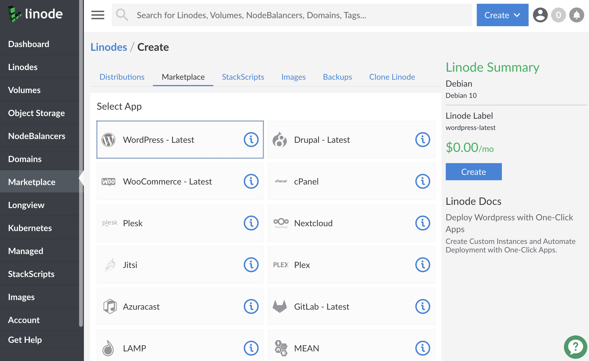
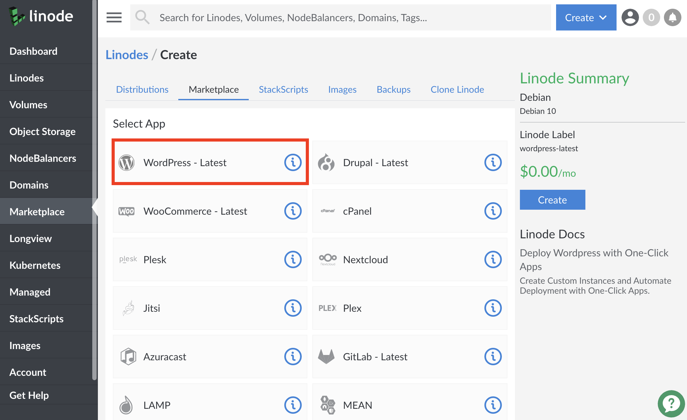
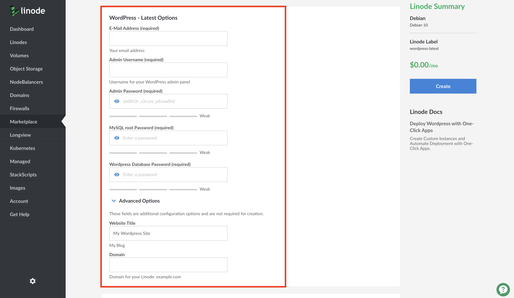
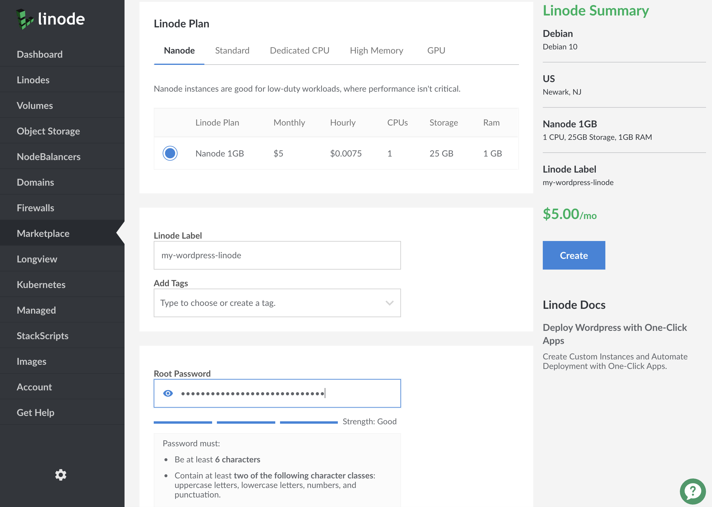

1.  Log into the Linode [Cloud Manager](https://cloud.linode.com).

1. From the Linode dashboard, click on the **Marketplace** option in the left-hand navigation menu:

    

1. The Linode creation page will appear, with the **Marketplace** tab and the **Create From: Marketplace** option pre-selected.

    

1.  Select the app you would like to create. For this example, WordPress will be selected:

    

1.  After the **Select App** section you'll find a new section with additional configuration options specific to your app. Fill out the required options. In the case of WordPress, you'll find fields for the WordPress administrator's username, password, e-mail address, and database passwords.

    

    You can fill out additional options by clicking on **Show Advanced Options**. For the WordPress example, this option is the site's title.

1.  The **Select an Image** section displays that Debian is pre-selected. This is the underlying operating system that your Linode will run.

1.  Under the **Region** section, choose which data center you would like your app to be deployed to. Choose a region that is close to your audience's geographic location. When you are closer to your data center, your network speeds will generally be higher, and your network latency will be lower.

1.  Choose which plan you'd like to use under the **Linode Plan** section. Your plan specifies the hardware resources assigned to your server. The resources that you need are determined by the requirements of your app. Linode's plans are split into four types: Shared, Dedicated CPU, High Memory, and GPU.

    For small sites like WordPress blogs a 1GB Linode (Nanode) is usually enough, and for video game servers a 2GB or 4GB Shared Linode is often a good choice. Some game servers may benefit from the Dedicated CPU plans. Our [How to Choose a Linode Plan](/docs/platform/how-to-choose-a-linode-plan/) guide presents more information about the different use-cases for each plan.

    
You can always upgrade your Linode later if you need more memory, CPU cores, or any of the other hardware resources. Also, you can downgrade your plan if you think you don't need as much as you're currently using. Furthermore, you can change plan types entirely, like going from a Shared Linode to a Dedicated CPU Linode.

Review the [Resizing a Linode](/docs/platform/disk-images/resizing-a-linode/) guide for upgrading and downgrading instructions. When downgrading your plan, the size of your Linode's disk must fit within the new plan's disk space allocation.


1.  For this example, a 1GB Linode (Nanode) is selected.

    

1.  Create a label and (optionally) select tags for your Linode. The label is your Linode's name and must be unique among all the Linodes on your account. [Tags](/docs/quick-answers/linode-platform/tags-and-groups/) are used to organize your Linodes within the Cloud Manager.

1.  Create a root password. This is **not** the password for your WordPress site, game, or other application. Instead, this is the password for the Linode server. You will need it if you ever decide to perform maintenance on your server in the future.

    It is strongly recommended that you create a long, complex, and unique password and store it somewhere secure for future reference. If you forget your root password, check out our [Reset the Root Password on Your Linode](/docs/quick-answers/linode-platform/reset-the-root-password-on-your-linode/) guide to create a new one.

    
A strong password is the first step in securing your server and avoiding potential vulnerabilities for anyone trying to exploit your server. For more information on securing your server, check out our [How to Secure Your Server](/docs/security/securing-your-server/) guide.


1.  Click **Create**. You will be taken to the Linode's Dashboard where you can monitor the status of your Linode's creation.

    Once your Linode has been created, the Cloud Manager will then start to deploy your app in the background. **This will take several minutes**. Once your app has been deployed it will be available at the IP address of the Linode you created. If you visit your IP address before the app is ready, try again a few minutes later.
