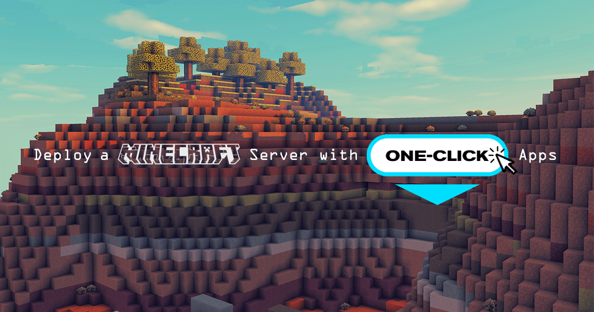

With over 100 million users around the world, [Minecraft](https://www.minecraft.net/en-us/) is the most popular online game of all time. You and other players are free to build and explore in a 3D generated world made up of millions of mineable blocks. Collect resources by leveling mountains, taming forests, and venturing out to sea. Choose a home from the varied list of biomes like ice worlds, flower plains, and jungles. Build ancient castles or modern mega cities, and fill them with redstone circuit contraptions and villagers. Fight off nightly invasions of Skeletons, Zombies, and explosive Creepers, or adventure to the End and the Nether to summon the fabled End Dragon and the chaotic Wither. If that is not enough, Minecraft is also highly moddable and customizable. You decide the rules when hosting your own Minecraft server for you and your friends to play together in this highly addictive game.

## Deploying the Minecraft Server Marketplace App



**Software installation should complete within 5-10 minutes after the Linode has finished provisioning.**

## Configuration Options

### Minecraft Options

You can configure your Minecraft Server App by providing values for the following fields:

| **Field** | **Description** |
|:--------------|:------------|
| **The username for the Linode's admin/SSH user** | This is the limited user account to be created for the Linode. This account has sudo user privileges. Only use lowercase characters. This username does not (and, for security reasons, likely should not) be the same as your Mojang or Microsoft account. |
| **The password for the Linode's admin/SSH user** | Set a password for the limited sudo user. The password must meet the complexity strength validation requirements for a strong password. This password can be used to perform any action on your server, similar to root, so make it long, complex, and unique. |
| **World Name** | The world name and it's corresponding file name. *Advanced Configuration*. |
| **Message of the Day** | Text that is displayed whenever a player logs on to the server. *Advanced Configuration*. |
| **Flight Enabled** | Allows flight if there is a mod installed that supports flying. This configuration has no effect on creative mode flight. *Advanced Configuration*. |
| **Nether World Enabled** | Enables the Nether world. *Advanced Configuration*. |
| **Player Achievements Enabled** | Whenever a player unlocks an achievement, it is broadcast to all logged in players. *Advanced Configuration*. |
| **Maximum Players** | Maximum amount of players allowed on the server. *Advanced Configuration*. |
| **Player Idle Timeout Limit** | If not set to *disabled*, the amount of time in minutes a player can be idle before being kicked off of the server. *Advanced Configuration*. |
| **Difficulty Level** | The game difficulty. *Advanced Configuration*. |
| **Hardcore Mode Enabled** | If set to `true`, the difficulty is set to *Hard*. Additionally, on death the player doesn't respawn and is be limited to *spectator* mode. *Advanced Configuration*. |
| **PvP Enabled** | Enables player versus player combat on the server. *Advanced Configuration*. |
| **Force Game Mode Enabled** | Forces players to join the server's default game mode. `false` allows players to join with their previous game mode. `true` forces the default game mode.
| **World Type** | Type of world to generate. *Default* = standard, *flat* = featureless and flat, *largebiomes* = larger biomes, *amplified* = larger height limit. *Advanced Configuration*. |
| **World Seed** | A random value used by Minecraft's world generation algorithm to create a unique world. For example: `qazwsx123`. See [Minecraft's Gamepedia](https://minecraft.gamepedia.com/Seed_(level_generation)) entry on seeds for more information. *Advanced Configuration*. |
| **Spawn Animals Enabled** | Determines if animals (sheep, chickens, squid, etc.) spawn. *Advanced Configuration*. |
| **Spawn Monsters Enabled** | Determines if monsters (creepers, skeletons, spiders, etc.) spawn. *Advanced Configuration*. |
| **Spawn NPCs Enabled** | Determines if villagers spawn. *Advanced Configuration*. |
| **Game Mode** | The game mode of the server. *Survival* is the default game mode, *creative* allows for flight and unlimited resources, *adventure* prevents players from destroying blocks, and *spectator* grants the ability to fly, but prevents any player interaction on the server. *Advanced Configuration*. |
| **Structure Generation Enabled** | Enables the ability to generate structures like villages and mineshafts. *Advanced Configuration*. |
| **Maximum Build Height** | Maximum height at which players can place blocks. World generation may exceed this limit. *Advanced Configuration*. |
| **Maximum World Size** | Maximum radius of the world, in blocks. *Advanced Configuration*. |
| **View Distance** | The distance a player can see, measured in chunks (16 block cubes). For example, `10` enables the user to see 10 chunks in any direction. |
| **Command Block Enabled** | Enables the placement of command blocks through the `/give` command. *Advanced Configuration*. |
| **Querying Enabled** | Enables GameSpy4. Used to obtain information about the server. *Advanced Configuration*. |
| **Enable RCON** | Enable remote access (RCON) to the Minecraft server to run commands. *Advanced Configuration*. |
| **RCON Password** | The RCON password. *Advanced Configuration*. |
| **RCON Port** | The port used for RCON. *Advanced Configuration*. |
| **Maximum Tick Time** | The maximum amount of milliseconds a single tick can take before the server considers itself frozen or crashed and shuts down. *Advanced Configuration*. |
| **Network Compression Threshold** | The threshold at which bytes are compressed. *Advanced Configuration*. |
| **Op-permission Level** | Sets the permission level for operators (ops) when using the `/op` command. *Advanced Configuration*. |
| **Port Number** | The server's listening port number. *Advanced Configuration*. |
| **Snooper Enabled** | Determines if the server sends stats to [https://snoop.minecraft.net](https://snoop.minecraft.net). *Advanced Configuration*. |
| **Use Native Transport Enabled** | Improve server performance by optimizing sent and received packets. *Advanced Configuration*. |

### General Options

For advice on filling out the remaining options on the **Create a Linode** form, see [Getting Started > Create a Linode](/docs/guides/getting-started/#create-a-linode). That said, some options may be limited or recommended based on this Marketplace App:

- **Supported distributions:** Ubuntu 20.04 LTS
- **Recommended plan:** The plan size should be based on the amount of traffic you expect to see on your server. We recommend 2GB of RAM for every 15 players. For example, if you are expecting a small group of players (between 1-15), the 2GB plan should suffice. Up to 30 players, a 4GB Linode would be a better fit.

## Getting Started after Deployment

Ensure that you have [installed Minecraft](https://www.minecraft.net/en-us/get-minecraft) on your personal computer and created a Minecraft user account before getting started with this section.

After Minecraft has finished installing on your Linode, you are able to access your Minecraft server by copying your Linode's IPv4 address and entering it in the Multiplayer menu on your personal computer's Minecraft installation. To find your Linode's IPv4 address:

1. Click on the **Linodes** link in the sidebar. You see a list of all your Linodes.

1. Find the Linode you just created when deploying your app and select it.

1. Navigate to the **Networking** tab.

1. Under the **IPv4** heading, your IPv4 address are listed under the **Address** column. Copy your IPv4 address.

1. Open Minecraft on your computer and click on **Multiplayer**, then click **Add Server**.

1. Enter a name for your server in the **Server Name** box. This name is displayed on the *Play Multiplayer* server selection screen.

1. Paste your IP address in the **Server Address** field and click **Done**:

    

1. Once your server is ready to play on, the status indicator shows a series of green bars.

    

    If there is a red *X* over the status bars, or it says *old*, then your Linode has not finished installing Minecraft. Wait a few minutes, then hit **Refresh**.

## Customization After Installation

After installation you can change your Minecraft options by customizing the system configuration files.

- **Customize the Minecraft Service**

    The system service file is located in your home directory: `~/etc/systemd/system/mcserver.service`. You can update this file to optimize your server's performance.

- **Customize the Minecraft World Options**

    The files to configure the world options are also located in your home directory: `~/serverfiles`. Here you find `server.properties`, `banned-ips.json`, and more. The name of the world you created during installation has a folder here as well. Inside this folder are other configuration files for that specific world.

## Software Included

The Minecraft Marketplace App installs the following software on your Linode:

| **Software** | **Description** |
|:--------------|:------------|
| [**Minecraft 1.17**](https://www.minecraft.net/en-us/) | Game server. |
| [**LinuxGSM**](https://linuxgsm.com) | A command line tool for the deployment and management of Linux game servers. |
| [**UFW**](https://wiki.ubuntu.com/UncomplicatedFirewall) | Firewall utility. Port 25575 allows outgoing and incoming traffic. |
| [**Fail2ban**](https://www.fail2ban.org/wiki/index.php/Main_Page) | Fail2Ban is an intrusion prevention software framework that protects computer servers from brute-force attacks. |


