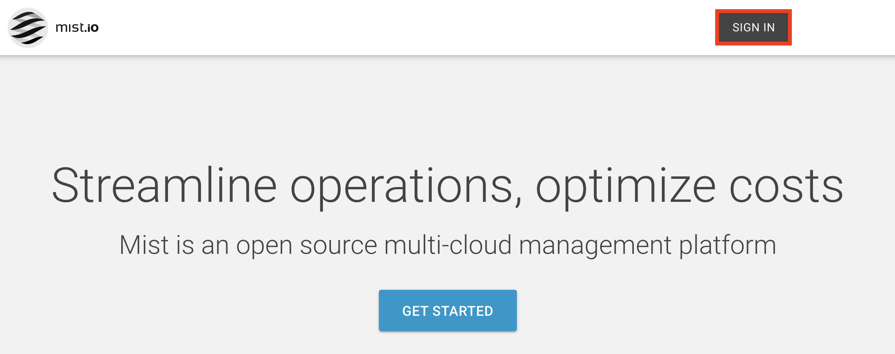

[Mist.io](https://mist.io/) is an open source, multi-cloud management platform. Mist supports all popular infrastructure technologies including public clouds, private clouds, hypervisors, containers, and bare metal servers. It provides a unified interface for performing common management tasks like provisioning, orchestration, monitoring, automation, and cost analysis. It also comes with a RESTful API so you can easily integrate it in your existing workflows.

## Deploying the Mist.io Marketplace App



**Software installation should complete within 5-15 minutes after the Linode has finished provisioning.**

## Configuration Options

### Mist.io Options

| **Field** | **Description** |
|:--------------|:------------|
| **Mist admin user's email** | The e-mail address of the administrator. Used as a log-in credential similar to a username. *Required* |
| **Mist admin user's password** | The password of the Mist.io administrator account. *Required* |

### General Options

For advice on filling out the remaining options on the **Create a Linode** form, see [Getting Started > Create a Linode](/docs/guides/getting-started/#create-a-linode). That said, some options may be limited or recommended based on this Marketplace App:

- **Supported distributions:** Debian 9 and Debian 10
- **Recommended plan:** 8GB Compute Instance

## Getting Started After Deployment

Once the Mist.io server is successfully created, a few additional steps must be completed to be able to begin using the application.

### Log In to Mist.io

1. In a web browser, enter your Linode's [IP address](/docs/guides/find-your-linodes-ip-address/) or the [Domain](/docs/guides/dns-manager/) associated with it to access your Mist.io App's login screen.

1. Click on the **Sign in** button at the top right of the page.

    

1. Enter your Mist admin `Email Address` and `Password` in their respective fields to complete the log-in process.

    

### Next Steps

After creating your account, create a name for your organization, [Add Clouds](https://docs.mist.io/category/75-adding-clouds-bare-metal-and-containers) to manage, as well as any separate [virtual machines, containers,](https://docs.mist.io/category/158-machines) and more.

For more information and guidance for getting the most out of your Mist.io App, check out the following:

* [Mist User Documentation](https://docs.mist.io) for quick start and other informative articles.
* [Mist API Documentation](https://mist.io/swagger) for integration with your existing workflows.
* [Mist Community Edition Github Repo](https://github.com/mistio/mist-ce/blob/master/README.md) for additional configuration and maintenance instructions.

## Software Included

The Mist.io Marketplace App installs the following software on your Linode:

| **Software** | **Description** |
|:--------------|:------------|
| [**Docker Compose**](https://docs.docker.com/compose/) | Tool for defining and running multi-container Docker applications.|
| [**Mist Community Edition v4.3.8**](https://github.com/mistio/mist-ce) | An open source Mult-Cloud Management Platform.|


